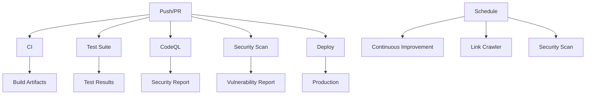

# GitHub Actions Workflows

This repository contains comprehensive GitHub Actions workflows for the Zion Tech Group application. All workflows are designed to ensure code quality, security, and reliable deployment.

## 🚀 Available Workflows

### 1. CI (Continuous Integration)
**File:** `.github/workflows/ci.yml`
**Triggers:** Push to main/develop/cursor branches, Pull Requests
**Purpose:** Build, test, and validate code changes

**Features:**
- Node.js 20 setup with npm caching
- Dependency installation
- Linting and type checking
- Build verification
- Test execution
- Artifact upload

### 2. Test Suite
**File:** `.github/workflows/test.yml`
**Triggers:** Push to main/develop/cursor branches, Pull Requests
**Purpose:** Comprehensive testing and coverage reporting

**Features:**
- Jest test execution with coverage
- Codecov integration
- Build output verification
- Artifact management
- Concurrency control

### 3. CodeQL Security Analysis
**File:** `.github/workflows/codeql.yml`
**Triggers:** Push, Pull Requests, Weekly schedule
**Purpose:** Advanced security vulnerability detection

**Features:**
- JavaScript/TypeScript analysis
- Security and quality queries
- SARIF file generation
- Artifact upload
- Scheduled scanning

### 4. Security & Dependency Scanning
**File:** `.github/workflows/security.yml`
**Triggers:** Push, Pull Requests, Weekly schedule
**Purpose:** Comprehensive security analysis

**Features:**
- NPM audit vulnerability scanning
- Dependency outdated checking
- Code security analysis
- Sensitive file detection
- Security summary generation
- PR commenting

### 5. Continuous Improvement
**File:** `.github/workflows/continuous-improvement.yml`
**Triggers:** Every 6 hours, Manual dispatch
**Purpose:** Automated code improvement and diversification

**Features:**
- Automation script execution
- Change detection
- Automated PR creation
- Auto-merge enablement
- Branch management

### 6. Link Crawler Factory
**File:** `.github/workflows/agent-factory.yml`
**Triggers:** Every 2 hours, Manual dispatch
**Purpose:** Automated link health monitoring

**Features:**
- Parallel link checking
- Broken link detection
- Queue management
- Issue creation
- Report generation

### 7. NPM Package Publishing
**File:** `.github/workflows/npm-publish.yml`
**Triggers:** Push to main (excluding docs)
**Purpose:** Automated package publishing

**Features:**
- Node.js 20 setup
- Test execution
- Build verification
- NPM publishing
- Release creation

### 8. Deployment
**File:** `.github/workflows/deploy.yml`
**Triggers:** Push to main, Manual dispatch
**Purpose:** Automated deployment to production

**Features:**
- Multi-environment support
- Netlify deployment
- Vercel deployment
- Deployment status tracking
- Notification system

## 🔧 Configuration

### Required Secrets

#### For Deployment:
- `NETLIFY_AUTH_TOKEN`: Netlify authentication token
- `NETLIFY_SITE_ID`: Netlify site identifier
- `VERCEL_TOKEN`: Vercel authentication token
- `VERCEL_ORG_ID`: Vercel organization ID
- `VERCEL_PROJECT_ID`: Vercel project ID

#### For Publishing:
- `NPM_TOKEN`: NPM authentication token

#### For Security:
- `CODECOV_TOKEN`: Codecov authentication token

### Environment Variables

All workflows use Node.js 20 and include proper caching for npm dependencies.

## 📊 Workflow Dependencies

## 🚦 Workflow Status

- **CI**: ✅ Active - Runs on all code changes
- **Test**: ✅ Active - Comprehensive testing
- **CodeQL**: ✅ Active - Security analysis
- **Security**: ✅ Active - Vulnerability scanning
- **Improvement**: ✅ Active - Automated improvements
- **Link Crawler**: ✅ Active - Link health monitoring
- **NPM Publish**: ✅ Active - Package publishing
- **Deploy**: ✅ Active - Production deployment

## 🛠️ Customization

### Adding New Workflows

1. Create a new `.yml` file in `.github/workflows/`
2. Follow the established naming conventions
3. Include proper permissions and concurrency controls
4. Add timeout limits for all jobs
5. Include artifact uploads where appropriate

### Modifying Existing Workflows

1. Test changes in a feature branch first
2. Ensure backward compatibility
3. Update this README if workflow behavior changes
4. Consider impact on dependent workflows

## 📈 Monitoring

### Workflow Metrics

- **Success Rate**: Track workflow success/failure rates
- **Execution Time**: Monitor workflow performance
- **Resource Usage**: Optimize runner usage
- **Artifact Storage**: Manage artifact retention

### Alerts

- Failed deployments trigger notifications
- Security vulnerabilities create issues
- Broken links generate reports
- Test failures block merges

## 🔒 Security Features

- **Dependency Scanning**: Automated vulnerability detection
- **Code Analysis**: Static security analysis
- **Secret Detection**: Hardcoded credential scanning
- **Access Control**: Minimal required permissions
- **Audit Logging**: Complete workflow audit trail

## 📝 Best Practices

1. **Always use Node.js 20** for consistency
2. **Include timeout limits** to prevent hanging workflows
3. **Use concurrency controls** to manage resource usage
4. **Upload artifacts** for debugging and analysis
5. **Handle errors gracefully** with continue-on-error where appropriate
6. **Document changes** in this README
7. **Test workflows** before merging to main

## 🆘 Troubleshooting

### Common Issues

1. **Workflow Timeout**: Increase timeout-minutes value
2. **Permission Denied**: Check workflow permissions
3. **Secret Not Found**: Verify secret names and values
4. **Build Failures**: Check Node.js version and dependencies
5. **Artifact Issues**: Verify file paths and permissions

### Debug Steps

1. Check workflow run logs
2. Verify secret configuration
3. Test locally with act (GitHub Actions local runner)
4. Review workflow syntax
5. Check branch protection rules

## 📚 Resources

- [GitHub Actions Documentation](https://docs.github.com/en/actions)
- [Node.js Setup Action](https://github.com/actions/setup-node)
- [CodeQL Documentation](https://codeql.github.com/)
- [Security Best Practices](https://securitylab.github.com/)

## 🤝 Contributing

When modifying workflows:

1. Test changes thoroughly
2. Update this documentation
3. Follow established patterns
4. Consider security implications
5. Add appropriate error handling

---

**Last Updated:** $(date)
**Maintained by:** Zion Tech Group Development Team