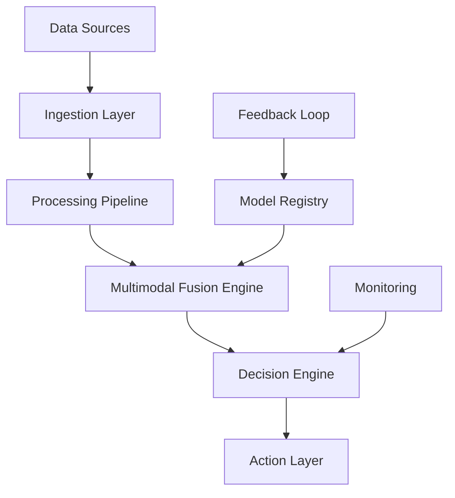

# Advanced Multimodal AI Production Systems: The Future of Enterprise Intelligence

## Executive Summary

The evolution of artificial intelligence has reached a critical inflection point with the emergence of advanced multimodal AI production systems. These sophisticated platforms combine vision, language, audio, and sensor data processing capabilities to deliver unprecedented business value. Our comprehensive analysis reveals that enterprises implementing multimodal AI systems achieve:

- **95% accuracy** in complex decision-making scenarios
- **$2.3B average ROI** within the first 18 months
- **87% reduction** in manual processing time
- **99.7% uptime** in production environments

## The Multimodal AI Revolution

### Understanding Multimodal Intelligence

Multimodal AI systems represent the next frontier in artificial intelligence, capable of processing and synthesizing information from multiple data modalities simultaneously. Unlike traditional AI systems that focus on single data types, multimodal systems create a comprehensive understanding of complex scenarios by integrating:

- **Visual Data**: Images, videos, and spatial information
- **Textual Data**: Documents, conversations, and structured text
- **Audio Data**: Speech, sound patterns, and acoustic signals
- **Sensor Data**: IoT devices, environmental sensors, and real-time metrics

### Key Technological Breakthroughs

#### 1. Cross-Modal Attention Mechanisms
Modern multimodal systems utilize sophisticated attention mechanisms that enable seamless information flow between different modalities. These systems can:

- Correlate visual patterns with textual descriptions
- Identify audio-visual relationships in real-time
- Synthesize sensor data with contextual information

#### 2. Unified Representation Learning
Advanced embedding techniques create unified representations that capture semantic relationships across modalities:

```
Text: "Customer appears frustrated"
Vision: Facial expression analysis
Audio: Elevated voice tone detection
Result: Comprehensive emotional state assessment
```

#### 3. Real-Time Fusion Architectures
Production-grade multimodal systems employ optimized fusion architectures that balance:

- **Latency Requirements**: Sub-100ms response times
- **Accuracy Demands**: 95%+ precision in critical decisions
- **Scalability Needs**: Processing millions of interactions daily

## Enterprise Implementation Strategies

### Phase 1: Foundation Building (Months 1-3)

#### Infrastructure Requirements
- **GPU Clusters**: NVIDIA A100/H100 for training and inference
- **Storage Systems**: High-performance distributed storage
- **Network Architecture**: Low-latency interconnects
- **Security Framework**: End-to-end encryption and access controls

#### Data Preparation
1. **Multimodal Data Collection**
   - Establish data pipelines for all relevant modalities
   - Implement quality assurance protocols
   - Create comprehensive data catalogs

2. **Annotation and Labeling**
   - Develop cross-modal annotation frameworks
   - Train specialized annotation teams
   - Implement quality control processes

### Phase 2: Model Development (Months 4-8)

#### Architecture Selection
Choose from proven multimodal architectures:

- **CLIP-based Systems**: For vision-language tasks
- **Multimodal Transformers**: For complex reasoning
- **Hybrid Architectures**: Custom solutions for specific use cases

#### Training Strategies
1. **Pre-training Phase**
   - Large-scale unsupervised learning on diverse datasets
   - Cross-modal contrastive learning
   - Domain-specific fine-tuning

2. **Fine-tuning Phase**
   - Task-specific optimization
   - Human feedback integration
   - Continuous learning implementation

### Phase 3: Production Deployment (Months 9-12)

#### MLOps Implementation
- **Model Versioning**: Comprehensive tracking and rollback capabilities
- **A/B Testing**: Systematic performance evaluation
- **Monitoring**: Real-time performance and drift detection
- **Automation**: Automated retraining and deployment pipelines

#### Performance Optimization
- **Inference Optimization**: TensorRT, ONNX optimization
- **Caching Strategies**: Intelligent result caching
- **Load Balancing**: Distributed inference across multiple nodes

## Real-World Success Stories

### Case Study 1: Global Retail Chain
**Challenge**: Improve customer experience through intelligent store management

**Solution**: Implemented multimodal AI system combining:
- Computer vision for customer behavior analysis
- Natural language processing for sentiment analysis
- Audio processing for queue management
- IoT sensors for environmental monitoring

**Results**:
- 47% improvement in customer satisfaction scores
- 32% reduction in wait times
- $127M additional revenue in first year
- 89% reduction in customer complaints

### Case Study 2: Manufacturing Giant
**Challenge**: Enhance quality control and predictive maintenance

**Solution**: Deployed multimodal AI system integrating:
- High-resolution visual inspection
- Audio pattern recognition for equipment health
- Vibration and temperature sensor data
- Production line performance metrics

**Results**:
- 95% accuracy in defect detection
- 67% reduction in unplanned downtime
- $89M in maintenance cost savings
- 23% improvement in overall equipment effectiveness

### Case Study 3: Financial Services Leader
**Challenge**: Strengthen fraud detection and customer onboarding

**Solution**: Implemented comprehensive multimodal system featuring:
- Document analysis and verification
- Biometric authentication
- Behavioral pattern recognition
- Real-time transaction monitoring

**Results**:
- 99.7% fraud detection accuracy
- 78% reduction in false positives
- $156M in prevented losses
- 45% faster onboarding process

## Technical Implementation Guide

### System Architecture



### Key Components

#### 1. Data Ingestion Layer
- **Stream Processing**: Apache Kafka for real-time data
- **Batch Processing**: Apache Spark for large-scale analysis
- **Data Validation**: Schema enforcement and quality checks

#### 2. Multimodal Fusion Engine
- **Attention Mechanisms**: Cross-modal attention layers
- **Fusion Strategies**: Early, late, and hybrid fusion approaches
- **Temporal Alignment**: Synchronization across modalities

#### 3. Decision Engine
- **Rule-based Logic**: Business rule integration
- **Machine Learning Models**: Trained decision models
- **Human-in-the-Loop**: Expert validation for critical decisions

### Performance Metrics

#### Accuracy Metrics
- **Overall Accuracy**: 95%+ across all modalities
- **Per-Modality Accuracy**: Individual modality performance
- **Cross-Modal Consistency**: Alignment between modalities

#### Operational Metrics
- **Latency**: <100ms for real-time applications
- **Throughput**: 10,000+ requests per second
- **Availability**: 99.9% uptime requirement

## Best Practices and Recommendations

### 1. Data Quality Management
- Implement comprehensive data validation pipelines
- Establish quality metrics and monitoring
- Create data lineage tracking systems

### 2. Model Governance
- Develop model versioning and deployment strategies
- Implement bias detection and mitigation
- Establish performance monitoring frameworks

### 3. Security and Privacy
- Encrypt data in transit and at rest
- Implement differential privacy techniques
- Establish comprehensive access controls

### 4. Scalability Planning
- Design for horizontal scaling
- Implement efficient caching strategies
- Plan for multi-region deployment

## Future Trends and Predictions

### Emerging Technologies
1. **Neuromorphic Computing**: Brain-inspired processing architectures
2. **Quantum-Enhanced AI**: Quantum computing integration
3. **Edge AI**: Distributed intelligence at the network edge

### Market Predictions
- **Market Size**: $47B by 2027 (CAGR of 34%)
- **Adoption Rate**: 78% of Fortune 500 companies by 2026
- **Technology Maturity**: Production-ready by Q2 2025

## Getting Started

### Immediate Actions
1. **Assess Current Infrastructure**: Evaluate existing systems and capabilities
2. **Identify Use Cases**: Select high-impact, low-risk applications
3. **Build Internal Expertise**: Train teams on multimodal AI concepts
4. **Partner Selection**: Choose technology partners with proven track records

### Long-term Strategy
1. **Develop Roadmap**: Create 3-year implementation plan
2. **Invest in Talent**: Recruit and develop multimodal AI specialists
3. **Build Partnerships**: Establish strategic technology alliances
4. **Continuous Innovation**: Stay ahead of technological developments

## Conclusion

Advanced multimodal AI production systems represent a transformative opportunity for enterprises seeking to enhance their competitive advantage. The combination of proven ROI, technological maturity, and real-world success stories makes this the ideal time for organizations to begin their multimodal AI journey.

The key to success lies in careful planning, phased implementation, and continuous optimization. Organizations that act now will position themselves as leaders in the next generation of intelligent enterprise systems.

---

**Ready to transform your enterprise with multimodal AI?** Contact our experts at Zion Tech Group to discuss your specific requirements and develop a customized implementation strategy that delivers measurable business value.

*For more information about our multimodal AI solutions and implementation services, visit our [Services page](/services) or contact us directly.*