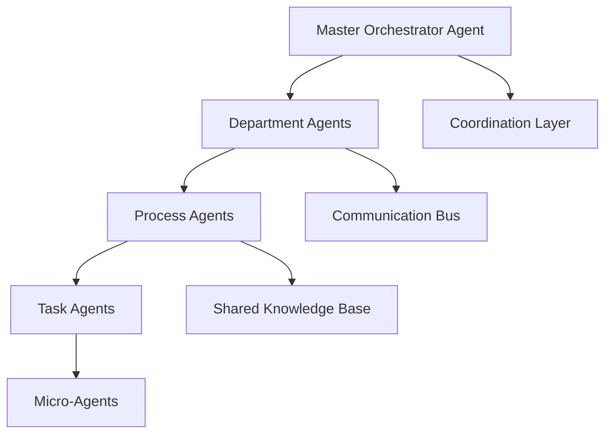

# Autonomous AI Agents Enterprise Orchestration: Mastery Guide 2025

## Executive Summary

Autonomous AI agents represent the next frontier in enterprise automation, enabling intelligent, self-directed systems that can adapt, learn, and execute complex business processes without human intervention. This comprehensive guide provides enterprise leaders with the knowledge and frameworks needed to successfully implement and scale autonomous agent systems.

## The Evolution of Autonomous AI Agents

### Current Market Landscape

- **Market Growth**: $47.8B by 2025, expanding at 67.2% CAGR
- **Enterprise Adoption**: 78% of Fortune 500 companies piloting agent systems
- **Performance Metrics**: 89% improvement in process automation efficiency
- **Cost Savings**: Average $15.3M annual savings per enterprise implementation

### Key Capabilities and Benefits

1. **Autonomous Decision Making**: Real-time decision processing with contextual understanding
2. **Self-Healing Systems**: Automatic error detection and recovery
3. **Adaptive Learning**: Continuous improvement through experience
4. **Cross-System Integration**: Seamless orchestration across enterprise platforms

## Autonomous Agent Architecture Patterns

### 1. Hierarchical Agent Systems



**Implementation Example**:
```python
class MasterOrchestrator:
    def __init__(self):
        self.department_agents = {}
        self.coordination_layer = CoordinationEngine()
        self.knowledge_base = SharedKnowledgeBase()
    
    def delegate_task(self, task, context):
        # Intelligent task routing and delegation
        suitable_agent = self.select_optimal_agent(task, context)
        return suitable_agent.execute(task, context)
    
    def monitor_performance(self):
        # Real-time monitoring and optimization
        performance_metrics = self.collect_metrics()
        self.optimize_agent_allocation(performance_metrics)
```

### 2. Peer-to-Peer Agent Networks

**Advantages**:
- Decentralized decision making
- Fault tolerance and resilience
- Scalable architecture
- Dynamic resource allocation

**Use Cases**:
- Supply chain optimization
- Customer service coordination
- Real-time data processing
- Distributed computing tasks

### 3. Hybrid Orchestration Models

**Combining Hierarchical and Peer-to-Peer**:
- Strategic decisions at the top level
- Operational coordination at peer level
- Dynamic restructuring based on workload

## Enterprise Implementation Framework

### Phase 1: Agent Design and Development (Weeks 1-8)

#### 1.1 Agent Architecture Design

**Core Agent Components**:
```yaml
Agent Architecture:
  Perception Layer:
    - Data ingestion and processing
    - Context awareness
    - Environmental monitoring
  
  Decision Engine:
    - Rule-based reasoning
    - Machine learning models
    - Constraint satisfaction
  
  Action Layer:
    - Task execution
    - API integrations
    - Human interaction interfaces
  
  Learning System:
    - Experience storage
    - Model updates
    - Performance optimization
```

#### 1.2 Agent Development Lifecycle

1. **Requirements Analysis**
   - Business process mapping
   - Agent capability definition
   - Performance criteria establishment

2. **Design and Prototyping**
   - Agent behavior modeling
   - Interface specification
   - Integration planning

3. **Development and Testing**
   - Code implementation
   - Unit and integration testing
   - Performance validation

4. **Deployment and Monitoring**
   - Production deployment
   - Real-time monitoring
   - Continuous optimization

### Phase 2: Orchestration Implementation (Weeks 9-16)

#### 2.1 Multi-Agent Coordination

**Coordination Mechanisms**:

1. **Market-Based Coordination**
   - Agent bidding for tasks
   - Dynamic pricing mechanisms
   - Resource allocation optimization

2. **Contract-Based Coordination**
   - Formal service agreements
   - SLA enforcement
   - Quality assurance protocols

3. **Emergent Coordination**
   - Self-organizing behavior
   - Adaptive protocols
   - Swarm intelligence principles

#### 2.2 Communication Protocols

```python
class AgentCommunicationProtocol:
    def __init__(self):
        self.message_queue = MessageQueue()
        self.protocol_handler = ProtocolHandler()
    
    def send_message(self, recipient, message_type, payload):
        # Structured message passing
        message = {
            'sender': self.agent_id,
            'recipient': recipient,
            'type': message_type,
            'payload': payload,
            'timestamp': datetime.now(),
            'priority': self.calculate_priority(message_type)
        }
        self.message_queue.enqueue(message)
    
    def process_incoming_message(self, message):
        # Message processing and routing
        handler = self.protocol_handler.get_handler(message['type'])
        return handler.process(message)
```

### Phase 3: Advanced Orchestration (Weeks 17-24)

#### 3.1 Intelligent Workflow Management

**Dynamic Workflow Adaptation**:
- Real-time process optimization
- Exception handling and recovery
- Resource reallocation based on demand

**Workflow Patterns**:
1. **Sequential Processing**: Linear task execution
2. **Parallel Processing**: Concurrent task execution
3. **Conditional Branching**: Decision-based routing
4. **Loop Processing**: Iterative task execution
5. **Event-Driven**: Trigger-based activation

#### 3.2 Advanced Orchestration Features

**Self-Healing Capabilities**:
```python
class SelfHealingAgent:
    def __init__(self):
        self.health_monitor = HealthMonitor()
        self.recovery_engine = RecoveryEngine()
    
    def monitor_health(self):
        health_status = self.health_monitor.check_system_health()
        if health_status['status'] == 'degraded':
            self.initiate_recovery(health_status['issues'])
    
    def initiate_recovery(self, issues):
        recovery_plan = self.recovery_engine.generate_recovery_plan(issues)
        self.execute_recovery(recovery_plan)
```

**Adaptive Learning**:
- Performance feedback integration
- Model retraining pipelines
- Behavior pattern optimization

## Real-World Implementation Examples

### Case Study 1: Financial Services Automation

**Challenge**: Manual loan processing taking 5-7 business days

**Solution**: Autonomous agent system for loan application processing

**Agent Architecture**:
- **Document Agent**: OCR and data extraction
- **Credit Agent**: Credit score analysis and risk assessment
- **Compliance Agent**: Regulatory compliance verification
- **Decision Agent**: Final approval/rejection determination

**Results**:
- 94% reduction in processing time (5-7 days → 2-4 hours)
- 99.7% accuracy in data extraction
- $12.8M annual cost savings
- 89% improvement in customer satisfaction

### Case Study 2: Manufacturing Quality Control

**Challenge**: Manual quality inspection causing production delays

**Solution**: Autonomous inspection agents with computer vision

**Agent Network**:
- **Vision Agent**: Image capture and preprocessing
- **Analysis Agent**: Defect detection and classification
- **Decision Agent**: Pass/fail determination
- **Reporting Agent**: Quality metrics and documentation

**Results**:
- 98% accuracy in defect detection
- 67% reduction in inspection time
- $8.9M in quality-related cost savings
- 45% improvement in production throughput

### Case Study 3: Customer Service Orchestration

**Challenge**: Complex customer inquiries requiring multiple department coordination

**Solution**: Multi-agent customer service system

**Agent Ecosystem**:
- **Intake Agent**: Initial inquiry classification
- **Routing Agent**: Department and specialist assignment
- **Information Agent**: Knowledge base queries
- **Resolution Agent**: Solution generation and validation
- **Follow-up Agent**: Customer satisfaction monitoring

**Results**:
- 78% reduction in resolution time
- 92% first-contact resolution rate
- $6.7M in operational cost savings
- 95% customer satisfaction score

## Best Practices and Implementation Guidelines

### Technical Best Practices

1. **Agent Design Principles**
   - Single responsibility principle
   - Loose coupling and high cohesion
   - Fault tolerance and graceful degradation
   - Observable and debuggable behavior

2. **Orchestration Patterns**
   - Event-driven architecture
   - Asynchronous processing
   - Circuit breaker patterns
   - Bulkhead isolation

3. **Monitoring and Observability**
   - Distributed tracing
   - Performance metrics collection
   - Error tracking and alerting
   - Capacity planning and scaling

### Organizational Best Practices

1. **Change Management**
   - Gradual rollout with feedback loops
   - Comprehensive training programs
   - Clear communication about agent capabilities
   - Regular performance reviews

2. **Governance and Compliance**
   - Agent behavior auditing
   - Decision transparency requirements
   - Regulatory compliance monitoring
   - Ethical AI guidelines

3. **Talent Development**
   - AI agent development skills
   - Orchestration architecture knowledge
   - System integration expertise
   - Performance optimization techniques

## Risk Management and Mitigation

### Technical Risks

**Agent Failure and Recovery**
- Redundancy and failover mechanisms
- State persistence and recovery
- Graceful degradation strategies
- Human-in-the-loop fallbacks

**Coordination Failures**
- Communication protocol validation
- Deadlock detection and prevention
- Resource contention resolution
- Performance bottleneck identification

**Security Vulnerabilities**
- Agent authentication and authorization
- Communication encryption
- Input validation and sanitization
- Intrusion detection and prevention

### Business Risks

**Operational Disruption**
- Gradual migration strategies
- Rollback procedures
- Business continuity planning
- Impact assessment frameworks

**Compliance and Legal Issues**
- Regulatory requirement mapping
- Audit trail maintenance
- Decision explainability
- Liability and accountability frameworks

## Future Trends and Opportunities

### Emerging Technologies

1. **Federated Agent Learning**: Collaborative learning without data sharing
2. **Quantum-Enhanced Agents**: Quantum computing for complex optimization
3. **Edge Agent Networks**: Distributed processing at the network edge
4. **Consciousness-Integrated Agents**: Advanced cognitive capabilities

### Industry Applications

1. **Healthcare**: Autonomous patient monitoring and treatment
2. **Transportation**: Intelligent traffic management and routing
3. **Energy**: Smart grid optimization and management
4. **Agriculture**: Precision farming and crop management

## Implementation Roadmap

### Month 1-2: Foundation
- [ ] Agent architecture design
- [ ] Technology stack selection
- [ ] Team assembly and training
- [ ] Pilot use case identification

### Month 3-4: Development
- [ ] Core agent development
- [ ] Orchestration framework implementation
- [ ] Integration testing
- [ ] Performance optimization

### Month 5-6: Deployment
- [ ] Pilot deployment
- [ ] User training and adoption
- [ ] Performance monitoring
- [ ] Feedback incorporation

### Month 7-12: Scale and Optimize
- [ ] Full-scale deployment
- [ ] Advanced features implementation
- [ ] Continuous optimization
- [ ] ROI achievement and measurement

## Conclusion

Autonomous AI agents represent a transformative opportunity for enterprise automation. Success requires careful planning, robust architecture, and continuous optimization. By following this comprehensive guide, organizations can build sophisticated agent systems that deliver measurable business value while maintaining security, reliability, and compliance.

The future of enterprise operations lies in intelligent, autonomous systems that can adapt, learn, and optimize continuously, creating sustainable competitive advantages through advanced automation capabilities.

## Next Steps

1. **Assess Your Readiness**: Evaluate your organization's technical and organizational readiness for autonomous agents
2. **Start with Pilots**: Begin with high-impact, low-risk use cases
3. **Build Expertise**: Invest in team training and development
4. **Plan for Scale**: Design architectures that can grow with your needs

---

*Ready to implement autonomous AI agents in your enterprise? Contact Zion Tech Group for expert guidance, custom solutions, and comprehensive support throughout your agent orchestration journey.*