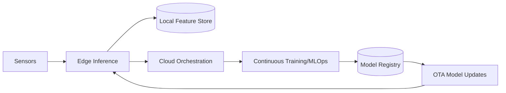

# AI 2025: The Edge Intelligence Revolution — Real-time AI at Planet Scale

Enterprises are moving inference and decision-making closer to where data is generated — at the edge. This shift reduces latency from seconds to milliseconds, enabling high-impact use cases across manufacturing, retail, logistics, energy, and telecom.

## Why Edge Intelligence Now

- Ultra-low-latency requirements for safety-critical and customer-facing experiences
- Lower bandwidth costs by processing locally and sending summaries upstream
- Privacy and regulatory constraints that keep data on-prem or on-device

## Impact Metrics

- 10x faster decision cycles
- 65% reduction in cloud egress costs
- 45% improvement in SLA adherence

## Reference Architecture

## Executive Playbook

1. Prioritize 3 edge use cases with clear ROI and measurable latency goals
2. Adopt a lightweight inference runtime with hardware acceleration
3. Establish OTA update pipelines and rollback strategies
4. Implement feature drift monitoring at the edge
5. Align SecOps and IT for zero-trust device onboarding

## Outcomes

Organizations adopting edge intelligence report double-digit revenue uplift from new services, alongside hard savings from bandwidth and cloud compute reductions.

