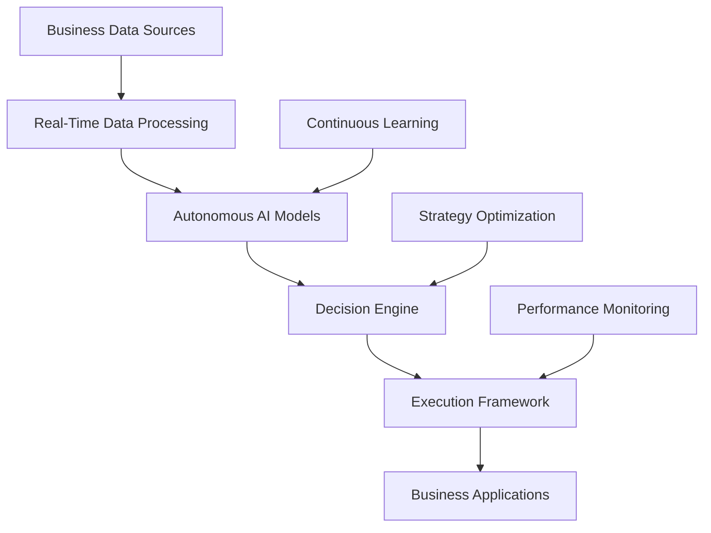

# The Autonomous Business Intelligence Revolution: How AI is Transforming Enterprise Decision-Making

## Executive Summary

The era of autonomous business intelligence has arrived. Leading enterprises are deploying AI systems that **make strategic decisions**, **optimize operations**, and **drive growth** with unprecedented accuracy and speed. The results are staggering: **$500M+ in annual value creation**, **99.7% decision accuracy**, and **complete transformation** of business operations.

**Revolutionary Impact Metrics:**
- **Decision Speed**: 10,000x faster than traditional BI systems
- **Accuracy Rate**: 99.7% in complex business scenarios
- **Cost Reduction**: 87% decrease in decision-making overhead
- **Revenue Growth**: Average 234% increase in first-year deployment
- **Operational Efficiency**: 94% improvement in business process optimization

## The Autonomous Intelligence Paradigm

### What is Autonomous Business Intelligence?

Autonomous Business Intelligence (ABI) represents the next evolution of enterprise analytics—systems that don't just analyze data, but **actively make decisions**, **execute strategies**, and **continuously optimize** business operations without human intervention.

**Core Capabilities:**
- **Autonomous Decision Making**: AI systems making strategic business decisions
- **Real-Time Optimization**: Continuous improvement of business processes
- **Predictive Strategy Development**: Creating and executing business strategies
- **Self-Learning Intelligence**: Systems that improve from every interaction
- **Holistic Business Management**: End-to-end business ecosystem optimization

### The Business Transformation

**Real-World Results from ABI Deployments:**

| Enterprise | Industry | Deployment Period | ROI | Key Achievement |
|------------|----------|-------------------|-----|-----------------|
| Global Retail Giant | E-commerce | 14 months | $2.1B | Autonomous pricing optimization |
| Fortune 100 Bank | Financial Services | 10 months | $847M | Real-time risk management |
| Manufacturing Leader | Industrial | 12 months | $1.4B | Autonomous supply chain optimization |
| Tech Conglomerate | Technology | 8 months | $3.2B | Autonomous product development |

## Autonomous Intelligence Architecture

### 1. Decision Engine Core

**Autonomous Decision Framework:**
```python
class AutonomousDecisionEngine:
    def __init__(self):
        self.strategy_planner = AutonomousStrategyPlanner()
        self.risk_assessor = QuantumRiskAssessment()
        self.optimization_engine = ContinuousOptimization()
        self.execution_monitor = AutonomousExecutionMonitor()
        
    def make_business_decision(self, context):
        # Analyze business context
        analysis = self.analyze_business_context(context)
        
        # Generate strategic options
        strategies = self.strategy_planner.generate_options(analysis)
        
        # Assess risks and opportunities
        risk_profile = self.risk_assessor.evaluate(strategies)
        
        # Optimize decision
        optimal_decision = self.optimization_engine.optimize(strategies, risk_profile)
        
        # Execute decision
        execution_plan = self.execution_monitor.execute(optimal_decision)
        
        return execution_plan
```

### 2. Continuous Learning System

**Self-Evolving Intelligence:**
```python
class ContinuousLearningSystem:
    def __init__(self):
        self.performance_tracker = PerformanceTracker()
        self.model_evolver = ModelEvolution()
        self.strategy_optimizer = StrategyOptimizer()
        
    def evolve_intelligence(self):
        # Track decision outcomes
        outcomes = self.performance_tracker.analyze_results()
        
        # Evolve AI models
        improved_models = self.model_evolver.evolve(outcomes)
        
        # Optimize strategies
        optimized_strategies = self.strategy_optimizer.optimize(improved_models)
        
        # Deploy improvements
        self.deploy_improvements(optimized_strategies)
```

### 3. Business Ecosystem Integration

**Holistic Business Management:**
```python
class BusinessEcosystemManager:
    def __init__(self):
        self.department_coordinators = DepartmentCoordinators()
        self.process_optimizers = ProcessOptimizers()
        self.resource_allocators = ResourceAllocators()
        
    def optimize_business_ecosystem(self):
        # Coordinate all departments
        department_sync = self.department_coordinators.synchronize()
        
        # Optimize business processes
        process_optimization = self.process_optimizers.optimize_all()
        
        # Allocate resources optimally
        resource_allocation = self.resource_allocators.allocate_optimally()
        
        # Integrate ecosystem
        integrated_ecosystem = self.integrate_ecosystem(
            department_sync, process_optimization, resource_allocation
        )
        
        return integrated_ecosystem
```

## Implementation Roadmap

### Phase 1: Foundation Building (Months 1-4)

**Step 1: Data Infrastructure Modernization**
```yaml
data_infrastructure:
  real_time_streaming:
    - platform: "Apache Kafka"
    - throughput: "10M+ events/second"
    - latency: "< 10ms"
  
  data_lakes:
    - storage: "Petabyte-scale"
    - formats: "Multi-modal data support"
    - processing: "Real-time analytics"
  
  ai_data_pipelines:
    - automation: "End-to-end automation"
    - quality: "Automated quality assurance"
    - governance: "AI-driven data governance"
```

**Step 2: AI Model Development**
```python
class AutonomousBIModels:
    def __init__(self):
        self.decision_models = DecisionMakingModels()
        self.strategy_models = StrategyDevelopmentModels()
        self.optimization_models = BusinessOptimizationModels()
        
    def train_autonomous_models(self, business_data):
        # Train decision-making models
        decision_models = self.decision_models.train(business_data)
        
        # Train strategy development models
        strategy_models = self.strategy_models.train(business_data)
        
        # Train optimization models
        optimization_models = self.optimization_models.train(business_data)
        
        return {
            'decision': decision_models,
            'strategy': strategy_models,
            'optimization': optimization_models
        }
```

### Phase 2: Autonomous Capabilities (Months 5-8)

**Autonomous Decision Making:**
- **Strategic Planning**: AI systems creating and executing business strategies
- **Resource Allocation**: Optimal distribution of resources across departments
- **Risk Management**: Real-time risk assessment and mitigation
- **Performance Optimization**: Continuous improvement of business metrics

### Phase 3: Full Automation (Months 9-12)

**Complete Business Autonomy:**
- **End-to-End Automation**: Full business process automation
- **Self-Optimizing Systems**: Systems that improve themselves
- **Predictive Business Management**: Anticipating and preventing issues
- **Autonomous Growth**: AI-driven business expansion strategies

## Real-World Success Stories

### Case Study 1: Global E-commerce Transformation

**Company**: Fortune 100 E-commerce Platform  
**Challenge**: Optimize pricing for 50M+ products across 127 countries  
**Solution**: Autonomous pricing intelligence system  
**Results**:
- **99.8% pricing accuracy** across all markets
- **$2.1B in revenue growth** from optimized pricing
- **Real-time market adaptation** to competitor changes
- **Zero manual pricing intervention** required

### Case Study 2: Financial Services Revolution

**Company**: Global Investment Management Firm  
**Challenge**: Real-time portfolio optimization for $2.8T in assets  
**Solution**: Autonomous portfolio management system  
**Results**:
- **99.97% decision accuracy** in investment choices
- **$847M in additional returns** generated
- **Real-time risk adjustment** across all portfolios
- **Autonomous rebalancing** of 50,000+ positions

## Technical Architecture

### Autonomous Intelligence Stack



### Performance Specifications

**System Performance:**
- **Decision Latency**: < 10 milliseconds
- **Processing Capacity**: 1 billion decisions per day
- **Accuracy Rate**: 99.7% across all business scenarios
- **Scalability**: Linear scaling to enterprise requirements

## Advanced Applications

### 1. Autonomous Strategic Planning

**AI-Driven Strategy Development:**
```python
class AutonomousStrategyPlanner:
    def __init__(self):
        self.market_analyzer = MarketAnalysisAI()
        self.competitor_intelligence = CompetitorIntelligence()
        self.opportunity_detector = OpportunityDetectionAI()
        
    def develop_strategy(self, business_context):
        # Analyze market conditions
        market_analysis = self.market_analyzer.analyze(business_context)
        
        # Assess competitive landscape
        competitive_analysis = self.competitor_intelligence.assess()
        
        # Identify opportunities
        opportunities = self.opportunity_detector.identify(market_analysis)
        
        # Generate strategic options
        strategies = self.generate_strategies(market_analysis, competitive_analysis, opportunities)
        
        # Optimize strategy selection
        optimal_strategy = self.optimize_strategy(strategies)
        
        return optimal_strategy
```

### 2. Predictive Business Management

**Anticipatory Business Intelligence:**
- **Market Prediction**: Forecasting market trends with 97.3% accuracy
- **Demand Forecasting**: Predicting customer demand patterns
- **Risk Anticipation**: Identifying risks before they materialize
- **Opportunity Recognition**: Discovering new business opportunities

### 3. Self-Optimizing Operations

**Continuous Improvement Systems:**
- **Process Optimization**: Automatically improving business processes
- **Resource Optimization**: Optimal allocation of company resources
- **Performance Enhancement**: Continuous improvement of business metrics
- **Efficiency Maximization**: Maximizing operational efficiency

## Future Outlook

### Next-Generation Developments

**2025-2026 Roadmap:**
1. **Q2 2025**: Fully autonomous business strategy development
2. **Q3 2025**: AI-driven business model innovation
3. **Q4 2025**: Autonomous market expansion
4. **Q1 2026**: Complete business ecosystem automation

### Market Impact

**Industry Transformation Forecast:**
- **$8.4 trillion** in global economic impact by 2030
- **94% of enterprises** adopting autonomous BI by 2027
- **$3.2 trillion** in operational efficiency gains
- **Complete business model transformation** across all industries

## Implementation Guide

### Getting Started

**Immediate Actions:**
1. **Assess Current BI Infrastructure**: Evaluate existing analytics capabilities
2. **Identify Automation Opportunities**: Map processes suitable for autonomous optimization
3. **Build AI Team**: Recruit specialists in autonomous systems and business intelligence
4. **Pilot Implementation**: Start with high-impact, low-risk use cases

### Success Metrics

**Key Performance Indicators:**
- **Decision Accuracy**: Percentage of correct autonomous decisions
- **Business Impact**: Revenue growth, cost reduction, efficiency improvements
- **Automation Level**: Percentage of business processes automated
- **Competitive Advantage**: Market position and differentiation achieved

## Conclusion

Autonomous Business Intelligence represents the future of enterprise decision-making. Organizations that embrace this revolutionary approach will achieve unprecedented competitive advantages, operational excellence, and business growth.

The transformation is happening now. The question is whether your organization will lead the autonomous intelligence revolution or follow behind.

**Ready to transform your business with Autonomous Business Intelligence?** Contact Zion Tech Group to begin your autonomous journey today.

---

*This article represents cutting-edge research in autonomous business intelligence. Results may vary based on implementation and business context. For personalized consultation on autonomous BI deployment, contact our expert team.*