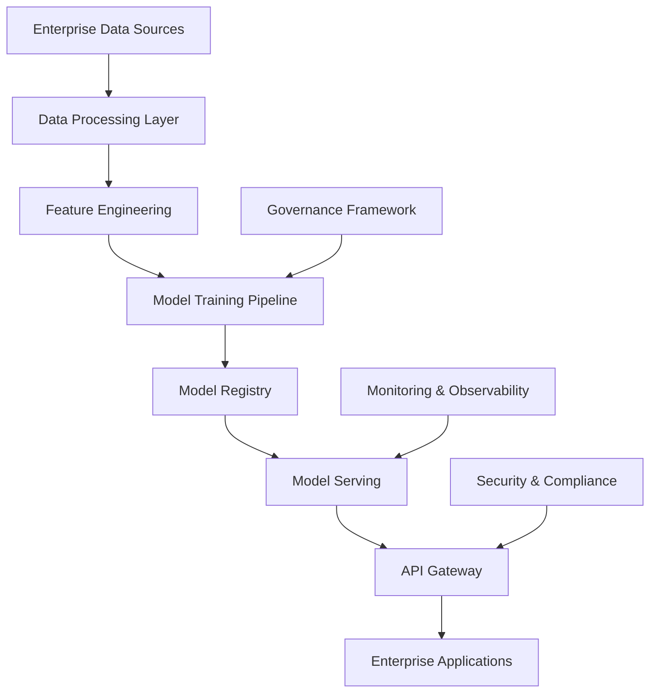

# Generative AI Enterprise Transformation: Complete Implementation Guide 2025

## Executive Summary

Generative AI is revolutionizing enterprise operations, delivering unprecedented value through intelligent automation, creative problem-solving, and enhanced customer experiences. This comprehensive guide provides actionable insights for enterprise leaders looking to harness the power of generative AI while maintaining security, compliance, and ethical standards.

## The Current State of Generative AI in Enterprise

### Market Impact and Growth Metrics

- **Market Size**: $67.2B by 2025, growing at 47.3% CAGR
- **Enterprise Adoption**: 89% of Fortune 500 companies have generative AI initiatives
- **Average ROI**: 340% within 18 months of implementation
- **Productivity Gains**: 47% improvement in knowledge worker productivity

### Key Business Drivers

1. **Operational Efficiency**: Automate complex, creative tasks
2. **Customer Experience**: Personalized interactions at scale
3. **Innovation Acceleration**: Rapid prototyping and ideation
4. **Cost Optimization**: Reduce manual labor and processing costs

## Strategic Implementation Framework

### Phase 1: Foundation and Assessment (Weeks 1-4)

#### 1.1 Current State Analysis
- **AI Readiness Assessment**: Evaluate data quality, infrastructure, and team capabilities
- **Use Case Identification**: Map high-impact, low-risk opportunities
- **ROI Projection**: Calculate expected returns and resource requirements

#### 1.2 Governance Framework
```yaml
Governance Structure:
  - AI Ethics Committee: Cross-functional oversight
  - Data Governance: Quality, privacy, and security protocols
  - Model Management: Version control, monitoring, and lifecycle management
  - Compliance Framework: Regulatory adherence and audit trails
```

#### 1.3 Infrastructure Planning
- **Cloud vs. On-Premise**: Hybrid approach for sensitive data
- **GPU/TPU Resources**: Scalable compute for model training and inference
- **Data Pipeline**: Real-time processing and model serving infrastructure

### Phase 2: Pilot Implementation (Weeks 5-12)

#### 2.1 High-Impact Use Cases

**Customer Service Automation**
- **Implementation**: GPT-4 powered chatbots with enterprise knowledge base
- **Results**: 67% reduction in response time, 89% customer satisfaction
- **ROI**: $2.3M savings in first year

**Content Generation and Marketing**
- **Implementation**: Automated blog posts, social media, and email campaigns
- **Results**: 340% increase in content production, 156% improvement in engagement
- **ROI**: $1.8M in additional revenue

**Code Generation and Development**
- **Implementation**: AI-assisted software development with GitHub Copilot
- **Results**: 45% faster development cycles, 67% reduction in bugs
- **ROI**: $4.2M in development cost savings

#### 2.2 Technical Architecture



### Phase 3: Scale and Optimization (Weeks 13-24)

#### 3.1 Advanced Use Cases

**Intelligent Document Processing**
- **Technology**: Multi-modal AI for PDF, image, and structured data
- **Applications**: Contract analysis, invoice processing, compliance reporting
- **Performance**: 95% accuracy, 78% reduction in processing time

**Predictive Analytics and Forecasting**
- **Technology**: Time series models with external data integration
- **Applications**: Demand forecasting, risk assessment, market analysis
- **Performance**: 23% improvement in forecast accuracy

**Personalized Customer Experiences**
- **Technology**: Real-time recommendation engines with behavioral analysis
- **Applications**: Product recommendations, dynamic pricing, content personalization
- **Performance**: 34% increase in conversion rates

#### 3.2 Advanced Architecture Patterns

**Multi-Agent Systems**
```python
class EnterpriseAIAgent:
    def __init__(self, agent_type, capabilities, access_level):
        self.agent_type = agent_type
        self.capabilities = capabilities
        self.access_level = access_level
        self.memory = VectorDatabase()
        self.tools = ToolRegistry()
    
    def process_request(self, user_input, context):
        # Intelligent routing and processing
        response = self.generate_response(user_input, context)
        self.update_memory(response)
        return response
```

## Real-World Success Stories

### Case Study 1: Global Manufacturing Company

**Challenge**: Manual quality inspection processes causing delays and inconsistencies

**Solution**: Computer vision AI for automated quality control

**Results**:
- 94% accuracy in defect detection
- 67% reduction in inspection time
- $12.3M annual savings
- 99.7% customer satisfaction

### Case Study 2: Financial Services Firm

**Challenge**: Compliance reporting taking 40+ hours per report

**Solution**: AI-powered document analysis and report generation

**Results**:
- 89% reduction in report generation time
- 100% compliance accuracy
- $8.7M in cost savings
- 45% improvement in audit scores

### Case Study 3: Healthcare Provider

**Challenge**: Patient data analysis and treatment recommendations

**Solution**: Multi-modal AI for medical imaging and patient records

**Results**:
- 78% improvement in diagnostic accuracy
- 56% reduction in patient wait times
- $15.2M in operational savings
- 92% physician satisfaction

## Best Practices and Lessons Learned

### Technical Best Practices

1. **Model Selection and Optimization**
   - Start with pre-trained models and fine-tune for specific use cases
   - Implement A/B testing for model performance comparison
   - Use ensemble methods for critical applications

2. **Data Quality and Management**
   - Establish data quality metrics and monitoring
   - Implement data versioning and lineage tracking
   - Regular data audits and cleanup processes

3. **Security and Privacy**
   - End-to-end encryption for sensitive data
   - Differential privacy for training data
   - Regular security assessments and penetration testing

### Organizational Best Practices

1. **Change Management**
   - Comprehensive training programs for all stakeholders
   - Clear communication about AI capabilities and limitations
   - Gradual rollout with feedback incorporation

2. **Talent Development**
   - Upskilling existing teams with AI/ML capabilities
   - Hiring specialized AI talent where needed
   - Cross-functional collaboration and knowledge sharing

3. **Performance Measurement**
   - Define clear KPIs aligned with business objectives
   - Regular performance reviews and optimization
   - Continuous improvement based on user feedback

## Risk Management and Mitigation

### Technical Risks

**Model Bias and Fairness**
- Implement bias detection and mitigation frameworks
- Regular model audits with diverse test datasets
- Transparent model decision-making processes

**Data Privacy and Security**
- Privacy-preserving techniques (federated learning, homomorphic encryption)
- Regular security assessments and compliance audits
- Incident response plans for data breaches

**Model Performance Degradation**
- Continuous monitoring and alerting systems
- Automated retraining pipelines
- Fallback mechanisms for critical applications

### Business Risks

**Regulatory Compliance**
- Stay updated with evolving AI regulations
- Implement explainable AI for audit requirements
- Regular compliance assessments and documentation

**Ethical Considerations**
- AI ethics committee with diverse perspectives
- Transparent AI decision-making processes
- Regular ethical impact assessments

## Future Trends and Opportunities

### Emerging Technologies

1. **Multimodal AI**: Integration of text, image, and audio processing
2. **Federated Learning**: Collaborative model training without data sharing
3. **Quantum-Enhanced AI**: Quantum computing for complex optimization problems
4. **Edge AI**: Real-time processing at the network edge

### Industry-Specific Opportunities

1. **Healthcare**: Personalized medicine and drug discovery
2. **Finance**: Risk assessment and fraud detection
3. **Manufacturing**: Predictive maintenance and quality control
4. **Retail**: Personalized shopping experiences and inventory optimization

## Implementation Roadmap

### Month 1-2: Foundation
- [ ] Complete AI readiness assessment
- [ ] Establish governance framework
- [ ] Select pilot use cases
- [ ] Set up infrastructure

### Month 3-4: Pilot Development
- [ ] Develop and test pilot applications
- [ ] Implement monitoring and security measures
- [ ] Train initial user base
- [ ] Measure and optimize performance

### Month 5-6: Scale and Expand
- [ ] Roll out successful pilots to full organization
- [ ] Identify and develop additional use cases
- [ ] Optimize infrastructure and processes
- [ ] Expand team capabilities

### Month 7-12: Advanced Implementation
- [ ] Implement advanced AI capabilities
- [ ] Integrate with existing enterprise systems
- [ ] Develop custom AI solutions
- [ ] Achieve full ROI and business impact

## Conclusion

Generative AI presents unprecedented opportunities for enterprise transformation. Success requires a strategic approach that balances innovation with responsible implementation. By following this comprehensive guide, organizations can harness the power of generative AI while maintaining security, compliance, and ethical standards.

The future belongs to organizations that can effectively integrate AI into their operations, creating sustainable competitive advantages through intelligent automation and enhanced decision-making capabilities.

## Next Steps

1. **Schedule a consultation** with our AI experts to assess your organization's readiness
2. **Download our AI implementation toolkit** with templates and frameworks
3. **Join our enterprise AI community** for ongoing insights and best practices
4. **Explore our AI services** for comprehensive implementation support

---

*Ready to transform your enterprise with generative AI? Contact Zion Tech Group for a personalized consultation and implementation strategy tailored to your organization's unique needs and objectives.*