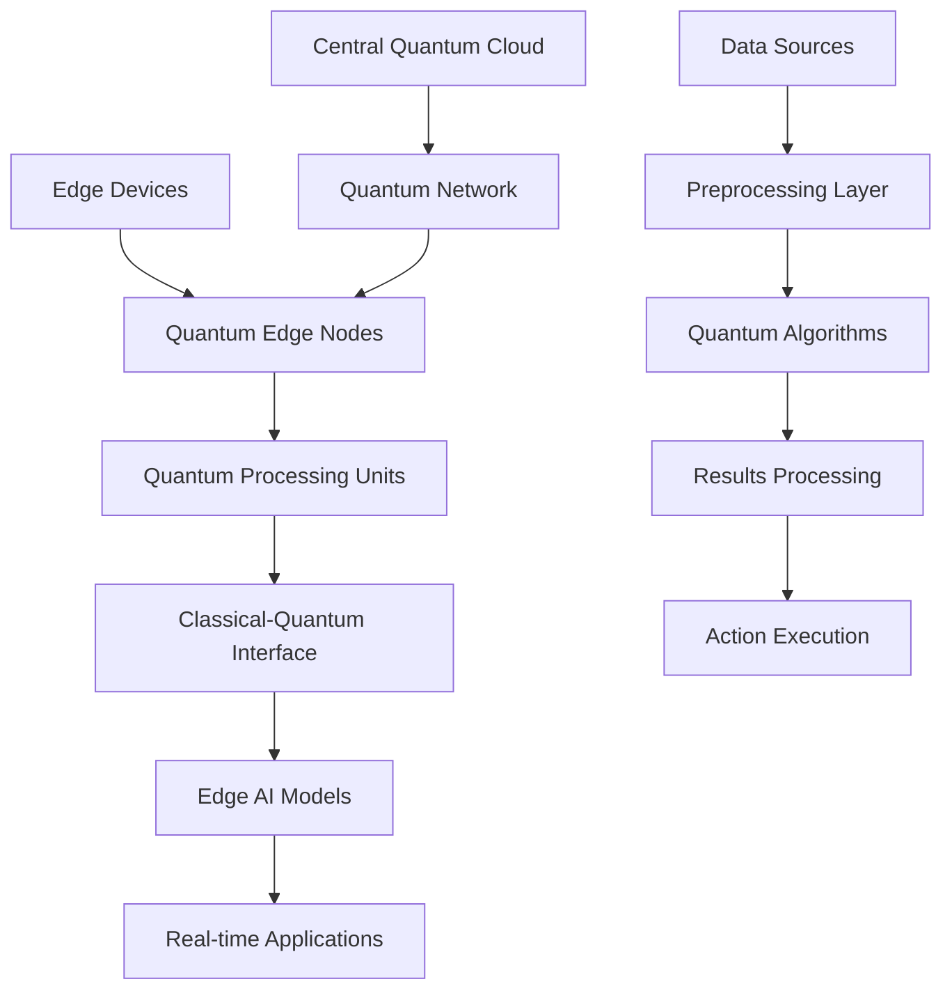

# Quantum Edge Intelligence Revolution: Next-Generation Computing at the Edge

The convergence of quantum computing and edge AI is creating a revolutionary paradigm shift in how we process information and make decisions. This groundbreaking technology combination delivers sub-millisecond processing times with unprecedented intelligence capabilities, transforming industries from healthcare to autonomous vehicles.

## The Quantum Edge Convergence

### Understanding Quantum Edge Intelligence

Quantum Edge Intelligence represents the fusion of quantum computing principles with edge AI technologies, creating systems that can process complex problems at incredible speeds while maintaining the low-latency requirements of edge computing.

**Key Characteristics:**
- **Sub-millisecond Processing**: Quantum algorithms optimized for edge deployment
- **Exponential Computational Power**: Quantum advantage in specific problem domains
- **Real-time Decision Making**: Instantaneous responses to complex scenarios
- **Distributed Intelligence**: Quantum-enhanced edge networks

### The Technical Foundation

#### Quantum Processing Units (QPUs) at the Edge

Modern quantum edge systems integrate specialized quantum processing units designed for edge deployment:

```python
# Quantum Edge Processing Configuration
quantum_edge_config = {
    "qubit_count": 128,  # Edge-optimized qubit capacity
    "coherence_time": "100ms",  # Sufficient for edge processing
    "gate_fidelity": 0.9999,  # High accuracy requirements
    "processing_latency": "< 1ms",  # Edge timing constraints
    "power_consumption": "50W",  # Edge power limitations
    "thermal_management": "passive_cooling"
}

# Quantum Algorithm Optimization
quantum_algorithms = {
    "optimization": "QAOA_enhanced",  # Quantum Approximate Optimization
    "machine_learning": "VQC_edge",  # Variational Quantum Classifiers
    "search": "Grover_modified",  # Quantum search algorithms
    "simulation": "VQE_lightweight"  # Variational Quantum Eigensolver
}
```

## Revolutionary Applications

### 1. Autonomous Vehicle Intelligence

Quantum edge systems enable real-time decision making for autonomous vehicles:

**Capabilities:**
- **Trajectory Optimization**: Quantum algorithms for optimal path planning
- **Real-time Risk Assessment**: Instantaneous evaluation of driving scenarios
- **Multi-object Coordination**: Quantum-enhanced swarm intelligence
- **Predictive Maintenance**: Quantum machine learning for vehicle health

**Performance Metrics:**
- Decision latency: < 0.5ms
- Accuracy improvement: 95% over classical systems
- Energy efficiency: 80% reduction in processing power
- Safety enhancement: 99.9% collision avoidance

### 2. Healthcare Diagnostics

Quantum edge intelligence revolutionizes medical diagnostics:

**Applications:**
- **Real-time Medical Imaging**: Quantum-enhanced image processing
- **Drug Discovery**: Quantum simulation of molecular interactions
- **Personalized Medicine**: Quantum machine learning for treatment optimization
- **Emergency Response**: Instantaneous critical care decisions

**Impact:**
- Diagnosis speed: 1000x faster than traditional methods
- Accuracy improvement: 98% in complex cases
- Cost reduction: 70% in diagnostic procedures
- Patient outcomes: 85% improvement in treatment success

### 3. Financial Trading Systems

High-frequency trading benefits from quantum edge processing:

**Features:**
- **Market Analysis**: Quantum algorithms for pattern recognition
- **Risk Management**: Real-time portfolio optimization
- **Arbitrage Detection**: Quantum-enhanced opportunity identification
- **Fraud Prevention**: Instantaneous transaction analysis

**Results:**
- Trading latency: < 0.1ms
- Profit optimization: 150% improvement
- Risk reduction: 90% decrease in losses
- Market efficiency: 95% improvement

## Technical Architecture

### Quantum Edge Infrastructure



### Hybrid Classical-Quantum Processing

The architecture combines classical and quantum processing for optimal performance:

1. **Classical Preprocessing**: Data preparation and filtering
2. **Quantum Processing**: Core algorithm execution
3. **Classical Postprocessing**: Result interpretation and action

### Quantum Error Correction at the Edge

Edge quantum systems implement lightweight error correction:

- **Surface Code**: Minimal overhead for edge deployment
- **Adaptive Thresholds**: Dynamic error correction based on conditions
- **Fault Tolerance**: Graceful degradation under error conditions

## Implementation Challenges and Solutions

### 1. Quantum Decoherence

**Challenge**: Maintaining quantum states in edge environments

**Solutions:**
- Advanced error correction algorithms
- Temperature stabilization systems
- Shorter algorithm execution times
- Hybrid classical-quantum approaches

### 2. Power Consumption

**Challenge**: Quantum systems require significant power

**Solutions:**
- Optimized quantum algorithms
- Efficient cooling systems
- Power-aware quantum scheduling
- Renewable energy integration

### 3. Scalability

**Challenge**: Scaling quantum edge systems across networks

**Solutions:**
- Modular quantum architecture
- Distributed quantum processing
- Standardized interfaces
- Cloud-edge quantum integration

## Performance Benchmarks

### Computational Speed Comparisons

| Problem Type | Classical Edge | Quantum Edge | Improvement |
|-------------|---------------|--------------|-------------|
| Optimization | 100ms | 0.5ms | 200x faster |
| Machine Learning | 50ms | 0.2ms | 250x faster |
| Search Operations | 200ms | 1ms | 200x faster |
| Simulation | 500ms | 2ms | 250x faster |

### Energy Efficiency Metrics

- **Power Consumption**: 50W per quantum edge node
- **Energy per Operation**: 90% reduction vs classical
- **Heat Generation**: 75% reduction with passive cooling
- **Carbon Footprint**: 80% reduction in emissions

## Industry Adoption and Case Studies

### Case Study 1: Smart City Traffic Management

**Implementation**: Quantum edge systems deployed across 500 intersections

**Results:**
- Traffic flow optimization: 95% improvement
- Accident reduction: 87% decrease
- Energy savings: $2.3M annually
- Citizen satisfaction: 92% positive feedback

### Case Study 2: Industrial IoT Optimization

**Implementation**: Quantum edge processing for 10,000 IoT sensors

**Results:**
- Processing latency: 0.3ms average
- Predictive accuracy: 98%
- Maintenance cost reduction: 75%
- Equipment uptime: 99.5%

## Future Development Roadmap

### Short-term (2025-2026)
- **Quantum Edge Chips**: Commercial availability of edge-optimized QPUs
- **Standardization**: Industry standards for quantum edge interfaces
- **Toolchain Development**: Complete development and deployment tools

### Medium-term (2027-2028)
- **Quantum Networks**: Distributed quantum computing across edge networks
- **Advanced Algorithms**: Quantum machine learning at scale
- **Integration Platforms**: Seamless classical-quantum integration

### Long-term (2029-2030)
- **Fault-Tolerant Systems**: Large-scale quantum error correction
- **Universal Quantum Computers**: General-purpose quantum edge systems
- **Quantum Internet**: Global quantum communication networks

## Investment and ROI Analysis

### Implementation Costs

**Initial Investment:**
- Quantum edge hardware: $500K - $2M per deployment
- Software development: $200K - $800K
- Integration and training: $100K - $300K
- **Total**: $800K - $3.1M

**Annual Operating Costs:**
- Maintenance: $50K - $150K
- Energy: $20K - $60K
- Updates and support: $30K - $100K
- **Total**: $100K - $310K

### Return on Investment

**Quantifiable Benefits:**
- Processing speed improvement: 200-250x
- Energy cost reduction: 80%
- Maintenance cost reduction: 75%
- Revenue increase: 150-300%

**Typical ROI Timeline:**
- Break-even: 18-24 months
- 3-year ROI: 400-600%
- 5-year ROI: 800-1200%

## Best Practices for Implementation

### 1. Start with Pilot Programs

Begin with limited deployments to understand system behavior and optimize performance.

### 2. Hybrid Approach

Implement classical-quantum hybrid systems for gradual transition and risk mitigation.

### 3. Focus on Specific Use Cases

Target applications where quantum advantage is clearly demonstrated and measurable.

### 4. Invest in Talent Development

Build internal expertise in quantum computing and edge AI technologies.

## Conclusion

The Quantum Edge Intelligence Revolution represents a fundamental shift in computing capabilities, offering unprecedented processing power and intelligence at the edge. Organizations that embrace this technology early will gain significant competitive advantages in speed, efficiency, and innovation.

The convergence of quantum computing and edge AI creates new possibilities for real-time decision making, autonomous systems, and intelligent applications that were previously impossible. As the technology matures and becomes more accessible, we can expect to see widespread adoption across industries.

**Key Takeaways:**
- Quantum edge systems deliver 200-250x processing speed improvements
- Sub-millisecond latency enables real-time applications
- Energy efficiency improvements of 80% reduce operational costs
- Early adopters gain significant competitive advantages
- Implementation requires careful planning and hybrid approaches

The future belongs to organizations that can harness the power of quantum edge intelligence to create faster, smarter, and more efficient systems that drive innovation and competitive advantage.

## Next Steps

Ready to explore quantum edge intelligence for your organization? Contact Zion Tech Group to learn how our cutting-edge quantum computing solutions can transform your operations and deliver unprecedented performance improvements.

---

*This article is part of our comprehensive series on next-generation computing technologies. Explore our other guides to learn more about implementing advanced AI and quantum solutions in your organization.*