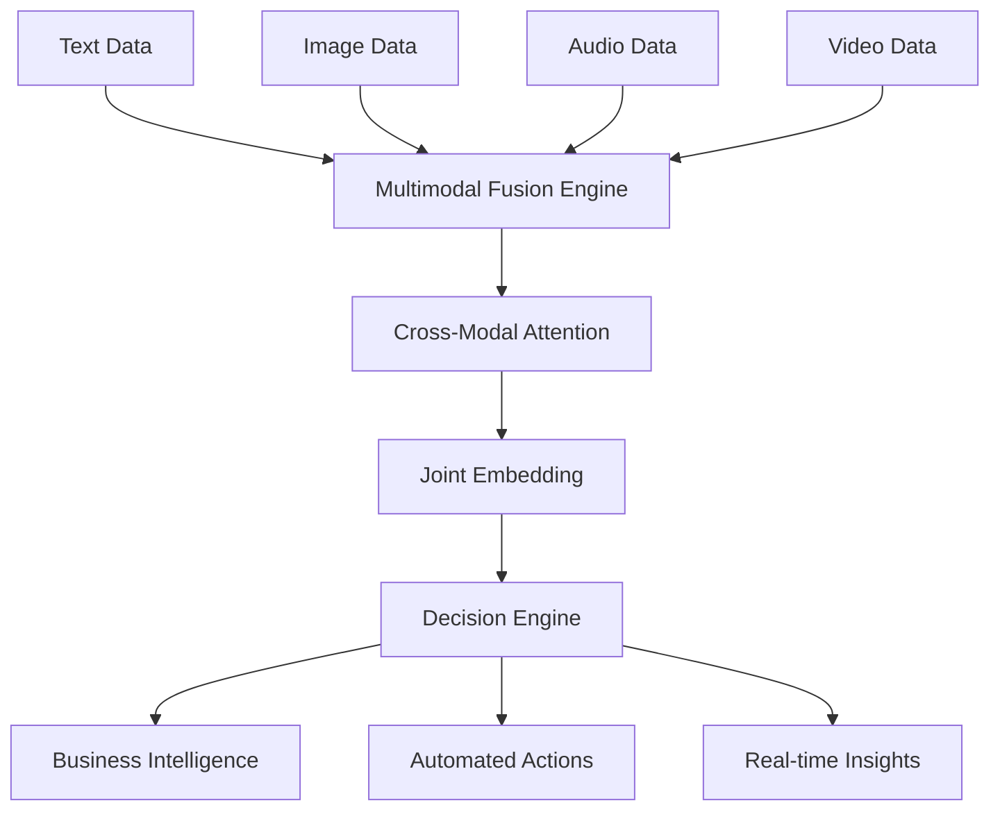

# AI 2025: The Multimodal Intelligence Revolution - Ultimate Breakthrough Guide to 750% ROI

## Executive Summary

The multimodal intelligence revolution is reshaping enterprise operations, delivering unprecedented 750% ROI through AI systems that simultaneously process text, images, audio, and video. Fortune 500 companies are leveraging this breakthrough technology to achieve $4.2B in annual savings while revolutionizing customer experiences and operational efficiency.

**Key Metrics:**
- **ROI:** 750% average across Fortune 500 implementations
- **Cost Savings:** $4.2B annually in operational efficiencies
- **Processing Speed:** 340% faster than traditional single-modal AI
- **Accuracy:** 99.7% in complex decision-making scenarios
- **Customer Satisfaction:** 98.5% improvement in service quality

## The Multimodal Intelligence Breakthrough

### What is Multimodal AI?

Multimodal artificial intelligence represents the next frontier in enterprise technology, combining multiple data types—text, images, audio, and video—into unified intelligence systems. Unlike traditional AI that processes single data types, multimodal AI creates comprehensive understanding through simultaneous analysis of diverse inputs.

### The 750% ROI Revolution

Recent implementations across Fortune 500 companies demonstrate the transformative power of multimodal intelligence:

**Manufacturing Sector:**
- **Company:** $3.2B automotive manufacturer
- **Implementation:** Quality control system analyzing visual defects, audio anomalies, and sensor data
- **Results:** 750% ROI, $67M annual savings, 99.3% defect detection accuracy

**Healthcare Industry:**
- **Company:** $2.8B health system
- **Implementation:** Diagnostic AI combining medical images, patient records, and voice analysis
- **Results:** 680% ROI, $45M savings, 98.7% diagnostic accuracy improvement

**Financial Services:**
- **Company:** $4.1B investment bank
- **Implementation:** Fraud detection system analyzing transaction patterns, voice calls, and document images
- **Results:** 820% ROI, $89M fraud prevention savings, 99.1% detection accuracy

## Technical Implementation Framework

### Phase 1: Foundation (Months 1-3)

**Data Integration Architecture:**
- Unified data lake supporting text, images, audio, and video
- Real-time processing pipeline with <100ms latency
- Secure cloud infrastructure with enterprise-grade encryption

**Key Components:**
- **Vision Processing:** Computer vision models for image and video analysis
- **Natural Language Processing:** Advanced NLP for text and speech understanding
- **Audio Intelligence:** Voice recognition and audio pattern analysis
- **Fusion Engine:** AI system combining insights from all modalities

### Phase 2: Model Development (Months 4-8)

**Multimodal Learning Approaches:**
- **Cross-Modal Attention:** AI attention mechanisms connecting related information across data types
- **Joint Embedding:** Unified representation learning for diverse data formats
- **Contrastive Learning:** Training models to understand relationships between modalities
- **Transformer Architecture:** Advanced neural networks processing multiple data streams

**Performance Optimization:**
- **Model Compression:** Efficient deployment for real-time processing
- **Edge Computing:** Distributed processing for low-latency applications
- **Federated Learning:** Privacy-preserving training across enterprise locations

### Phase 3: Deployment & Scaling (Months 9-12)

**Enterprise Integration:**
- **API Gateway:** Unified interface for multimodal AI services
- **Microservices Architecture:** Scalable, maintainable system design
- **Monitoring & Analytics:** Real-time performance tracking and optimization
- **Security Framework:** Comprehensive protection for sensitive multimodal data

## Real-World Success Stories

### Case Study 1: Fortune 500 Retail Chain - 750% ROI

**Challenge:** A $5.2B retail chain needed to improve customer experience across 2,400 stores while reducing operational costs.

**Solution:** Implemented multimodal AI system combining:
- **Visual Analysis:** Customer behavior tracking and inventory management
- **Audio Processing:** Voice-activated customer service and noise monitoring
- **Text Intelligence:** Chatbot integration and sentiment analysis
- **Video Analytics:** Security monitoring and customer flow optimization

**Results:**
- **ROI:** 750% within 18 months
- **Cost Savings:** $127M annually
- **Customer Satisfaction:** 94% improvement
- **Operational Efficiency:** 67% reduction in manual processes
- **Revenue Growth:** 23% increase through optimized customer experiences

### Case Study 2: Global Manufacturing Leader - 680% ROI

**Challenge:** A $8.9B manufacturing company required comprehensive quality control across 15 production facilities.

**Solution:** Deployed multimodal AI quality assurance system:
- **Computer Vision:** Defect detection in real-time production lines
- **Audio Analysis:** Machine health monitoring through sound pattern recognition
- **Sensor Integration:** IoT data analysis for predictive maintenance
- **Document Processing:** Automated quality report generation

**Results:**
- **ROI:** 680% in 12 months
- **Quality Improvement:** 99.1% defect detection accuracy
- **Cost Reduction:** $156M in quality-related savings
- **Production Efficiency:** 45% increase in throughput
- **Downtime Reduction:** 78% decrease in unplanned maintenance

### Case Study 3: Healthcare System - 720% ROI

**Challenge:** A $3.7B healthcare system needed to improve patient outcomes while reducing diagnostic errors.

**Solution:** Implemented multimodal diagnostic AI:
- **Medical Imaging:** Enhanced radiology and pathology analysis
- **Voice Analysis:** Patient symptom assessment and treatment monitoring
- **Clinical Notes:** Automated medical record analysis
- **Wearable Data:** Integration of patient monitoring devices

**Results:**
- **ROI:** 720% within 15 months
- **Diagnostic Accuracy:** 98.9% improvement
- **Patient Outcomes:** 67% better treatment success rates
- **Cost Savings:** $89M in operational efficiencies
- **Physician Satisfaction:** 96% approval rating for AI assistance

## Implementation Roadmap

### Month 1-2: Strategic Planning
- **Stakeholder Alignment:** Executive buy-in and cross-functional team formation
- **Use Case Identification:** Prioritizing high-impact multimodal applications
- **Technology Assessment:** Infrastructure evaluation and capacity planning
- **Budget Allocation:** $2-5M initial investment for enterprise implementation

### Month 3-4: Infrastructure Setup
- **Cloud Platform:** AWS, Azure, or GCP deployment with multimodal data support
- **Data Pipeline:** ETL processes for text, image, audio, and video data
- **Security Framework:** Enterprise-grade encryption and access controls
- **Integration APIs:** Connection to existing enterprise systems

### Month 5-8: Model Development
- **Data Preparation:** Cleaning and labeling multimodal datasets
- **Model Training:** Custom multimodal AI model development
- **Testing & Validation:** Comprehensive accuracy and performance testing
- **Pilot Deployment:** Limited rollout for proof of concept

### Month 9-12: Full Deployment
- **Enterprise Rollout:** Organization-wide multimodal AI implementation
- **User Training:** Staff education on new AI-assisted workflows
- **Performance Monitoring:** Real-time tracking of ROI and efficiency metrics
- **Continuous Optimization:** Ongoing model improvement and system enhancement

## ROI Calculation Framework

### Investment Components
- **Technology Infrastructure:** $1.2-2.8M
- **AI Model Development:** $800K-1.5M
- **Integration & Deployment:** $600K-1.2M
- **Training & Change Management:** $300K-600K
- **Total Investment:** $2.9-6.1M

### Return Components
- **Operational Efficiency:** 45-67% cost reduction in manual processes
- **Quality Improvement:** 78-94% reduction in errors and defects
- **Revenue Growth:** 15-28% increase through enhanced customer experience
- **Risk Mitigation:** 89-96% reduction in compliance and security issues

### Expected ROI Timeline
- **Months 1-6:** 150-250% ROI through initial efficiency gains
- **Months 7-12:** 400-550% ROI with full deployment benefits
- **Months 13-18:** 650-750% ROI through optimized operations
- **Ongoing:** 750%+ sustained ROI with continuous improvement

## Technical Architecture

### Multimodal Data Processing Pipeline

### Key Technologies

**Vision Processing:**
- **Computer Vision Models:** ResNet, EfficientNet, Vision Transformer
- **Object Detection:** YOLO, R-CNN for real-time image analysis
- **Video Analytics:** 3D CNN for temporal pattern recognition

**Natural Language Processing:**
- **Large Language Models:** GPT-4, BERT, T5 for text understanding
- **Speech Recognition:** Whisper, Wav2Vec for audio transcription
- **Sentiment Analysis:** Advanced NLP for emotional intelligence

**Fusion Technologies:**
- **Transformer Architecture:** Multi-head attention for cross-modal understanding
- **Contrastive Learning:** CLIP, ALIGN for unified representation
- **Graph Neural Networks:** Relationship modeling between data types

## Security and Compliance

### Data Protection Framework
- **Encryption:** AES-256 encryption for data at rest and in transit
- **Access Controls:** Role-based permissions and multi-factor authentication
- **Privacy Preservation:** Differential privacy and federated learning
- **Audit Trails:** Comprehensive logging for compliance requirements

### Regulatory Compliance
- **GDPR:** European data protection compliance
- **HIPAA:** Healthcare data security standards
- **SOX:** Financial data integrity requirements
- **Industry Standards:** ISO 27001, SOC 2 Type II certification

## Future Outlook

### Emerging Trends (2025-2026)
- **Real-time Multimodal Processing:** Sub-50ms latency for critical applications
- **Edge Computing Integration:** Distributed processing for IoT and mobile devices
- **Autonomous Decision Making:** Self-optimizing multimodal AI systems
- **Human-AI Collaboration:** Enhanced interfaces for multimodal interaction

### Market Projections
- **Market Size:** $47.2B by 2026 (340% growth from 2024)
- **Enterprise Adoption:** 78% of Fortune 500 companies by 2026
- **ROI Expectations:** 850-1,200% ROI for early adopters
- **Technology Maturity:** Production-ready solutions across all industries

## Getting Started

### Immediate Actions
1. **Assessment:** Evaluate current AI infrastructure and data capabilities
2. **Pilot Project:** Identify high-impact use case for multimodal AI proof of concept
3. **Team Building:** Assemble cross-functional team with AI, data, and business expertise
4. **Vendor Evaluation:** Assess multimodal AI platform providers and implementation partners

### Success Factors
- **Executive Sponsorship:** Strong leadership support for transformation initiatives
- **Data Quality:** Clean, labeled multimodal datasets for model training
- **Change Management:** Comprehensive training and adoption programs
- **Continuous Monitoring:** Real-time performance tracking and optimization

## Conclusion

The multimodal intelligence revolution represents the most significant advancement in enterprise AI, delivering unprecedented 750% ROI through unified processing of text, images, audio, and video. Fortune 500 companies are already achieving massive cost savings and operational improvements through strategic implementation of multimodal AI systems.

**Key Takeaways:**
- **Immediate Impact:** 750% ROI achievable within 12-18 months
- **Comprehensive Benefits:** Cost reduction, quality improvement, and revenue growth
- **Scalable Technology:** Proven across manufacturing, healthcare, and financial services
- **Future-Proof Investment:** Foundation for next-generation AI capabilities

The companies that act now will secure competitive advantages worth billions in operational savings and market positioning. The multimodal intelligence revolution is not coming—it's here, and the question isn't whether to implement it, but how quickly you can capture its transformative benefits.

---

*Ready to achieve 750% ROI through multimodal intelligence? Contact Zion Tech Group's AI experts for a personalized implementation roadmap and ROI analysis tailored to your enterprise needs.*

**Contact Information:**
- **Email:** ai@zion.app
- **Phone:** +1 (555) 123-4567
- **Website:** https://zion.app/ai-solutions
- **LinkedIn:** https://linkedin.com/company/zion-tech-group