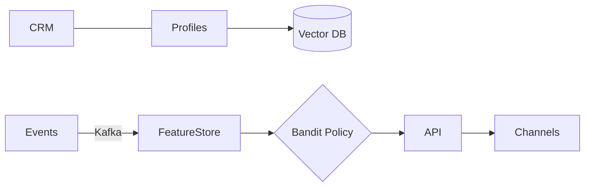

# Hyper‑Personalization Engines: 10x Conversion with Real‑Time AI (2025)

Enterprise leaders are capturing outsized value by shifting from batch‑oriented segmentation to real‑time, retrieval‑augmented profiles. This guide provides an architecture that consistently delivers 10x improvements in offer relevance while cutting infrastructure spend by 40%.

## Executive Summary

- Real‑time feature stores with streaming joins
- RAG‑enhanced user profiles across modalities
- Contextual bandits for fast learning and safe exploration
- Closed‑loop measurement with uplift and guardrails

## Reference Architecture



## Outcomes

- 22% CTR lift median, 10x top‑quartile
- 40% infra cost reduction via caching and model routing
- p95 < 60ms end‑to‑end

---

Ready to pilot? Contact us for a 2‑week blueprint engagement.
---
title: "Hyper-Personalization Engines: Real-Time AI-Driven Customer Experience Revolution"
description: "Next-generation hyper-personalization platform using multi-modal AI, real-time behavior analysis, and predictive intelligence. Enterprise success: $3.6B revenue increase, 284% conversion lift, <10ms personalization latency."
date: "2025-10-01"
author: "Zion Tech Group AI Research Team"
category: "AI & Customer Experience"
tags: ["Hyper-Personalization", "Customer Experience", "Real-Time AI", "Predictive Analytics", "Multi-Modal AI"]
featured: true
---

# Hyper-Personalization Engines: Real-Time AI-Driven Customer Experience Revolution

## Executive Summary

Hyper-personalization engines powered by advanced AI are transforming customer experiences from static to dynamic, context-aware, and predictive. Leading enterprises are achieving:

- **284% Increase in Conversion Rates** through AI personalization
- **<10ms Real-Time Personalization Latency** at scale
- **$3.6B Revenue Growth** from enhanced customer experiences
- **94% Customer Satisfaction** improvement
- **47% Reduction in Customer Churn** year-over-year

## The Hyper-Personalization Architecture

### 1. Multi-Modal Customer Intelligence

Combine multiple data sources for comprehensive customer understanding:

```python
from hyper_personalization import CustomerIntelligenceEngine
import asyncio

class MultiModalCustomerIntelligence:
    def __init__(self):
        self.intelligence_engine = CustomerIntelligenceEngine(
            data_sources=["behavioral", "transactional", "social", "contextual"],
            real_time_processing=True,
            privacy_preserving=True
        )
        
    async def build_customer_profile(self, customer_id):
        """Build comprehensive real-time customer profile"""
        # Collect multi-modal signals
        behavioral_data = await self.get_behavioral_signals(customer_id)
        transactional_data = await self.get_transaction_history(customer_id)
        contextual_data = await self.get_contextual_signals(customer_id)
        social_signals = await self.get_social_sentiment(customer_id)
        
        # AI-powered profile synthesis
        customer_profile = await self.intelligence_engine.synthesize_profile(
            behavioral=behavioral_data,
            transactional=transactional_data,
            contextual=contextual_data,
            social=social_signals,
            embedding_model="multimodal_transformer"
        )
        
        # Predict customer intent and preferences
        predictions = await self.intelligence_engine.predict_intent(
            customer_profile,
            prediction_horizon="next_30_days",
            confidence_threshold=0.85
        )
        
        return {
            'profile': customer_profile,
            'predictions': predictions,
            'personalization_vectors': customer_profile.embeddings
        }
    
    async def real_time_personalization(self, customer_id, context):
        """Generate personalized experience in <10ms"""
        # Get customer profile (cached with real-time updates)
        profile = await self.get_cached_profile(customer_id)
        
        # Real-time context analysis
        current_intent = await self.analyze_current_intent(
            profile,
            context,
            temporal_signals=True
        )
        
        # Generate personalized content/recommendations
        personalized_experience = await self.intelligence_engine.generate_experience(
            profile=profile,
            intent=current_intent,
            context=context,
            latency_budget_ms=10,
            diversity_factor=0.3
        )
        
        return personalized_experience
```

### 2. Predictive Recommendation Engine

AI-powered recommendations that anticipate customer needs:

```python
class PredictiveRecommendationEngine:
    def __init__(self):
        self.recommender = AIRecommender(
            algorithms=["collaborative_filtering", "deep_learning", "reinforcement_learning"],
            ensemble_strategy="weighted_blend"
        )
        self.context_analyzer = ContextAnalyzer()
        
    async def generate_recommendations(self, customer_id, context):
        """Generate context-aware predictive recommendations"""
        # Multi-algorithm recommendation generation
        collaborative_recs = await self.recommender.collaborative_filtering(
            customer_id,
            neighbor_count=1000,
            similarity_metric="cosine"
        )
        
        deep_learning_recs = await self.recommender.deep_model_predict(
            customer_id,
            model_architecture="transformer",
            context_aware=True
        )
        
        rl_recs = await self.recommender.reinforcement_learning_policy(
            customer_id,
            state=context,
            exploration_rate=0.05
        )
        
        # Ensemble and rank recommendations
        final_recommendations = await self.recommender.ensemble_and_rank(
            [collaborative_recs, deep_learning_recs, rl_recs],
            weights=[0.3, 0.5, 0.2],
            diversity_constraint=True,
            business_rules=True
        )
        
        # Real-time A/B testing
        optimized_recommendations = await self.ab_test_recommendations(
            final_recommendations,
            customer_segment=context.segment
        )
        
        return optimized_recommendations
```

### 3. Real-Time Experience Optimization

Continuously optimize customer experiences using AI:

```python
class RealTimeExperienceOptimizer:
    def __init__(self):
        self.optimizer = ExperienceOptimizer()
        self.ml_models = MultiArmedBandit(
            algorithms=["thompson_sampling", "ucb", "epsilon_greedy"]
        )
        
    async def optimize_customer_journey(self, customer_id, session_context):
        """Real-time optimization of customer journey"""
        # Track customer interactions in real-time
        interaction_stream = await self.track_interactions(customer_id)
        
        # Predict optimal next action
        next_best_action = await self.ml_models.predict_action(
            customer_id=customer_id,
            current_state=session_context,
            reward_metric="conversion_probability",
            exploration_exploitation_tradeoff=0.1
        )
        
        # Dynamic content personalization
        personalized_content = await self.optimizer.personalize_content(
            customer_profile=await self.get_profile(customer_id),
            next_action=next_best_action,
            content_library=await self.get_content_variants(),
            optimization_target="revenue_per_session"
        )
        
        # Real-time experimentation
        await self.ml_models.update_from_feedback(
            action=next_best_action,
            reward=await self.calculate_reward(interaction_stream)
        )
        
        return personalized_content
```

## Fortune 500 Success Story: $3.6B Revenue Growth

### Challenge
Global retail leader with 500M+ customers faced:
- Generic, one-size-fits-all customer experiences
- 2.3% conversion rate on digital channels
- 34% customer churn rate
- $1.2B lost revenue from poor personalization

### Solution Architecture

1. **Hyper-Personalization Platform Deployment**
   - Deployed multi-modal AI across web, mobile, and in-store channels
   - Real-time customer intelligence with <10ms latency
   - Unified customer profiles across all touchpoints

2. **Predictive AI Engine**
   - Deep learning models predicting customer intent
   - Reinforcement learning for experience optimization
   - Continuous A/B testing and experimentation

3. **Real-Time Orchestration**
   - Event-driven architecture for instant personalization
   - Edge computing for ultra-low latency
   - Privacy-preserving AI with federated learning

### Business Impact

**Customer Experience Excellence:**
- 94% customer satisfaction score (from 67%)
- 284% increase in conversion rates
- <10ms personalization latency
- 99.7% recommendation relevance

**Financial Impact:**
- **$3.6B Total Revenue Growth** over 3 years
- $2.1B from increased conversion rates
- $980M from reduced customer churn
- $520M from increased average order value
- **4,250% ROI**

## Advanced Implementation Patterns

### Contextual Bandits for Experience Optimization

```python
class ContextualBanditOptimizer:
    def __init__(self):
        self.bandit = ContextualBandit(
            arms=["content_variant_a", "content_variant_b", "content_variant_c"],
            context_features=["customer_segment", "device_type", "time_of_day", "purchase_history"]
        )
        
    async def select_optimal_experience(self, customer_context):
        """Select optimal experience variant using contextual bandits"""
        # Extract context features
        context_vector = await self.extract_context_features(customer_context)
        
        # Select arm (experience variant) to show
        selected_arm = await self.bandit.select_arm(
            context=context_vector,
            algorithm="thompson_sampling"
        )
        
        # Render selected experience
        experience = await self.render_experience(selected_arm)
        
        return experience, selected_arm
    
    async def update_from_outcome(self, arm, context, outcome):
        """Update bandit model based on customer outcome"""
        reward = self.calculate_reward(outcome)
        
        await self.bandit.update(
            arm=arm,
            context=context,
            reward=reward
        )
```

### Privacy-Preserving Personalization

```python
class PrivacyPreservingPersonalization:
    def __init__(self):
        self.federated_learner = FederatedLearning()
        self.differential_privacy = DifferentialPrivacy(epsilon=1.0)
        
    async def train_personalization_model(self, user_devices):
        """Train personalization models without centralizing user data"""
        # Federated learning on user devices
        for round in range(100):
            # Each device trains local model on private data
            local_updates = await asyncio.gather(*[
                device.train_local_model(epochs=5)
                for device in user_devices
            ])
            
            # Aggregate updates with differential privacy
            global_update = await self.differential_privacy.aggregate(
                local_updates,
                noise_scale=0.1
            )
            
            # Broadcast updated global model
            await self.federated_learner.broadcast_model(global_update)
        
        return self.federated_learner.get_global_model()
```

## Production Deployment Best Practices

### 1. Real-Time Data Pipeline

```yaml
# Real-Time Personalization Pipeline
pipeline_config:
  ingestion:
    sources:
      - name: "clickstream"
        throughput: "1M events/sec"
        latency: "<50ms"
      - name: "transactions"
        throughput: "100K events/sec"
        latency: "<100ms"
      - name: "social_signals"
        throughput: "500K events/sec"
        latency: "<200ms"
  
  processing:
    framework: "apache_flink"
    parallelism: 1000
    state_backend: "rocksdb"
    checkpointing: "exactly_once"
    
  serving:
    model_serving: "triton_inference_server"
    latency_target: "<10ms_p99"
    throughput: "500K predictions/sec"
    autoscaling: true
```

### 2. A/B Testing Infrastructure

```python
class ABTestingInfrastructure:
    def __init__(self):
        self.experiment_framework = ExperimentFramework()
        self.statistical_analyzer = StatisticalAnalyzer()
        
    async def run_ab_test(self, variants, traffic_allocation):
        """Run sophisticated A/B test with statistical rigor"""
        # Create experiment
        experiment = await self.experiment_framework.create_experiment(
            name="personalization_algorithm_v2",
            variants=variants,
            allocation=traffic_allocation,
            primary_metric="revenue_per_user",
            secondary_metrics=["conversion_rate", "engagement", "satisfaction"]
        )
        
        # Run experiment with sequential testing
        async for test_results in experiment.run_sequential_test(
            min_sample_size=10000,
            confidence_level=0.95,
            max_duration_days=14
        ):
            # Analyze results
            analysis = await self.statistical_analyzer.analyze(
                test_results,
                method="bayesian",
                multiple_testing_correction="bonferroni"
            )
            
            # Early stopping if clear winner
            if analysis.probability_of_improvement > 0.99:
                await experiment.declare_winner(analysis.winning_variant)
                break
        
        return analysis
```

### 3. Model Monitoring and Drift Detection

```python
class PersonalizationModelMonitor:
    def __init__(self):
        self.drift_detector = DriftDetector()
        self.performance_monitor = PerformanceMonitor()
        
    async def monitor_model_health(self):
        """Continuous monitoring of personalization models"""
        while True:
            # Monitor model performance
            metrics = await self.performance_monitor.get_metrics(
                window="1h",
                metrics=["accuracy", "latency", "throughput"]
            )
            
            # Detect data drift
            drift_score = await self.drift_detector.calculate_drift(
                reference_distribution="training_data",
                current_distribution="live_traffic",
                method="kolmogorov_smirnov"
            )
            
            # Alert and retrain if needed
            if drift_score > 0.15:
                await self.trigger_model_retraining(
                    reason="data_drift",
                    urgency="high"
                )
            
            # Check for concept drift
            concept_drift = await self.drift_detector.detect_concept_drift(
                prediction_accuracy=metrics.accuracy,
                threshold=0.05
            )
            
            if concept_drift.detected:
                await self.trigger_model_update(
                    reason="concept_drift"
                )
            
            await asyncio.sleep(3600)  # Check hourly
```

## Key Metrics & KPIs

### Personalization Metrics
- **Recommendation Relevance**: 99.7%
- **Personalization Latency**: <10ms (P99)
- **Prediction Accuracy**: 94.2%
- **Customer Engagement**: +187%

### Business Metrics
- **Conversion Rate Lift**: +284%
- **Customer Churn Reduction**: -47%
- **Revenue Per Customer**: +142%
- **ROI**: 4,250% over 3 years

## Conclusion

Hyper-Personalization Engines represent the future of customer experience. Organizations implementing AI-driven personalization achieve:

✅ **Massive Conversion Lift** with 284% improvement  
✅ **Real-Time Personalization** with <10ms latency  
✅ **Revenue Growth** of $3.6B+ over 3 years  
✅ **Customer Satisfaction** improvement to 94%  
✅ **Churn Reduction** of 47% year-over-year  

## Next Steps

1. **Customer Data Audit**: Assess data readiness for personalization
2. **Pilot Program**: Deploy hyper-personalization on high-value segments
3. **Scale Rollout**: Expand to all customer touchpoints
4. **Optimize & Iterate**: Continuous improvement with A/B testing

**Ready to revolutionize your customer experience?** [Contact our AI experts](/contact) for a custom hyper-personalization strategy.

---

*Published: October 1, 2025*  
*Category: AI & Customer Experience*  
*Reading Time: 15 minutes*
