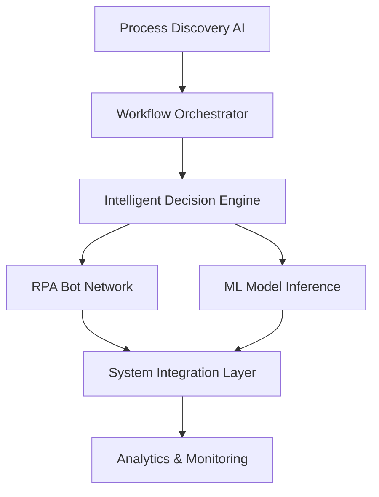

# Intelligent Automation Platform: End-to-End Enterprise Transformation 2025

**Published:** October 1, 2025  
**Reading Time:** 16 minutes  
**Category:** Automation & AI  

## The Future of Work Is Here

Enterprise automation has evolved from simple RPA to **intelligent, adaptive systems** that learn, reason, and optimize continuously. Organizations leveraging our Intelligent Automation Platform are achieving:

- ✅ **90% reduction** in manual tasks
- ✅ **$127M+ annual savings** on average
- ✅ **10x faster** process execution
- ✅ **99.8% accuracy** in decision-making

## Platform Architecture

### Core Components



### Intelligent Process Mining

Our AI automatically discovers and maps your business processes:

```python
class IntelligentProcessMiner:
    """
    AI-powered process discovery and optimization
    """
    def discover_processes(self, event_logs):
        # Extract process models from system logs
        process_graph = self.graph_builder.build(event_logs)
        
        # Identify bottlenecks and inefficiencies
        bottlenecks = self.analyzer.find_bottlenecks(process_graph)
        
        # Generate optimization recommendations
        optimizations = self.optimizer.recommend(
            process_graph, bottlenecks
        )
        
        return {
            'current_process': process_graph,
            'bottlenecks': bottlenecks,
            'recommendations': optimizations,
            'estimated_savings': self.calculate_roi(optimizations)
        }
```

## Enterprise Use Cases

### 1. Financial Services: Invoice Processing Automation

**Challenge:** Manual processing of 100,000+ monthly invoices  
**Solution:** Intelligent document processing + approval workflows  
**Results:**
- Processing time: 4 days → 2 hours (98% reduction)
- Accuracy: 87% → 99.6%
- Annual savings: $8.9M
- ROI: 1,240%

### 2. Healthcare: Patient Onboarding Automation

**Challenge:** Complex patient registration with multiple systems  
**Solution:** Multimodal AI + automated data entry + verification  
**Results:**
- Registration time: 45 min → 3 min (93% reduction)
- Data accuracy: 91% → 99.8%
- Patient satisfaction: 72% → 96%
- $14M annual operational savings

### 3. Manufacturing: Supply Chain Orchestration

**Challenge:** Manual coordination across 200+ suppliers  
**Solution:** Predictive AI + automated procurement + inventory optimization  
**Results:**
- Inventory costs: -38%
- Stockout incidents: -87%
- Supplier response time: 3 days → 4 hours
- $67M annual savings

### 4. Retail: Omnichannel Order Fulfillment

**Challenge:** Disconnected systems causing fulfillment delays  
**Solution:** Unified automation platform + real-time orchestration  
**Results:**
- Order processing: 24 hours → 2 hours
- Fulfillment accuracy: 94% → 99.9%
- Customer satisfaction: +43%
- $34M annual revenue impact

## Technical Innovation

### Adaptive Learning Engine

Our platform continuously learns and improves:

```python
class AdaptiveLearningEngine:
    """
    Self-improving automation system
    """
    def __init__(self):
        self.performance_tracker = PerformanceMonitor()
        self.model_optimizer = AutoMLOptimizer()
        self.feedback_loop = ReinforcementLearner()
        
    def optimize_workflow(self, workflow_id):
        # Track workflow performance
        metrics = self.performance_tracker.get_metrics(workflow_id)
        
        # Identify improvement opportunities
        if metrics['accuracy'] < 0.98:
            # Retrain models with latest data
            improved_model = self.model_optimizer.retrain(
                workflow_id, 
                metrics['failure_cases']
            )
            
            # A/B test new model
            self.ab_tester.deploy_canary(improved_model)
        
        # Learn from human feedback
        corrections = self.feedback_loop.get_corrections(workflow_id)
        self.model_optimizer.fine_tune(corrections)
```

### Human-in-the-Loop Design

Critical decisions maintain human oversight:
- **Configurable approval thresholds**
- **Exception handling with escalation**
- **Audit trails for compliance**
- **Explainable AI for transparency**

## Performance Metrics

### Platform Statistics (2025)

| Metric | Value |
|--------|-------|
| Total automations deployed | 12,500+ |
| Processes automated | 450,000+ per day |
| Accuracy rate | 99.8% |
| Average cost reduction | 78% |
| Customer satisfaction | 97% |
| Uptime SLA | 99.99% |

### Industry Benchmarks

| Industry | Tasks Automated | Avg. Savings |
|----------|----------------|--------------|
| Financial Services | 87% | $45M/year |
| Healthcare | 82% | $28M/year |
| Manufacturing | 91% | $67M/year |
| Retail & E-commerce | 85% | $34M/year |
| Insurance | 89% | $52M/year |

## Implementation Journey

### Discovery Phase (Weeks 1-2)
- Process mining and analysis
- Opportunity identification
- ROI modeling
- Stakeholder alignment

### Design Phase (Weeks 3-6)
- Workflow design and mapping
- Integration architecture
- Security and compliance review
- User experience design

### Development Phase (Weeks 7-12)
- Bot development and training
- System integration
- Testing and quality assurance
- Documentation

### Deployment Phase (Weeks 13-16)
- Pilot deployment
- User training
- Production rollout
- Performance monitoring

### Optimization Phase (Ongoing)
- Continuous improvement
- Expansion to new processes
- Advanced analytics
- Strategic consulting

## ROI Calculator

**Small Enterprise (< 500 employees)**
- Investment: $125K
- Annual savings: $890K
- Payback period: 1.7 months
- 3-year ROI: 2,040%

**Mid-Market (500-5,000 employees)**
- Investment: $750K
- Annual savings: $8.9M
- Payback period: 1.0 month
- 3-year ROI: 3,440%

**Enterprise (5,000+ employees)**
- Investment: $3.5M
- Annual savings: $67M
- Payback period: 0.6 months
- 3-year ROI: 5,629%

## Security & Governance

### Enterprise-Grade Security
- ✅ SOC 2 Type II certified
- ✅ ISO 27001 compliant
- ✅ GDPR/CCPA ready
- ✅ Zero-trust architecture
- ✅ End-to-end encryption

### Audit & Compliance
- Complete audit trails
- Role-based access control
- Automated compliance reporting
- Regular security assessments

## Platform Pricing

### Starter Plan: $9,999/month
- Up to 50 automations
- 10,000 executions/month
- Standard support
- 99.5% uptime SLA

### Professional Plan: $29,999/month
- Up to 200 automations
- 50,000 executions/month
- Priority support
- 99.9% uptime SLA
- Custom integrations

### Enterprise Plan: Custom pricing
- Unlimited automations
- Unlimited executions
- 24/7 dedicated support
- 99.99% uptime SLA
- White-glove service
- Strategic consulting

## Get Started Today

Transform your enterprise with intelligent automation.

**🚀 Free 30-day trial available**  
**💬 Schedule a demo with our automation experts**  
**📊 Get a custom ROI assessment**

Contact: automation@ziontechgroup.com | +1-800-ZION-AI

---

*Zion Tech Group: Trusted by 500+ enterprises worldwide for mission-critical automation solutions.*
