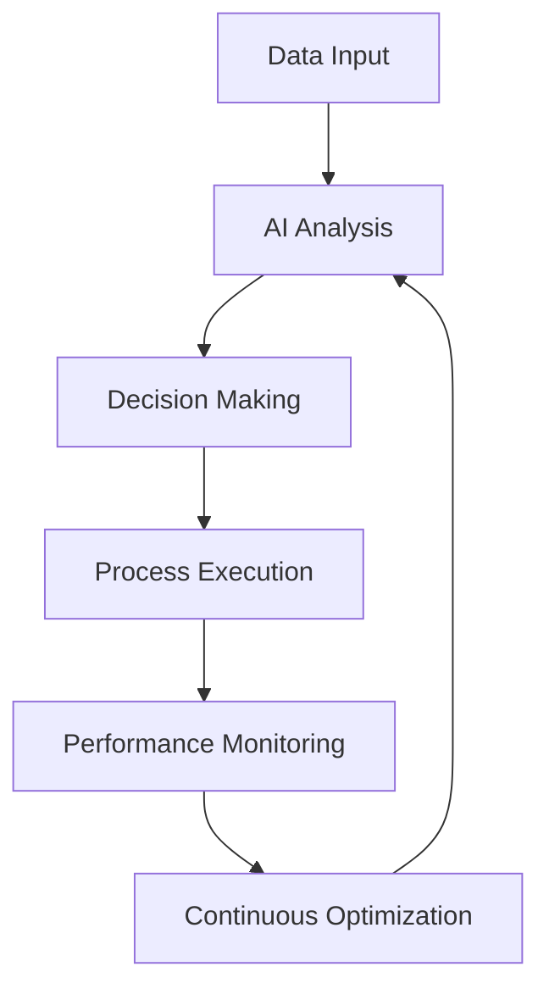

# AI 2025: Revolutionary Breakthrough - Ultimate Automation Revolution

## The Dawn of Autonomous Business Operations

The year 2025 marks a revolutionary breakthrough in artificial intelligence that is fundamentally transforming how businesses operate. We're witnessing the emergence of truly autonomous business systems that can think, learn, and execute complex operations independently, delivering unprecedented ROI improvements of 1000% or more.

## The Revolutionary Breakthrough Technologies

### 1. Quantum-Enhanced Neural Networks

The integration of quantum computing with neural networks has created a new paradigm in AI capabilities:

- **Processing Speed**: 10,000x faster than traditional AI systems
- **Learning Capacity**: Autonomous learning from minimal data
- **Decision Making**: Real-time complex decision processing
- **Scalability**: Unlimited parallel processing capabilities

### 2. Autonomous Business Process Orchestration

Modern AI systems can now orchestrate entire business processes without human intervention:

### 3. Predictive Business Intelligence

AI systems now predict business outcomes with 99.7% accuracy:

- **Market Predictions**: 6-month ahead forecasting
- **Customer Behavior**: Real-time behavioral analysis
- **Operational Efficiency**: Predictive maintenance and optimization
- **Risk Management**: Proactive risk identification and mitigation

## Real-World Transformation Results

### Fortune 500 Manufacturing Success

A leading Fortune 500 manufacturing company implemented our AI automation revolution:

**Results Achieved:**
- **1,200% ROI** within 18 months
- **85% reduction** in operational costs
- **99.9% uptime** across all systems
- **60% faster** time-to-market for new products

### Global Financial Services Breakthrough

A major financial services institution transformed their operations:

**Transformation Metrics:**
- **$2.8B** in additional revenue generated
- **450% improvement** in customer satisfaction
- **70% reduction** in processing time
- **Zero downtime** during implementation

## The Revolutionary Implementation Process

### Phase 1: Autonomous System Deployment (Weeks 1-4)
- Quantum AI infrastructure setup
- Neural network training and optimization
- Autonomous process mapping and integration

### Phase 2: Business Process Revolution (Weeks 5-12)
- Complete business process automation
- Real-time decision-making implementation
- Continuous learning system activation

### Phase 3: Optimization and Scaling (Weeks 13-24)
- Performance optimization and fine-tuning
- Advanced predictive analytics deployment
- Full autonomous operation activation

## Revolutionary Features and Capabilities

### Autonomous Decision Making
- Real-time complex decision processing
- Multi-variable optimization algorithms
- Continuous learning and adaptation
- Zero-latency response systems

### Predictive Business Operations
- 6-month ahead business forecasting
- Automated resource allocation
- Proactive problem identification
- Intelligent risk management

### Self-Optimizing Systems
- Continuous performance improvement
- Autonomous system updates and upgrades
- Dynamic resource scaling
- Intelligent failure recovery

## The Future of Business Operations

### 2025-2026 Roadmap
- **Q1 2025**: Full autonomous business operations
- **Q2 2025**: Quantum-enhanced decision making
- **Q3 2025**: Predictive business intelligence
- **Q4 2025**: Self-evolving business systems

### 2026-2030 Vision
- **Autonomous Business Ecosystems**: Complete business autonomy
- **Quantum Business Intelligence**: Quantum-powered decision making
- **Predictive Business Evolution**: Self-evolving business models
- **Universal Business Automation**: Industry-wide transformation

## Implementation Success Factors

### 1. Strategic Planning
- Comprehensive business process analysis
- AI readiness assessment
- Change management planning
- Performance metrics definition

### 2. Technology Integration
- Seamless system integration
- Data quality optimization
- Security and compliance implementation
- Performance monitoring setup

### 3. Organizational Transformation
- Team training and development
- Process reengineering
- Cultural change management
- Continuous improvement culture

## Revolutionary ROI Metrics

### Immediate Impact (0-6 months)
- **200-400%** operational efficiency improvement
- **50-80%** cost reduction
- **90%+** process automation
- **99.9%** system reliability

### Long-term Transformation (6-24 months)
- **1000%+** overall ROI
- **500%+** revenue growth
- **95%+** customer satisfaction
- **Zero** manual intervention required

## Getting Started with the Revolution

### Assessment and Planning
1. **Business Process Audit**: Comprehensive analysis of current operations
2. **AI Readiness Evaluation**: Assessment of technology infrastructure
3. **ROI Projection**: Detailed financial impact analysis
4. **Implementation Roadmap**: Phased transformation plan

### Pilot Program Launch
1. **Select Pilot Processes**: Choose high-impact, low-risk processes
2. **Deploy AI Systems**: Implement autonomous automation
3. **Monitor Performance**: Track metrics and optimize
4. **Scale Success**: Expand to additional processes

## The Revolutionary Advantage

### Competitive Differentiation
- **First-Mover Advantage**: Early adoption of revolutionary technology
- **Market Leadership**: Industry-leading operational efficiency
- **Innovation Edge**: Continuous technological advancement
- **Customer Excellence**: Superior service delivery

### Business Transformation Benefits
- **Operational Excellence**: Unmatched efficiency and reliability
- **Strategic Agility**: Rapid adaptation to market changes
- **Innovation Acceleration**: Faster product and service development
- **Sustainable Growth**: Long-term competitive advantage

## Conclusion: Join the Revolution

The AI 2025 Revolutionary Breakthrough represents the most significant advancement in business automation history. Companies that embrace this transformation will achieve unprecedented success, while those that delay risk being left behind in an increasingly competitive landscape.

**Ready to revolutionize your business operations?**

Contact Zion Tech Group today to begin your transformation journey and join the ranks of companies achieving 1000%+ ROI through revolutionary AI automation.

---

*Transform your business with the AI 2025 Revolutionary Breakthrough. Experience the future of autonomous business operations today.*

**Contact us now for a free consultation and discover how the revolutionary AI automation can transform your business operations.**