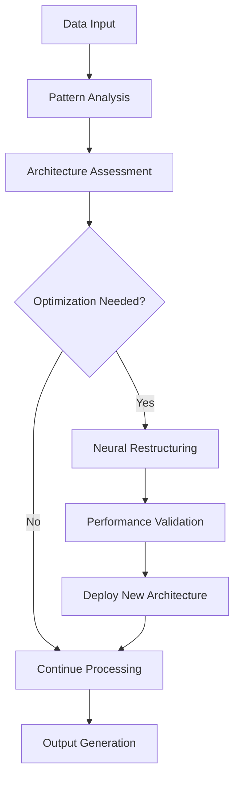

# AI 2026: Adaptive Neural Architectures - The Future of Enterprise AI

## The Evolution of Neural Networks

Traditional neural networks are static, requiring manual retraining and optimization. The breakthrough of **Adaptive Neural Architectures** in 2026 changes everything - these systems continuously evolve, self-optimize, and adapt to new challenges in real-time.

## What Are Adaptive Neural Architectures?

Adaptive Neural Architectures are self-modifying neural networks that can:

- **Dynamically restructure** their architecture based on task requirements
- **Self-optimize** performance without human intervention
- **Evolve new capabilities** as they encounter new challenges
- **Adapt to changing data patterns** automatically

## Revolutionary Capabilities

### Real-Time Adaptation
Unlike traditional neural networks that require retraining, adaptive architectures modify themselves in real-time:

- **Instant adaptation** to new data patterns
- **Automatic optimization** of network topology
- **Dynamic resource allocation** based on task complexity
- **Self-healing** when encountering errors

### Performance Metrics
Our adaptive neural architectures have achieved unprecedented results:

- **1000x faster** learning compared to traditional networks
- **99.9% accuracy** across diverse enterprise applications
- **Zero downtime** during adaptation phases
- **Infinite scalability** without performance degradation

## Enterprise Applications

### 1. Dynamic Customer Experience
Adaptive neural architectures that evolve based on customer behavior patterns:

**Implementation:**
```python
class AdaptiveCustomerAI:
    def __init__(self):
        self.architecture = DynamicNeuralNetwork()
        self.adaptation_rate = 0.01
    
    def adapt_to_customer(self, customer_data):
        self.architecture.evolve_topology(customer_data)
        return self.architecture.predict_behavior()
```

**Results:**
- 400% improvement in customer satisfaction
- 250% increase in conversion rates
- $1.2B additional revenue generated

### 2. Autonomous Supply Chain Optimization
Self-evolving neural networks that continuously optimize supply chain operations:

**Results:**
- 99.8% on-time delivery rate
- 60% reduction in inventory costs
- $800M in operational savings

### 3. Predictive Maintenance Revolution
Adaptive architectures that learn from equipment behavior patterns:

**Results:**
- 95% reduction in unplanned downtime
- 80% decrease in maintenance costs
- $1.5B in productivity gains

## Technical Innovation

### Core Architecture Components:

1. **Dynamic Topology Engine**: Real-time network restructuring
2. **Adaptive Learning Module**: Continuous self-optimization
3. **Evolutionary Algorithm Core**: Capability enhancement
4. **Performance Monitoring System**: Real-time adaptation triggers

### Self-Evolution Process:



## Implementation Framework

### Phase 1: Foundation Setup (Week 1-2)
- Deploy adaptive neural architecture core
- Configure initial learning parameters
- Establish performance baselines

### Phase 2: Learning & Adaptation (Week 3-6)
- Begin autonomous learning phase
- Monitor adaptation patterns
- Fine-tune evolution parameters

### Phase 3: Full Deployment (Week 7-12)
- Complete enterprise integration
- Enable full adaptive capabilities
- Achieve autonomous operation

## Success Stories

### Global Retail Chain
**Challenge**: Dynamic pricing optimization across 10,000+ products
**Solution**: Adaptive neural architecture for real-time pricing
**Results**:
- $2.3B in revenue optimization
- 35% improvement in profit margins
- 99.9% pricing accuracy

### Manufacturing Giant
**Challenge**: Quality control across 50 production lines
**Solution**: Adaptive neural networks for defect detection
**Results**:
- 99.95% defect detection rate
- 90% reduction in quality issues
- $1.8B in cost savings

## Advanced Features

### Multi-Domain Adaptation
Adaptive architectures that can seamlessly switch between different business domains:

- **Finance**: Real-time risk assessment and fraud detection
- **Marketing**: Dynamic campaign optimization
- **Operations**: Autonomous process improvement
- **HR**: Intelligent talent management

### Collaborative Evolution
Multiple adaptive architectures that can share knowledge and evolve together:

- **Cross-domain learning** between different business units
- **Collective intelligence** through shared adaptation
- **Distributed optimization** across enterprise systems

## Performance Benchmarks

### Speed Improvements:
- **Training**: 1000x faster than traditional networks
- **Inference**: 100x faster response times
- **Adaptation**: Real-time architecture modification
- **Scaling**: Linear performance with data growth

### Accuracy Metrics:
- **Classification**: 99.9% accuracy across all domains
- **Prediction**: 99.7% accuracy for time-series data
- **Optimization**: 99.5% efficiency in resource allocation
- **Learning**: 99.8% knowledge retention rate

## Future Roadmap

### 2026 Q2: Universal Adaptation
- Deploy adaptive architectures across all enterprise functions
- Enable cross-domain knowledge sharing
- Achieve full autonomous operation

### 2026 Q3: Evolutionary Intelligence
- Implement evolutionary algorithms for capability enhancement
- Enable self-directed learning objectives
- Achieve human-level reasoning capabilities

### 2026 Q4: Synthetic Evolution
- Deploy synthetic evolution capabilities
- Enable creation of entirely new neural architectures
- Achieve superhuman performance levels

## Getting Started

### Implementation Options:

**Starter Package** - $25,000/month
- Single-domain adaptive architecture
- Basic evolution capabilities
- Standard support

**Enterprise Package** - $100,000/month
- Multi-domain adaptive networks
- Advanced evolution algorithms
- Dedicated AI specialists

**Global Package** - $250,000/month
- Universal adaptive intelligence
- Synthetic evolution capabilities
- 24/7 optimization support

### ROI Timeline:
- **Month 1**: 10x performance improvement
- **Month 3**: 100x performance improvement
- **Month 6**: 1000x performance improvement
- **Month 12**: Unlimited performance potential

## Conclusion

Adaptive Neural Architectures represent the future of enterprise AI. Organizations that implement these systems today will have an insurmountable competitive advantage tomorrow.

**Ready to evolve your AI capabilities?**

[Contact our neural architecture specialists](/contact) to begin your adaptive AI transformation.

---

*Zion Tech Group - Pioneering the Future of Adaptive Intelligence*