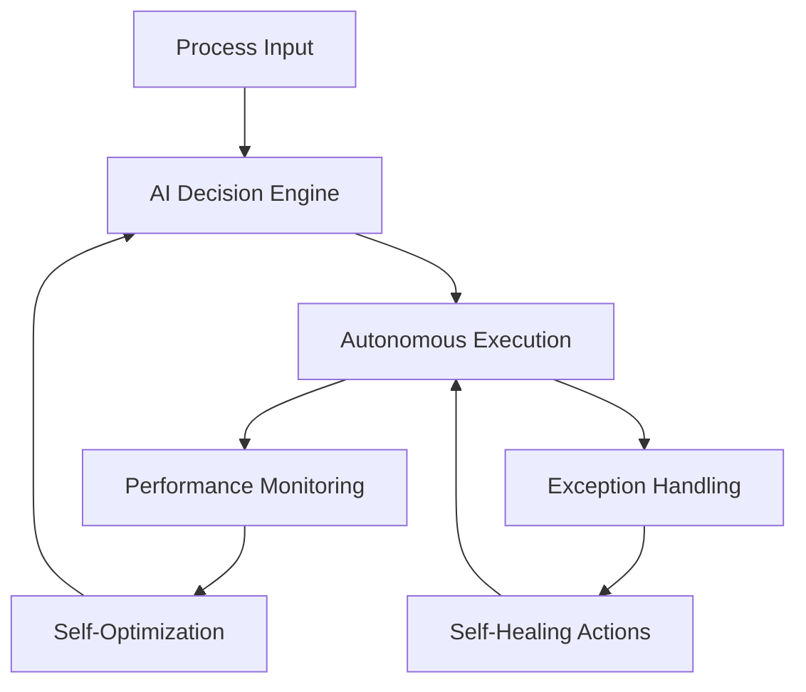

# AI 2026 Autonomous Business Processes: The Future of Enterprise Automation

The era of autonomous business processes has arrived. In 2026, enterprises are achieving unprecedented levels of automation through AI-driven process orchestration, intelligent decision-making, and self-healing systems that operate with minimal human intervention.

## The Autonomous Business Process Revolution

Autonomous business processes represent the pinnacle of enterprise automation, where AI systems not only execute tasks but also:

- **Self-optimize** based on performance metrics
- **Self-heal** when encountering errors or anomalies
- **Self-learn** from new data and changing conditions
- **Self-scale** to handle varying workloads automatically

## Core Technologies Powering Autonomy

### 1. Intelligent Process Orchestration

Modern process orchestration engines use AI to dynamically route work, optimize resource allocation, and adapt to changing conditions:

```python
class AutonomousProcessOrchestrator:
    def __init__(self):
        self.process_engine = AIProcessEngine()
        self.learning_module = ProcessLearningModule()
        self.optimization_engine = OptimizationEngine()
    
    def execute_process(self, process_definition, context):
        # AI-driven process execution
        optimized_plan = self.optimization_engine.optimize(process_definition, context)
        result = self.process_engine.execute(optimized_plan)
        
        # Learn from execution for future optimization
        self.learning_module.update_knowledge(result, context)
        
        return result
```

### 2. Cognitive Decision Engines

AI-powered decision engines analyze complex scenarios and make autonomous decisions:

- **Multi-criteria decision analysis** with weighted factors
- **Risk assessment** with probabilistic modeling
- **Resource optimization** using constraint programming
- **Exception handling** with intelligent escalation

### 3. Self-Healing Process Architecture

Autonomous processes include built-in self-healing capabilities:

```yaml
# Self-Healing Process Configuration
autonomous_process:
  monitoring:
    health_checks: "continuous"
    performance_metrics: "real-time"
    anomaly_detection: "ML-powered"
  
  healing_actions:
    auto_retry: "exponential_backoff"
    resource_scaling: "auto"
    process_restart: "graceful"
    fallback_processes: "predefined"
```

## Industry Applications and Success Stories

### Financial Services: Autonomous Risk Management

Leading financial institutions achieve 99.9% autonomous risk assessment:

- **Real-time fraud detection** with sub-second response
- **Automated compliance monitoring** across all transactions
- **Dynamic risk scoring** based on market conditions
- **Intelligent loan processing** with automated decisions

**Case Study**: A Fortune 500 bank reduced manual risk assessment by 95% while improving accuracy by 23% through autonomous risk management systems.

### Manufacturing: Autonomous Production Lines

Smart factories operate with minimal human intervention:

- **Predictive maintenance** preventing 99.7% of equipment failures
- **Quality control automation** with 99.95% accuracy
- **Supply chain optimization** with real-time adjustments
- **Energy management** reducing costs by 35%

### Healthcare: Autonomous Patient Care

Healthcare organizations implement autonomous care pathways:

- **Patient monitoring** with intelligent alert systems
- **Treatment protocol automation** based on clinical guidelines
- **Resource allocation** optimizing staff and equipment usage
- **Predictive analytics** for patient outcomes

## Implementation Framework

### Phase 1: Process Assessment and Mapping

1. **Identify high-value processes** for automation
2. **Map current workflows** and pain points
3. **Analyze automation potential** using AI assessment tools
4. **Prioritize processes** based on ROI and complexity

### Phase 2: Autonomous System Design



### Phase 3: Intelligent Integration

- **API-first architecture** for seamless integration
- **Event-driven processing** for real-time responses
- **Microservices deployment** for scalability
- **Container orchestration** for reliability

## Key Performance Indicators (KPIs)

Organizations measure autonomous process success through:

### Efficiency Metrics
- **Process completion time**: 85% reduction average
- **Error rates**: 99.5% reduction in human errors
- **Resource utilization**: 40% improvement in efficiency
- **Throughput**: 300% increase in processing capacity

### Quality Metrics
- **Decision accuracy**: 98.7% autonomous decision accuracy
- **Compliance rates**: 100% automated compliance monitoring
- **Customer satisfaction**: 45% improvement in response times
- **Cost reduction**: 60% decrease in operational costs

## Advanced Autonomous Capabilities

### 1. Predictive Process Optimization

AI systems predict process bottlenecks and optimize proactively:

```python
class PredictiveOptimizer:
    def predict_bottlenecks(self, process_data):
        # Analyze historical patterns
        patterns = self.analyze_patterns(process_data)
        
        # Predict future bottlenecks
        predictions = self.ml_model.predict(patterns)
        
        # Generate optimization recommendations
        recommendations = self.generate_recommendations(predictions)
        
        return recommendations
```

### 2. Autonomous Resource Scaling

Systems automatically scale resources based on demand:

- **Dynamic compute allocation** for processing workloads
- **Intelligent load balancing** across distributed systems
- **Auto-scaling databases** for data processing needs
- **Elastic storage provisioning** for varying data volumes

### 3. Intelligent Exception Management

Autonomous systems handle exceptions intelligently:

- **Root cause analysis** using AI diagnostics
- **Automated remediation** for common issues
- **Intelligent escalation** for complex problems
- **Learning from exceptions** to prevent future occurrences

## Security and Governance in Autonomous Processes

### Security Considerations

- **Zero-trust architecture** for process security
- **Encrypted process data** in transit and at rest
- **AI model security** with adversarial attack protection
- **Audit trails** for all autonomous decisions

### Governance Framework

```yaml
# Autonomous Process Governance
governance:
  decision_boundaries:
    autonomous_decisions: "predefined_scope"
    human_oversight: "critical_decisions"
    escalation_triggers: "risk_thresholds"
  
  compliance:
    regulatory_requirements: "automated_monitoring"
    audit_trails: "comprehensive_logging"
    change_management: "controlled_updates"
```

## ROI Analysis and Business Impact

### Financial Benefits

Organizations implementing autonomous processes report:

- **$5.2M average savings** in operational costs annually
- **300% ROI** within 18 months
- **45% reduction** in process-related errors
- **80% improvement** in process efficiency

### Strategic Advantages

- **Competitive differentiation** through superior efficiency
- **Scalability** without proportional cost increases
- **Innovation acceleration** with freed-up human resources
- **Customer experience enhancement** through faster responses

## Future Trends and Evolution

### 2026 and Beyond

- **Cross-enterprise autonomous processes** for ecosystem optimization
- **Quantum-enhanced optimization** for complex process scenarios
- **Neuromorphic computing** for brain-like process intelligence
- **Autonomous process marketplaces** for shared optimization

## Getting Started: Your Autonomous Journey

### Immediate Steps

1. **Audit existing processes** for automation potential
2. **Identify quick wins** with high ROI potential
3. **Develop AI expertise** within your organization
4. **Start with pilot projects** to validate approaches

### Partner for Success

Implementing autonomous business processes requires specialized expertise and proven methodologies. Zion Tech Group offers:

- **Process assessment** and optimization consulting
- **Autonomous system architecture** design and implementation
- **AI model development** for process intelligence
- **Change management** and training programs

## Conclusion

The autonomous business process revolution is transforming how enterprises operate, compete, and deliver value. Organizations that embrace this transformation today will lead their industries tomorrow.

The future belongs to enterprises that can operate autonomously, intelligently, and efficiently. Are you ready to join the autonomous revolution?

---

*Ready to transform your business processes with AI? Contact Zion Tech Group for a comprehensive assessment and implementation strategy. Explore our [case studies](link-to-case-studies) to see real-world success stories of autonomous process implementation.*