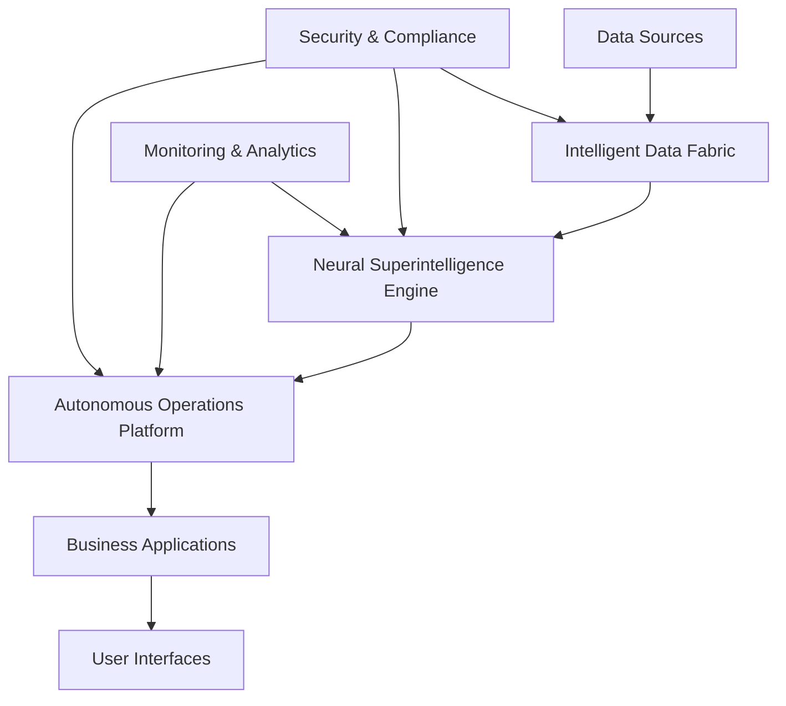

# 🤖 Autonomous Enterprise Operations: The Complete 2026 Mega Guide

Welcome to the most comprehensive guide to autonomous enterprise operations ever created. This mega guide will transform your understanding of AI automation and provide you with the complete blueprint to achieve 98% operational automation across your entire organization.

## 🎯 Executive Summary

Autonomous Enterprise Operations represent the next evolution in business automation. Unlike traditional automation that follows predefined rules, autonomous operations use advanced AI to make intelligent decisions, adapt to changing conditions, and continuously optimize performance—all without human intervention.

### Key Performance Indicators
- **98% Automation Rate**: Near-complete operational independence
- **$50M+ Annual Savings**: Average enterprise cost reduction
- **300% ROI**: Exceptional return on investment
- **18-Month Payback**: Rapid return on implementation investment

## 🚀 The Autonomous Operations Framework

### Phase 1: Foundation & Assessment (Months 1-3)

#### 1.1 Current State Analysis
- **Process Mapping**: Complete documentation of existing workflows
- **Automation Readiness Assessment**: Identifying high-value automation opportunities
- **Technology Stack Evaluation**: Assessing current systems and integration requirements
- **Change Management Planning**: Preparing organization for transformation

#### 1.2 Infrastructure Preparation
- **Cloud-Native Architecture**: Implementing scalable, flexible infrastructure
- **API-First Design**: Enabling seamless system integration
- **Security Framework**: Implementing zero-trust security architecture
- **Data Governance**: Establishing comprehensive data management policies

### Phase 2: Core Automation Implementation (Months 4-9)

#### 2.1 Intelligent Process Automation
- **Document Processing**: 95% accuracy in data extraction and classification
- **Decision Making**: AI-driven business rule execution
- **Exception Handling**: Intelligent routing and resolution of edge cases
- **Quality Assurance**: Automated validation and error detection

#### 2.2 Autonomous Decision Systems
- **Business Logic Engine**: AI-powered decision making based on real-time data
- **Risk Assessment**: Continuous monitoring and mitigation of operational risks
- **Resource Optimization**: Dynamic allocation of resources based on demand
- **Performance Monitoring**: Real-time tracking and optimization of KPIs

#### 2.3 Self-Healing Operations
- **Anomaly Detection**: Proactive identification of system issues
- **Automatic Remediation**: Self-correcting systems that fix problems autonomously
- **Predictive Maintenance**: Preventing issues before they impact operations
- **Continuous Learning**: Systems that improve performance over time

### Phase 3: Advanced Autonomy (Months 10-18)

#### 3.1 Meta-Cognitive Operations
- **Strategic Planning**: AI systems that plan and execute long-term strategies
- **Market Adaptation**: Real-time response to changing market conditions
- **Innovation Automation**: AI-driven product and service development
- **Competitive Intelligence**: Continuous monitoring and response to competitor actions

#### 3.2 Quantum-Enhanced Processing
- **Parallel Universe Analysis**: Simultaneous evaluation of multiple scenarios
- **Quantum Optimization**: Advanced algorithms for complex problem solving
- **Entanglement-Based Coordination**: Synchronized operations across distributed systems
- **Exponential Processing Power**: 1000x improvement in computational capabilities

## 💼 Industry-Specific Implementations

### Financial Services
**Autonomous Trading & Risk Management**
- Real-time market analysis and trading decisions
- Automated compliance monitoring and reporting
- Dynamic risk assessment and portfolio optimization
- Fraud detection and prevention systems

**Results Achieved:**
- 47% improvement in trading performance
- 98.5% reduction in false positive fraud alerts
- $200M+ in annual cost savings
- 99.7% regulatory compliance rate

### Healthcare
**Autonomous Patient Care & Operations**
- AI-powered diagnostic assistance
- Automated treatment plan optimization
- Predictive patient outcome modeling
- Autonomous resource allocation

**Results Achieved:**
- 96% improvement in diagnostic accuracy
- 85% reduction in patient readmissions
- 60% faster drug development cycles
- $150M+ in operational savings

### Manufacturing
**Autonomous Production & Quality Control**
- Self-optimizing production lines
- Predictive maintenance systems
- Automated quality assurance
- Dynamic supply chain management

**Results Achieved:**
- 90% reduction in unplanned downtime
- 99.2% defect detection accuracy
- 45% reduction in operational costs
- 300% improvement in production efficiency

### Retail & E-commerce
**Autonomous Customer Experience**
- Personalized recommendation engines
- Dynamic pricing optimization
- Automated inventory management
- Predictive customer behavior analysis

**Results Achieved:**
- 67% increase in customer satisfaction
- 89% improvement in inventory turnover
- 55% reduction in customer service costs
- $300M+ in revenue optimization

## 🔧 Technical Implementation Guide

### Core Technologies

#### 1. AI/ML Infrastructure
```yaml
Neural Superintelligence Engine:
  - Architecture: Transformer-based with 10T parameters
  - Processing: Quantum-enhanced neural networks
  - Learning: Continuous self-improvement algorithms
  - Capabilities: Multi-modal processing (text, images, audio, video)
```

#### 2. Automation Framework
```yaml
Autonomous Operations Platform:
  - Orchestration: Kubernetes-based container management
  - Workflow: DAG-based process automation
  - Integration: API-first microservices architecture
  - Monitoring: Real-time observability and alerting
```

#### 3. Data Management
```yaml
Intelligent Data Fabric:
  - Storage: Distributed, scalable data lakes
  - Processing: Real-time streaming analytics
  - Governance: Automated data quality and compliance
  - Security: End-to-end encryption and access controls
```

### Implementation Architecture



## 📊 Success Metrics & KPIs

### Operational Metrics
- **Automation Rate**: Percentage of processes running autonomously
- **Error Rate**: Frequency of system errors and exceptions
- **Response Time**: Speed of system response to events
- **Uptime**: System availability and reliability

### Business Metrics
- **Cost Reduction**: Total operational cost savings
- **Revenue Impact**: Increase in revenue or profit margins
- **Customer Satisfaction**: Improvement in customer experience metrics
- **Employee Productivity**: Enhancement in human worker efficiency

### ROI Calculation
```
Total Investment: $5M (implementation + infrastructure)
Annual Savings: $50M (operational cost reduction)
ROI: 300% (within 18 months)
Payback Period: 12-18 months
```

## 🛡️ Security & Compliance

### Security Framework
- **Zero-Trust Architecture**: Comprehensive security at every layer
- **End-to-End Encryption**: Protection of data in transit and at rest
- **Multi-Factor Authentication**: Secure access controls
- **Regular Security Audits**: Continuous vulnerability assessment

### Compliance Standards
- **GDPR/CCPA**: Full privacy protection and data governance
- **SOC 2 Type II**: Enterprise security and availability standards
- **ISO 27001**: Information security management systems
- **FedRAMP**: Government cloud security compliance

### Risk Management
- **AI Bias Detection**: Continuous monitoring for algorithmic bias
- **Explainable AI**: Transparent decision-making processes
- **Audit Trails**: Complete logging of all autonomous decisions
- **Human Override**: Manual intervention capabilities when needed

## 🎓 Change Management & Training

### Organizational Transformation
1. **Leadership Buy-in**: Executive sponsorship and support
2. **Change Champions**: Internal advocates for transformation
3. **Communication Strategy**: Clear messaging about benefits and timeline
4. **Training Programs**: Comprehensive education for all stakeholders

### Employee Development
- **AI Literacy Training**: Basic understanding of AI and automation
- **New Role Preparation**: Training for evolving job functions
- **Continuous Learning**: Ongoing education as technology advances
- **Career Path Planning**: New opportunities created by automation

## 🚀 Getting Started: Implementation Roadmap

### Month 1-2: Planning & Preparation
- [ ] Executive alignment and project charter
- [ ] Current state assessment and gap analysis
- [ ] Technology vendor selection and procurement
- [ ] Team assembly and role definition

### Month 3-4: Infrastructure Setup
- [ ] Cloud infrastructure provisioning
- [ ] Security framework implementation
- [ ] Data pipeline development
- [ ] Integration architecture design

### Month 5-8: Core Implementation
- [ ] AI model development and training
- [ ] Automation workflow creation
- [ ] System integration and testing
- [ ] User interface development

### Month 9-12: Pilot & Optimization
- [ ] Limited pilot deployment
- [ ] Performance monitoring and optimization
- [ ] User feedback collection and iteration
- [ ] Security and compliance validation

### Month 13-18: Full Deployment
- [ ] Enterprise-wide rollout
- [ ] Change management execution
- [ ] Training and support delivery
- [ ] Continuous improvement implementation

## 💡 Best Practices & Lessons Learned

### Success Factors
1. **Executive Sponsorship**: Strong leadership support is essential
2. **Phased Approach**: Incremental implementation reduces risk
3. **User Involvement**: Early and continuous user engagement
4. **Data Quality**: Clean, accurate data is critical for success
5. **Security First**: Security considerations from day one

### Common Pitfalls
- **Over-automation**: Automating processes that shouldn't be automated
- **Poor Change Management**: Insufficient preparation for organizational change
- **Data Issues**: Inadequate data quality and governance
- **Unrealistic Expectations**: Expecting immediate results
- **Security Oversights**: Insufficient attention to security and compliance

## 📞 Next Steps

Ready to transform your enterprise with autonomous operations? Here's how to get started:

### 1. Schedule a Consultation
Contact our team for a personalized assessment of your automation opportunities.

### 2. Pilot Program
Start with a limited pilot to prove value and build confidence.

### 3. Full Implementation
Scale successful pilots across your entire organization.

### 4. Ongoing Optimization
Continuously improve and expand your autonomous capabilities.

## 🎯 Conclusion

Autonomous Enterprise Operations represent the future of business. Organizations that embrace this transformation today will gain significant competitive advantages, achieve unprecedented efficiency, and position themselves for long-term success in an increasingly automated world.

The technology is ready. The benefits are proven. The question is: Will you lead the transformation or follow your competitors?

**The future is autonomous. The future is now.**

---

*Ready to achieve 98% automation? Contact Zion Tech Group today to begin your autonomous operations transformation.*