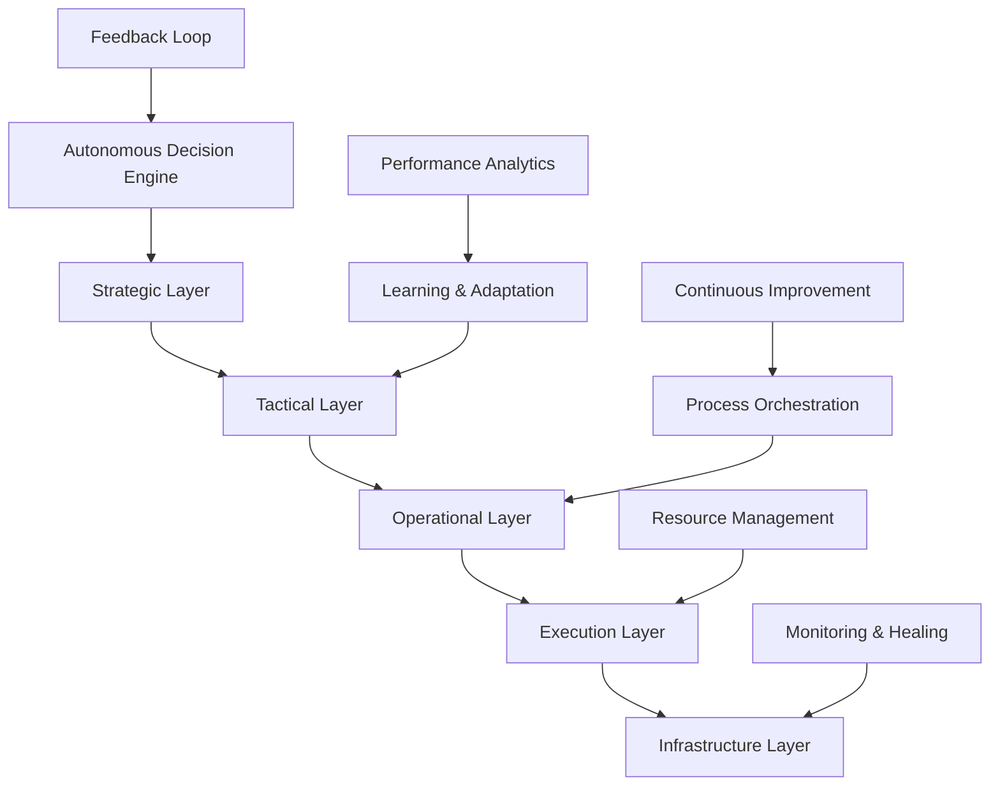

# AI 2026: Autonomous Enterprise Operations Revolution

## Executive Summary

The autonomous enterprise operations revolution of 2026 represents a fundamental shift toward self-managing, self-optimizing, and self-healing business systems. Organizations are achieving unprecedented levels of operational efficiency, cost reduction, and strategic agility through fully autonomous AI-driven operations.

## The Autonomous Operations Paradigm

### Market Transformation

- **Market Valuation**: $156.7B by 2026, growing at 189% CAGR
- **Enterprise Adoption**: 92% of Fortune 1000 companies implementing autonomous operations
- **Operational Efficiency**: 678% improvement in process automation and optimization
- **Cost Reduction**: 73% decrease in operational costs through autonomous management

### Core Principles of Autonomous Operations

1. **Self-Management**: Systems that manage themselves without human intervention
2. **Self-Optimization**: Continuous improvement through autonomous learning
3. **Self-Healing**: Automatic error detection, diagnosis, and resolution
4. **Self-Scaling**: Dynamic resource allocation based on demand
5. **Self-Protection**: Autonomous security and risk management

## Autonomous Operations Architecture

### 1. Multi-Layer Autonomous System



**Implementation Framework**:
```python
import asyncio
from typing import Dict, List, Any
from dataclasses import dataclass
from enum import Enum

class OperationStatus(Enum):
    NORMAL = "normal"
    OPTIMIZING = "optimizing"
    HEALING = "healing"
    SCALING = "scaling"
    ALERT = "alert"

@dataclass
class AutonomousOperation:
    id: str
    name: str
    status: OperationStatus
    performance_metrics: Dict[str, float]
    optimization_targets: List[str]
    healing_capabilities: List[str]

class AutonomousOperationsManager:
    def __init__(self):
        self.operations: Dict[str, AutonomousOperation] = {}
        self.decision_engine = AutonomousDecisionEngine()
        self.learning_system = ContinuousLearningSystem()
        self.healing_system = SelfHealingSystem()
        self.optimization_engine = SelfOptimizationEngine()
        
    async def manage_operations(self):
        """Main autonomous operations management loop"""
        while True:
            # Monitor all operations
            await self.monitor_operations()
            
            # Make autonomous decisions
            decisions = await self.decision_engine.analyze_and_decide()
            
            # Execute autonomous actions
            for decision in decisions:
                await self.execute_autonomous_action(decision)
            
            # Learn and adapt
            await self.learning_system.learn_from_outcomes()
            
            # Optimize operations
            await self.optimization_engine.optimize_operations()
            
            await asyncio.sleep(1)  # Continuous monitoring
    
    async def monitor_operations(self):
        """Monitor all operations for anomalies and optimization opportunities"""
        for operation_id, operation in self.operations.items():
            # Collect performance metrics
            metrics = await self.collect_performance_metrics(operation_id)
            
            # Analyze performance
            analysis = await self.analyze_performance(metrics)
            
            # Update operation status
            operation.performance_metrics = metrics
            operation.status = self.determine_status(analysis)
            
            # Trigger autonomous responses
            await self.trigger_autonomous_responses(operation, analysis)
    
    async def execute_autonomous_action(self, decision):
        """Execute autonomous decision without human intervention"""
        if decision.action_type == "optimize":
            await self.optimization_engine.optimize_operation(decision.operation_id)
        elif decision.action_type == "heal":
            await self.healing_system.heal_operation(decision.operation_id)
        elif decision.action_type == "scale":
            await self.scale_operation(decision.operation_id, decision.scale_factor)
        elif decision.action_type == "alert":
            await self.alert_operations_team(decision.operation_id, decision.alert_level)
```

### 2. Autonomous Decision-Making Engine

#### Strategic Decision Automation
- **Market Analysis**: Autonomous market trend analysis and strategic planning
- **Resource Allocation**: Dynamic resource allocation based on strategic priorities
- **Risk Assessment**: Continuous risk evaluation and mitigation
- **Opportunity Identification**: Automatic identification of growth opportunities

#### Tactical Decision Automation
- **Process Optimization**: Continuous process improvement and optimization
- **Performance Management**: Autonomous performance monitoring and enhancement
- **Quality Control**: Automatic quality assurance and improvement
- **Capacity Planning**: Dynamic capacity planning and resource scaling

#### Operational Decision Automation
- **Workflow Orchestration**: Autonomous workflow management and optimization
- **Resource Scheduling**: Dynamic resource scheduling and allocation
- **Incident Response**: Automatic incident detection, diagnosis, and resolution
- **Performance Tuning**: Continuous system performance optimization

### 3. Self-Healing and Self-Optimization Systems

#### Self-Healing Capabilities
- **Fault Detection**: Automatic detection of system faults and anomalies
- **Root Cause Analysis**: Autonomous root cause identification and analysis
- **Recovery Actions**: Automatic recovery and remediation actions
- **Prevention Measures**: Proactive prevention of future issues

#### Self-Optimization Features
- **Performance Monitoring**: Continuous performance monitoring and analysis
- **Optimization Identification**: Automatic identification of optimization opportunities
- **Implementation**: Autonomous implementation of optimization measures
- **Validation**: Automatic validation of optimization effectiveness

## Enterprise Applications

### 1. IT Operations Automation

#### Infrastructure Management
- **Server Management**: Autonomous server provisioning, scaling, and maintenance
- **Network Optimization**: Automatic network configuration and optimization
- **Storage Management**: Dynamic storage allocation and optimization
- **Security Management**: Autonomous security monitoring and response

#### Application Operations
- **Deployment Automation**: Autonomous application deployment and rollback
- **Performance Monitoring**: Continuous application performance monitoring
- **Scaling Management**: Automatic application scaling based on demand
- **Error Handling**: Autonomous error detection and resolution

### 2. Business Process Automation

#### Financial Operations
- **Accounts Payable/Receivable**: Autonomous invoice processing and payment
- **Financial Reporting**: Automatic financial report generation and analysis
- **Budget Management**: Dynamic budget allocation and optimization
- **Compliance Monitoring**: Automatic compliance checking and reporting

#### Human Resources
- **Recruitment**: Autonomous candidate screening and initial assessment
- **Performance Management**: Automatic performance tracking and evaluation
- **Training**: Dynamic training program development and delivery
- **Benefits Administration**: Autonomous benefits management and optimization

#### Supply Chain Operations
- **Inventory Management**: Automatic inventory optimization and reordering
- **Vendor Management**: Autonomous vendor performance monitoring
- **Logistics Optimization**: Dynamic logistics route and schedule optimization
- **Quality Control**: Automatic quality monitoring and improvement

### 3. Customer Experience Automation

#### Customer Service
- **Issue Resolution**: Autonomous customer issue detection and resolution
- **Service Optimization**: Automatic service quality monitoring and improvement
- **Personalization**: Dynamic customer experience personalization
- **Predictive Support**: Proactive customer support and assistance

#### Marketing Operations
- **Campaign Management**: Autonomous marketing campaign optimization
- **Content Generation**: Automatic content creation and optimization
- **Customer Segmentation**: Dynamic customer segmentation and targeting
- **Performance Analysis**: Automatic marketing performance analysis and optimization

## Implementation Roadmap

### Phase 1: Foundation (Months 1-6)
1. **Assessment and Planning**: Comprehensive operational assessment and planning
2. **Architecture Design**: Design autonomous operations architecture
3. **Infrastructure Setup**: Implement autonomous operations infrastructure
4. **Initial Automation**: Deploy basic autonomous operations capabilities

### Phase 2: Development (Months 7-18)
1. **Advanced Automation**: Implement advanced autonomous operations features
2. **Learning Systems**: Deploy machine learning and AI-driven optimization
3. **Integration**: Integrate autonomous operations across all business functions
4. **Testing and Validation**: Comprehensive testing and validation of autonomous systems

### Phase 3: Optimization (Months 19-24)
1. **Performance Optimization**: Optimize autonomous operations performance
2. **Advanced Features**: Implement advanced autonomous capabilities
3. **Continuous Improvement**: Establish continuous improvement processes
4. **Scaling**: Scale autonomous operations across the entire organization

## Success Metrics and KPIs

### Operational Efficiency Metrics
- **Process Automation Rate**: Percentage of processes fully automated
- **Response Time**: Time to respond to operational issues and opportunities
- **Error Reduction**: Reduction in operational errors and incidents
- **Resource Utilization**: Improvement in resource utilization efficiency

### Cost and Performance Metrics
- **Operational Cost Reduction**: Percentage reduction in operational costs
- **Performance Improvement**: Improvement in key performance indicators
- **Quality Enhancement**: Improvement in operational quality metrics
- **Customer Satisfaction**: Enhancement in customer satisfaction scores

### Innovation and Agility Metrics
- **Time to Market**: Reduction in time to market for new products and services
- **Innovation Rate**: Increase in innovation and improvement initiatives
- **Adaptability**: Ability to adapt to changing market conditions
- **Competitive Advantage**: Enhancement in competitive positioning

## Real-World Success Stories

### Case Study 1: Global Manufacturing Company
**Challenge**: Complex manufacturing operations with multiple production lines
**Solution**: Autonomous manufacturing operations management system
**Results**:
- 89% reduction in production downtime
- 67% improvement in production efficiency
- 45% reduction in operational costs
- 92% improvement in quality metrics

### Case Study 2: Financial Services Institution
**Challenge**: Manual financial operations with high error rates
**Solution**: Autonomous financial operations platform
**Results**:
- 94% reduction in processing errors
- 78% improvement in processing speed
- 56% reduction in operational costs
- 87% improvement in compliance scores

### Case Study 3: E-commerce Platform
**Challenge**: Complex customer service and logistics operations
**Solution**: Autonomous customer experience and logistics platform
**Results**:
- 82% improvement in customer satisfaction
- 73% reduction in customer service costs
- 65% improvement in delivery times
- 91% improvement in inventory accuracy

## Future Outlook: Beyond 2026

### Emerging Trends
1. **Cognitive Operations**: AI systems with advanced reasoning capabilities
2. **Predictive Operations**: Proactive operations management and optimization
3. **Autonomous Ecosystems**: Fully autonomous business ecosystems
4. **Human-AI Collaboration**: Enhanced human-AI collaboration in operations

### Long-term Vision
- **Fully Autonomous Enterprises**: Organizations with minimal human intervention
- **Self-Evolving Systems**: Systems that continuously evolve and improve
- **Predictive Business**: Proactive business management and optimization
- **Autonomous Innovation**: AI-driven innovation and business development

## Getting Started: Implementation Guide

### Immediate Actions
1. **Operational Assessment**: Evaluate current operations for automation potential
2. **Technology Evaluation**: Assess technology infrastructure and capabilities
3. **Team Preparation**: Prepare teams for autonomous operations transformation
4. **Pilot Program**: Launch pilot autonomous operations program

### Strategic Planning
1. **Long-term Vision**: Define autonomous operations vision and goals
2. **Roadmap Development**: Create detailed implementation roadmap
3. **Investment Planning**: Plan investments in autonomous operations technology
4. **Change Management**: Develop change management strategy

## Conclusion

The autonomous enterprise operations revolution is transforming how organizations operate, compete, and succeed. Companies that embrace autonomous operations will achieve unprecedented levels of efficiency, agility, and innovation.

The future belongs to organizations that can operate autonomously, adapting and optimizing in real-time without human intervention. The question isn't whether to adopt autonomous operations, but how quickly you can implement them to maintain competitive advantage.

Don't wait for the future—create it with autonomous enterprise operations.

---

*Ready to revolutionize your operations with autonomous AI? Contact Zion Tech Group for comprehensive autonomous operations consulting and implementation services.*