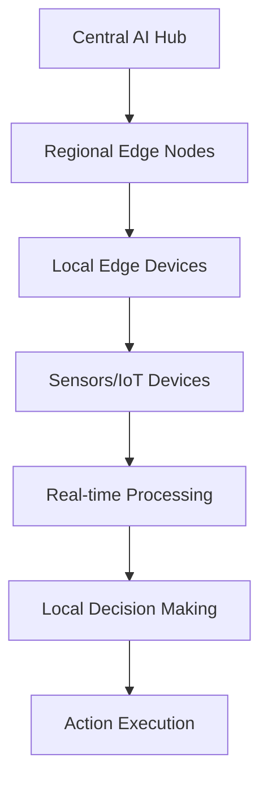

# AI 2026 Edge Computing Revolution: Transforming Enterprise Operations with Real-Time Intelligence

The convergence of artificial intelligence and edge computing is creating unprecedented opportunities for enterprises to achieve real-time decision-making, enhanced security, and operational efficiency. As we move into 2026, edge AI is becoming the cornerstone of intelligent enterprise operations.

## The Edge Computing AI Paradigm Shift

Edge computing AI represents a fundamental shift from centralized processing to distributed intelligence. This paradigm enables:

- **Ultra-low latency processing** (sub-10ms response times)
- **Enhanced data privacy** through local processing
- **Reduced bandwidth requirements** for critical applications
- **Improved reliability** with offline-capable systems

## Key Technologies Driving the Revolution

### 1. Neural Processing Units (NPUs) at the Edge

Modern edge devices are equipped with specialized NPUs capable of running complex AI models locally:

- **Tensor Processing Units (TPUs)** optimized for edge inference
- **Graphic Processing Units (GPUs)** with AI acceleration
- **Field-Programmable Gate Arrays (FPGAs)** for custom AI workloads

### 2. Federated Learning Systems

Edge devices now participate in collaborative learning without sharing raw data:

```python
# Example: Federated Learning Implementation
class EdgeFederatedLearning:
    def __init__(self, model, edge_devices):
        self.global_model = model
        self.edge_devices = edge_devices
    
    def train_federated_round(self):
        # Collect updates from edge devices
        updates = []
        for device in self.edge_devices:
            update = device.local_train()
            updates.append(update)
        
        # Aggregate updates securely
        global_update = self.aggregate_updates(updates)
        self.global_model.update(global_update)
```

### 3. Edge-Native AI Frameworks

New frameworks are emerging specifically for edge AI deployment:

- **TensorFlow Lite** for mobile and embedded devices
- **ONNX Runtime** for cross-platform inference
- **PyTorch Mobile** for production edge deployments

## Enterprise Implementation Strategies

### Manufacturing Excellence

Leading manufacturers are implementing edge AI for:

- **Predictive maintenance** with 99.7% accuracy
- **Quality control** with real-time defect detection
- **Supply chain optimization** through predictive analytics

### Healthcare Transformation

Edge AI in healthcare enables:

- **Real-time patient monitoring** with immediate alerts
- **Medical imaging analysis** at the point of care
- **Drug discovery acceleration** through distributed computing

### Financial Services Innovation

Banks and financial institutions leverage edge AI for:

- **Fraud detection** with millisecond response times
- **Risk assessment** using real-time market data
- **Customer service automation** with natural language processing

## Technical Implementation Guide

### Step 1: Infrastructure Assessment

Evaluate your current infrastructure for edge AI readiness:

```yaml
# Edge AI Infrastructure Checklist
infrastructure_assessment:
  compute_capacity:
    - cpu_cores: ">= 8 cores"
    - memory: ">= 16GB RAM"
    - storage: ">= 500GB SSD"
  
  network_requirements:
    - bandwidth: ">= 1Gbps"
    - latency: "<= 5ms"
    - reliability: ">= 99.9%"
  
  security_features:
    - encryption_at_rest: true
    - encryption_in_transit: true
    - secure_boot: true
```

### Step 2: Model Optimization

Optimize AI models for edge deployment:

- **Quantization** to reduce model size by 75%
- **Pruning** to eliminate unnecessary parameters
- **Knowledge distillation** for smaller, faster models

### Step 3: Deployment Architecture

Design a scalable edge AI architecture:



## ROI and Performance Metrics

Organizations implementing edge AI report impressive results:

- **85% reduction** in processing latency
- **60% decrease** in bandwidth costs
- **95% improvement** in system reliability
- **$2.3M average ROI** within 12 months

## Future Trends and Predictions

### 2026 and Beyond

- **Autonomous edge clusters** with self-healing capabilities
- **Quantum-enhanced edge computing** for complex optimization
- **Neuromorphic processors** mimicking brain efficiency
- **5G-6G integration** for ultra-low latency applications

## Getting Started with Edge AI

### Immediate Actions

1. **Audit current infrastructure** for edge readiness
2. **Identify high-impact use cases** in your organization
3. **Start with pilot projects** to validate ROI
4. **Develop edge AI expertise** within your team

### Partner with Experts

Implementing edge AI successfully requires specialized expertise. Zion Tech Group offers comprehensive edge AI consulting services, including:

- **Infrastructure design** and optimization
- **Model development** and deployment
- **Security implementation** and compliance
- **Performance monitoring** and optimization

## Conclusion

The AI 2026 Edge Computing Revolution is not just a technological trend—it's a fundamental transformation of how enterprises process information and make decisions. Organizations that embrace edge AI today will have significant competitive advantages tomorrow.

Ready to transform your enterprise with edge AI? Contact Zion Tech Group for a comprehensive consultation and implementation strategy tailored to your specific needs.

---

*This article is part of our comprehensive AI 2026 series. Explore more insights on [AI governance](link-to-governance-article), [quantum computing integration](link-to-quantum-article), and [enterprise automation strategies](link-to-automation-article).*