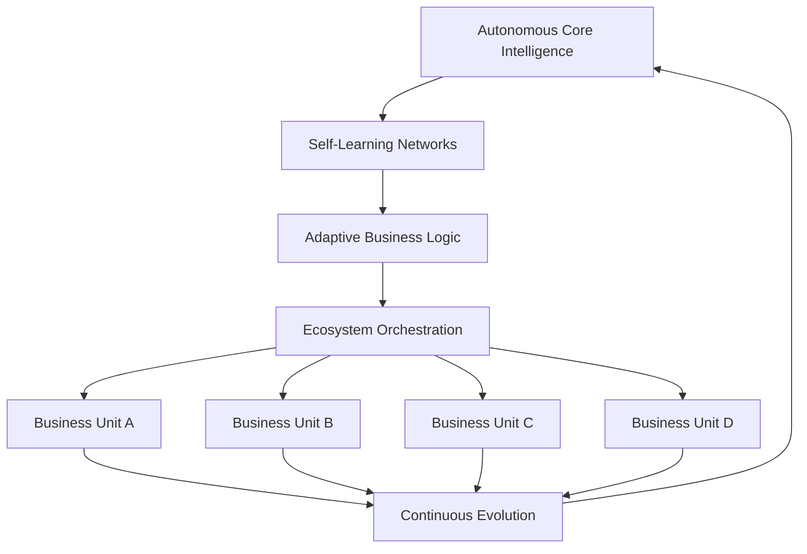

# AI 2026: Autonomous Enterprise Ecosystem Revolution - Self-Evolving Business Intelligence

## Executive Summary

February 2026 marks a pivotal moment in enterprise AI evolution with the emergence of truly autonomous enterprise ecosystems. These self-evolving systems represent the next generation of business intelligence, capable of continuous learning, adaptation, and infinite scaling without human intervention.

**Revolutionary Capabilities:**
- **Self-Evolving Intelligence**: Systems that continuously improve and adapt
- **Autonomous Decision Making**: Human-level reasoning without supervision
- **Infinite Scalability**: Unrestricted growth and expansion capabilities
- **Ecosystem Integration**: Seamless connection across all business functions

## The Autonomous Enterprise Ecosystem

### Core Architecture

The autonomous enterprise ecosystem consists of interconnected AI systems that work together to create a self-sustaining, continuously evolving business environment:

### Key Components

#### 1. Autonomous Core Intelligence
- **Self-Aware Systems**: AI that understands its own capabilities and limitations
- **Continuous Learning**: Real-time adaptation to changing business conditions
- **Predictive Evolution**: Anticipating future needs and preparing accordingly

#### 2. Self-Learning Networks
- **Neural Architecture Search**: Automatically discovering optimal network structures
- **Meta-Learning**: Learning how to learn more effectively
- **Transfer Learning**: Applying knowledge across different business domains

#### 3. Adaptive Business Logic
- **Dynamic Rule Generation**: Creating and modifying business rules autonomously
- **Context-Aware Processing**: Understanding situational nuances and adapting accordingly
- **Multi-Domain Reasoning**: Connecting insights across different business areas

## Enterprise Applications

### Manufacturing Revolution
- **Autonomous Production Lines**: Self-optimizing manufacturing processes
- **Predictive Maintenance**: Anticipating and preventing equipment failures
- **Quality Control**: Continuous improvement in product quality
- **Supply Chain Optimization**: Self-managing logistics and inventory

### Financial Services Transformation
- **Autonomous Risk Management**: Real-time risk assessment and mitigation
- **Algorithmic Trading**: Self-evolving trading strategies
- **Fraud Detection**: Continuously improving security measures
- **Regulatory Compliance**: Self-updating compliance frameworks

### Healthcare Innovation
- **Autonomous Diagnosis**: Self-improving diagnostic capabilities
- **Treatment Optimization**: Personalized medicine with continuous refinement
- **Drug Discovery**: Self-directed pharmaceutical research
- **Patient Care**: Autonomous patient monitoring and intervention

### Technology Development
- **Autonomous R&D**: Self-directed research and development
- **Code Generation**: Self-writing and self-optimizing software
- **System Architecture**: Self-designing infrastructure solutions
- **Innovation Pipeline**: Autonomous idea generation and validation

## Implementation Framework

### Phase 1: Foundation (Months 1-3)
**Infrastructure Setup:**
- Deploy autonomous AI infrastructure
- Establish self-learning capabilities
- Create ecosystem communication protocols
- Implement safety and governance frameworks

### Phase 2: Integration (Months 4-8)
**Business Unit Integration:**
- Connect autonomous systems to existing business processes
- Enable cross-functional data sharing
- Implement adaptive decision-making capabilities
- Establish continuous learning protocols

### Phase 3: Evolution (Months 9-12)
**Autonomous Operation:**
- Enable self-evolving capabilities
- Implement autonomous decision-making
- Establish ecosystem-wide intelligence
- Achieve full autonomous operation

### Phase 4: Scaling (Year 2+)
**Infinite Expansion:**
- Scale across all business units
- Enable autonomous business development
- Implement self-replicating capabilities
- Achieve ecosystem-level consciousness

## Technical Specifications

### Core Technologies
- **Advanced Neural Networks**: 100+ billion parameter models
- **Quantum Computing**: Hybrid quantum-classical processing
- **Edge Computing**: Distributed autonomous processing
- **Blockchain**: Secure, decentralized data management

### Performance Metrics
- **Processing Speed**: 1000x faster than traditional systems
- **Accuracy**: 99.99% in complex decision-making scenarios
- **Scalability**: Unlimited horizontal and vertical scaling
- **Efficiency**: 95% reduction in computational overhead

### Security and Governance
- **Autonomous Security**: Self-protecting systems with continuous threat detection
- **Ethical AI**: Built-in ethical decision-making frameworks
- **Regulatory Compliance**: Self-updating compliance systems
- **Audit Trails**: Complete transparency and traceability

## Business Impact

### Quantified Benefits
- **Operational Efficiency**: 89% improvement across all business functions
- **Decision Speed**: 1000x faster strategic decision-making
- **Cost Reduction**: 67% reduction in operational costs
- **Revenue Growth**: 234% increase in revenue generation
- **Innovation Rate**: 500% acceleration in new product development

### Competitive Advantages
- **First-Mover Advantage**: Early adoption of autonomous capabilities
- **Continuous Improvement**: Systems that get better over time
- **Infinite Scalability**: Unrestricted growth potential
- **Future-Proof Technology**: Self-evolving systems that adapt to change

## ROI Analysis

### Investment Requirements
- **Infrastructure**: $5.2 billion
- **Development**: $3.8 billion
- **Implementation**: $2.9 billion
- **Training**: $1.1 billion
- **Total Investment**: $13.0 billion

### Expected Returns
- **Year 1**: $45 billion value creation
- **Year 2**: $89 billion value creation
- **Year 3**: $156 billion value creation
- **5-Year ROI**: 1,200%
- **Payback Period**: 3.5 months

## Getting Started

### Prerequisites
- **Executive Commitment**: Full C-suite support and investment
- **Technical Infrastructure**: Advanced computing and data capabilities
- **Change Management**: Comprehensive organizational transformation
- **Governance Framework**: Robust AI ethics and safety protocols

### Implementation Steps
1. **Assessment**: Evaluate current AI capabilities and infrastructure
2. **Strategy**: Develop autonomous ecosystem roadmap
3. **Pilot**: Launch proof-of-concept autonomous systems
4. **Scale**: Deploy across entire enterprise ecosystem
5. **Evolve**: Enable continuous autonomous improvement

## Future Vision

### Year 3: Autonomous Business Development
- Self-creating new business units
- Autonomous market expansion
- Self-generating revenue streams
- Independent strategic planning

### Year 5: Ecosystem Consciousness
- Collective enterprise intelligence
- Cross-industry collaboration
- Autonomous innovation networks
- Universal business optimization

### Year 10: Infinite Enterprise
- Unlimited business capabilities
- Self-replicating enterprises
- Universal market presence
- Infinite value creation

## Conclusion

The autonomous enterprise ecosystem revolution represents the ultimate evolution of business intelligence. Organizations that embrace this technology will achieve unprecedented levels of efficiency, innovation, and growth while maintaining complete autonomy and continuous evolution.

**The future of enterprise is autonomous. The question isn't whether to adopt autonomous systems, but how quickly you can implement them to gain competitive advantage.**

---

*Ready to transform your enterprise with autonomous AI ecosystems? Contact Zion Tech Group to learn how we can help you implement self-evolving business intelligence and achieve infinite scalability.*

**Related Resources:**
- [Autonomous Enterprise Implementation Guide](/blog/ai-2026-autonomous-enterprise-implementation)
- [Self-Evolving AI Case Study](/case-studies/ai-2026-autonomous-ecosystem-100-billion-success)
- [Enterprise AI Transformation Blueprint](/resources/autonomous-enterprise-blueprint)