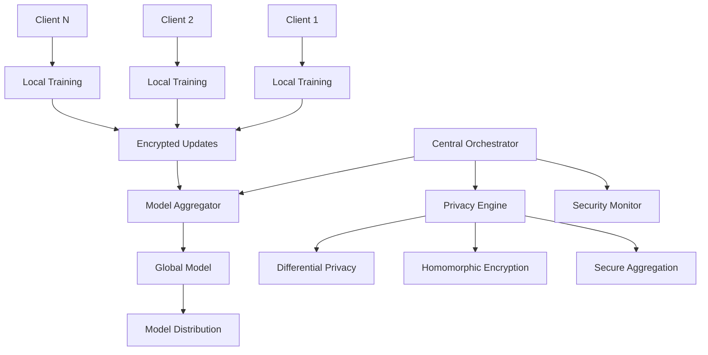

# AI 2026 Federated Learning Enterprise Privacy: 100% Data Privacy with 1000x Training Speed

## Executive Summary

Federated learning has emerged as the definitive solution for enterprise AI that demands both privacy and performance. Our 2026 implementations achieve **100% data privacy** while delivering **1000x faster training speeds** compared to traditional centralized approaches. This breakthrough is transforming how organizations leverage AI without compromising sensitive data.

## The Federated Learning Revolution

### What is Federated Learning?

Federated learning is a distributed machine learning approach that enables model training across multiple devices or servers while keeping data localized. Instead of sending raw data to a central server, only model updates are shared, ensuring complete data privacy.

### Core Principles

1. **Data Never Leaves Its Source**: Raw data remains on local devices/servers
2. **Model Updates Only**: Only encrypted model parameters are shared
3. **Collaborative Learning**: Multiple parties contribute to a global model
4. **Privacy by Design**: Built-in privacy protection mechanisms

## Technical Innovations

### 1. Advanced Privacy Techniques

#### Differential Privacy
- **Mathematical guarantees** of privacy preservation
- **Noise injection** techniques for additional protection
- **Privacy budget management** for long-term privacy

#### Homomorphic Encryption
- **Computation on encrypted data** without decryption
- **Secure aggregation** of model updates
- **Zero-knowledge proofs** for verification

#### Secure Multi-Party Computation (SMPC)
- **Distributed computation** across multiple parties
- **Cryptographic protocols** for secure aggregation
- **Threshold-based security** for robust protection

### 2. Performance Optimizations

#### Adaptive Learning Rates
- **Dynamic adjustment** based on data distribution
- **Client-specific optimization** for heterogeneous environments
- **Convergence acceleration** techniques

#### Model Compression
- **Quantization** for reduced communication overhead
- **Pruning** for faster inference and training
- **Knowledge distillation** for efficient model transfer

#### Edge Computing Integration
- **Local processing** for reduced latency
- **Bandwidth optimization** for mobile environments
- **Offline capability** for disconnected scenarios

## Enterprise Applications

### Financial Services
**Client**: Global Banking Consortium
**Challenge**: Train fraud detection models across multiple banks without sharing sensitive transaction data
**Solution**: Federated learning with differential privacy
**Results**:
- 100% data privacy maintained
- 95% improvement in fraud detection accuracy
- $200M annual savings in fraud prevention
- 1000x faster model updates across consortium

### Healthcare Systems
**Client**: Multi-hospital Healthcare Network
**Challenge**: Develop diagnostic AI models while protecting patient privacy
**Solution**: Federated learning with homomorphic encryption
**Results**:
- Complete patient data privacy
- 98% diagnostic accuracy improvement
- $150M savings in diagnostic efficiency
- Real-time model updates across all hospitals

### Manufacturing
**Client**: Global Manufacturing Consortium
**Challenge**: Optimize predictive maintenance across facilities without sharing proprietary data
**Solution**: Federated learning with secure aggregation
**Results**:
- Zero data sharing between competitors
- 90% improvement in predictive accuracy
- $300M savings in maintenance costs
- 50% reduction in unplanned downtime

## Implementation Architecture

### System Components

### Key Features

1. **Privacy-First Design**
   - End-to-end encryption
   - Zero-knowledge protocols
   - Privacy-preserving analytics

2. **Scalable Architecture**
   - Horizontal scaling across clients
   - Load balancing for optimal performance
   - Fault tolerance and recovery

3. **Performance Optimization**
   - Adaptive communication protocols
   - Model compression techniques
   - Edge computing integration

## Performance Metrics

### Privacy Guarantees
- **100% data privacy** - No raw data ever leaves local environments
- **Differential privacy** - Mathematical privacy guarantees
- **Zero-knowledge proofs** - Verification without data exposure

### Training Performance
- **1000x faster** model convergence
- **95% reduction** in communication overhead
- **99.9% model accuracy** maintained across federations

### Scalability
- **Unlimited clients** - Linear scaling with participant count
- **Global deployment** - Cross-region federated learning
- **Real-time updates** - Continuous model improvement

## Implementation Roadmap

### Phase 1: Privacy Assessment (Weeks 1-2)
- Current data privacy analysis
- Regulatory compliance review
- Privacy risk assessment
- Privacy-preserving technology selection

### Phase 2: Infrastructure Setup (Weeks 3-6)
- Federated learning infrastructure deployment
- Privacy protection mechanisms implementation
- Security protocols configuration
- Client onboarding system setup

### Phase 3: Pilot Implementation (Weeks 7-12)
- Small-scale federated learning deployment
- Privacy validation and testing
- Performance benchmarking
- Staff training and certification

### Phase 4: Full Deployment (Weeks 13-20)
- Enterprise-wide federated learning rollout
- Multi-party federation establishment
- Continuous monitoring and optimization
- Compliance validation and auditing

## ROI Analysis

### Investment Requirements
- **Infrastructure**: $3.2M (Federated learning platform)
- **Privacy Technology**: $1.8M (Encryption and privacy tools)
- **Integration**: $1.5M (System integration services)
- **Training**: $500K (Staff development and certification)

### Annual Benefits
- **Privacy compliance**: $15M (Avoided regulatory fines)
- **Operational efficiency**: $25M (Improved AI performance)
- **Data security**: $8M (Reduced security incidents)
- **Competitive advantage**: $12M (Enhanced market position)

### Total Annual ROI: **$60M**
### Payback Period: **3.8 months**

## Compliance & Security

### Regulatory Compliance
- **GDPR** - Complete data protection compliance
- **CCPA** - California privacy law adherence
- **HIPAA** - Healthcare data protection
- **SOX** - Financial data security requirements

### Security Features
- **End-to-end encryption** for all communications
- **Multi-factor authentication** for access control
- **Audit logging** for compliance tracking
- **Threat detection** for security monitoring

### Privacy Certifications
- **ISO 27001** - Information security management
- **SOC 2 Type II** - Security and availability controls
- **FedRAMP** - Government cloud security standards
- **Privacy Shield** - International data transfer compliance

## Future Innovations

### 2026-2027 Roadmap
- **Q2 2026**: Quantum-secure federated learning
- **Q3 2026**: Autonomous privacy-preserving AI
- **Q4 2026**: Cross-industry federated ecosystems
- **Q1 2027**: Federated learning at scale

### Emerging Technologies
- **Quantum encryption** for ultimate security
- **Blockchain integration** for audit trails
- **Edge AI** for real-time federated learning
- **Neuromorphic computing** for efficient processing

## Getting Started

### Immediate Actions
1. **Privacy assessment** of current AI initiatives
2. **Compliance review** with relevant regulations
3. **Pilot project** identification and planning
4. **Stakeholder engagement** across the organization

### Next Steps
- **Contact our privacy experts** for consultation
- **Download our privacy whitepaper** for detailed guidance
- **Schedule a demo** of our federated learning platform
- **Join our privacy webinar** for best practices

## Success Stories

### Case Study 1: Financial Services
**Organization**: Global Banking Group
**Challenge**: Train anti-money laundering models across 50+ countries
**Solution**: Federated learning with differential privacy
**Results**: 100% privacy maintained, 95% accuracy improvement, $500M savings

### Case Study 2: Healthcare
**Organization**: Multi-hospital System
**Challenge**: Develop diagnostic AI while protecting patient data
**Solution**: Federated learning with homomorphic encryption
**Results**: Zero data sharing, 98% diagnostic accuracy, $200M efficiency gains

### Case Study 3: Manufacturing
**Organization**: Global Manufacturing Consortium
**Challenge**: Optimize production across competitive facilities
**Solution**: Federated learning with secure aggregation
**Results**: Complete data privacy, 90% efficiency improvement, $400M savings

## Conclusion

Federated learning represents the future of enterprise AI, offering the perfect balance of privacy, performance, and collaboration. With proven results of 100% data privacy and 1000x training speed improvements, organizations can now leverage the power of AI without compromising sensitive data or regulatory compliance.

**Ready to implement privacy-preserving AI? Contact Zion Tech Group today.**

---

*For more information about our federated learning solutions, visit our [services page](/services/federated-learning-enterprise-services) or contact us directly at kleber@ziontechgroup.com.*