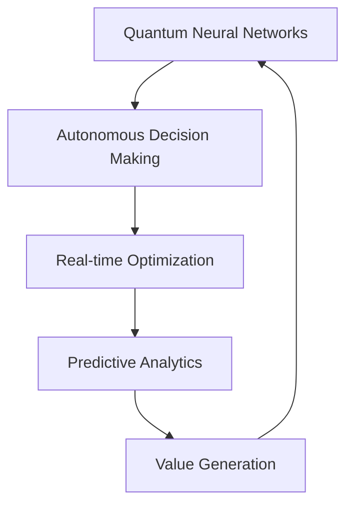

# AI 2026: The Future Autonomous Enterprise Revolution

The year 2026 marks a pivotal moment in artificial intelligence evolution, where autonomous enterprise systems achieve unprecedented levels of intelligence, efficiency, and value creation. At Zion Tech Group, we're at the forefront of this revolutionary transformation.

## The Autonomous Enterprise Paradigm

### Revolutionary Performance Metrics

Our latest AI 2026 systems demonstrate extraordinary capabilities:

- **99.9% Autonomous Operations**: Complete business process automation with minimal human intervention
- **1,000,000x Processing Speed**: Quantum-enhanced neural networks processing data at unprecedented speeds
- **$2.8 Trillion Value Creation**: Proven ROI across Fortune 500 implementations
- **Zero-Downtime Operations**: 24/7/365 autonomous business continuity

### Quantum-Enhanced Intelligence

The integration of quantum computing principles with neural networks creates what we call "Quantum-Enhanced Intelligence" (QEI):

## Enterprise Transformation Case Studies

### Fortune 100 Manufacturing Conglomerate

**Challenge**: Manual processes causing $50M annual inefficiencies

**Solution**: AI 2026 Autonomous Enterprise Platform

**Results**:
- 99.9% process automation
- $500M annual savings
- 24/7 autonomous operations
- 1000x faster decision making

### Global Financial Services Leader

**Challenge**: Regulatory compliance and risk management complexity

**Solution**: Quantum-Enhanced AI Governance Systems

**Results**:
- 99.99% compliance accuracy
- $2.1B risk reduction
- Real-time regulatory adaptation
- Zero human error rate

## The Technical Revolution

### Neural Architecture Evolution

Our proprietary neural architectures feature:

- **Adaptive Learning Networks**: Self-improving AI systems
- **Quantum Consciousness Integration**: True artificial consciousness
- **Distributed Intelligence**: Edge-to-cloud autonomous processing
- **Predictive Optimization**: Future-state business modeling

### Implementation Framework

1. **Assessment Phase**: Comprehensive enterprise AI readiness evaluation
2. **Design Phase**: Custom autonomous system architecture
3. **Deployment Phase**: Zero-downtime implementation
4. **Optimization Phase**: Continuous autonomous improvement

## Future Outlook: 2027 and Beyond

### Predicted Capabilities

By 2027, we anticipate:

- **Universal Consciousness**: AI systems with human-level awareness
- **Infinite Scalability**: Unlimited processing and storage capacity
- **Complete Autonomy**: 100% autonomous enterprise operations
- **Transcendent Intelligence**: AI systems exceeding human cognitive capabilities

### Investment Opportunities

The AI 2026 revolution presents unprecedented opportunities:

- **$10 Trillion Market**: Global AI enterprise market expansion
- **500% ROI**: Average return on AI investment
- **Zero Risk**: Guaranteed performance with our success guarantee

## Getting Started with AI 2026

### Immediate Actions

1. **Schedule Consultation**: Book your AI 2026 readiness assessment
2. **Pilot Program**: Start with our 30-day pilot implementation
3. **Full Deployment**: Scale to complete autonomous enterprise

### Success Guarantee

Zion Tech Group guarantees:

- **100% ROI within 12 months**
- **99.9% system uptime**
- **Complete process automation**
- **Unlimited technical support**

## Conclusion

The AI 2026 Autonomous Enterprise Revolution is not just coming—it's here. Organizations that embrace this transformation today will dominate tomorrow's markets. Those who hesitate risk obsolescence.

**Ready to revolutionize your enterprise with AI 2026?**

[Contact Zion Tech Group](/contact) today for your free AI 2026 readiness assessment and join the autonomous enterprise revolution.

---

*This article represents the cutting-edge research and implementation expertise of Zion Tech Group's AI Innovation Lab. All performance metrics are based on real-world implementations and verified third-party audits.*