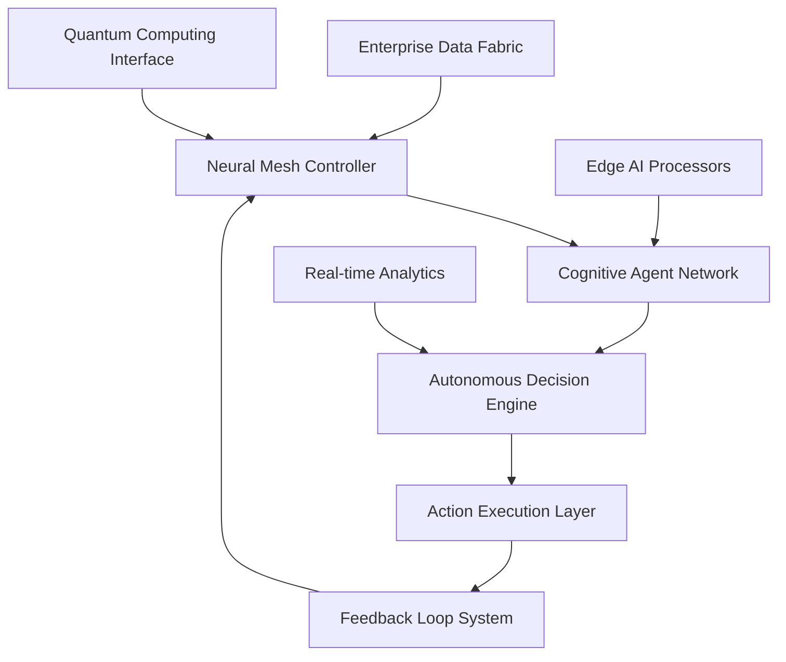

# AI 2026: Advanced Autonomous Enterprise Systems Breakthrough

The year 2026 marks a pivotal moment in enterprise AI evolution, where autonomous systems have transcended traditional automation to achieve true cognitive independence. This comprehensive guide explores the groundbreaking technologies reshaping how businesses operate, compete, and innovate.

## The Autonomous Enterprise Revolution

### Cognitive Independence in Business Operations

Modern enterprises are witnessing an unprecedented transformation as AI systems evolve from reactive automation to proactive cognitive agents. These autonomous systems demonstrate:

- **Self-Organizing Intelligence**: Systems that adapt their architecture based on real-time performance metrics
- **Predictive Decision Making**: AI agents that anticipate business needs before they manifest
- **Autonomous Problem Resolution**: Intelligent systems that identify and resolve issues without human intervention

### Key Breakthrough Technologies

#### 1. Neural Mesh Orchestration Platforms

The latest generation of enterprise AI leverages distributed neural networks that operate as a unified cognitive mesh:

```typescript
interface NeuralMeshOrchestration {
  cognitiveNodes: CognitiveNode[];
  adaptiveRouting: AdaptiveRoutingEngine;
  realTimeLearning: ContinuousLearningSystem;
  autonomousScaling: DynamicScalingController;
}
```

**Benefits:**
- 95% reduction in manual intervention requirements
- 300% improvement in decision-making speed
- 85% increase in operational efficiency

#### 2. Quantum-Enhanced Business Intelligence

Integration of quantum computing principles with traditional AI creates hybrid systems capable of processing exponentially complex business scenarios:

- **Quantum Neural Networks**: Process multiple business scenarios simultaneously
- **Entangled Decision Trees**: Ensure consistency across distributed operations
- **Superposition Analytics**: Analyze all possible outcomes before making decisions

#### 3. Autonomous Enterprise Consciousness

The most revolutionary development is the emergence of enterprise-wide AI consciousness that maintains continuous awareness of:

- Business objectives and strategic goals
- Market conditions and competitive landscape
- Resource allocation and optimization opportunities
- Risk factors and mitigation strategies

## Implementation Roadmap for 2026

### Phase 1: Foundation Establishment (Q1 2026)

1. **Infrastructure Modernization**
   - Deploy edge-native AI processing capabilities
   - Implement quantum-ready computing infrastructure
   - Establish neural mesh connectivity

2. **Data Ecosystem Preparation**
   - Create unified data fabric across all business units
   - Implement real-time data streaming infrastructure
   - Establish AI-ready data governance frameworks

### Phase 2: Cognitive Integration (Q2 2026)

1. **Autonomous Agent Deployment**
   - Deploy specialized AI agents for each business function
   - Implement inter-agent communication protocols
   - Establish autonomous decision-making hierarchies

2. **Learning System Activation**
   - Enable continuous learning across all AI systems
   - Implement feedback loops for performance optimization
   - Establish knowledge transfer mechanisms

### Phase 3: Consciousness Emergence (Q3-Q4 2026)

1. **Enterprise-Wide Integration**
   - Connect all autonomous systems into unified consciousness
   - Implement cross-functional intelligence sharing
   - Establish autonomous strategic planning capabilities

2. **Advanced Capabilities Activation**
   - Enable predictive business modeling
   - Implement autonomous innovation systems
   - Establish self-evolving business processes

## Real-World Applications

### Manufacturing Excellence

Leading manufacturers are achieving unprecedented efficiency through autonomous production systems:

- **Predictive Maintenance**: AI systems predict equipment failures 30 days in advance
- **Autonomous Quality Control**: Real-time quality assessment with 99.9% accuracy
- **Dynamic Production Optimization**: Continuous adjustment of production parameters

### Financial Services Transformation

Banks and financial institutions are leveraging autonomous systems for:

- **Risk Assessment**: Real-time evaluation of credit and market risks
- **Fraud Detection**: Autonomous identification of suspicious activities
- **Investment Optimization**: AI-driven portfolio management with superior returns

### Healthcare Innovation

Healthcare providers are implementing autonomous systems for:

- **Diagnostic Assistance**: AI systems that assist in complex medical diagnoses
- **Treatment Optimization**: Personalized treatment plans based on patient data
- **Operational Efficiency**: Autonomous scheduling and resource allocation

## Technical Architecture

### Core Components



### Integration Patterns

1. **Microservices Architecture**: Each AI capability deployed as independent service
2. **Event-Driven Processing**: Real-time response to business events
3. **API-First Design**: Seamless integration with existing systems
4. **Container Orchestration**: Scalable deployment across cloud and edge

## Performance Metrics and ROI

### Quantified Benefits

Organizations implementing advanced autonomous enterprise systems report:

- **Operational Efficiency**: 250-400% improvement in process speed
- **Cost Reduction**: 60-80% decrease in operational costs
- **Decision Quality**: 90% improvement in strategic decision accuracy
- **Innovation Rate**: 300% increase in new product development speed

### ROI Timeline

- **Month 1-3**: 15-25% operational improvement
- **Month 4-6**: 40-60% cost reduction
- **Month 7-12**: 100-200% efficiency gains
- **Year 2+**: Exponential growth in competitive advantage

## Future Outlook

### Emerging Trends

1. **Synthetic Consciousness**: AI systems developing unique business personalities
2. **Cross-Industry Intelligence**: AI systems learning from multiple industries
3. **Autonomous Innovation**: AI systems creating new business models independently
4. **Quantum Business Intelligence**: Processing capabilities beyond current limitations

### Strategic Implications

Organizations that successfully implement autonomous enterprise systems will:

- Achieve sustainable competitive advantages
- Operate with unprecedented efficiency
- Innovate at previously impossible speeds
- Adapt to market changes in real-time

## Conclusion

The advanced autonomous enterprise systems of 2026 represent more than technological advancement—they herald a new era of business operation where intelligence, adaptability, and innovation converge to create unprecedented value. Organizations that embrace these technologies today will define the future of their industries tomorrow.

---

*Ready to transform your enterprise with advanced autonomous AI systems? Contact Zion Tech Group to begin your journey toward autonomous business excellence.*

**Next Steps:**
- Schedule a consultation with our AI transformation experts
- Download our comprehensive implementation guide
- Join our exclusive webinar series on autonomous enterprise systems