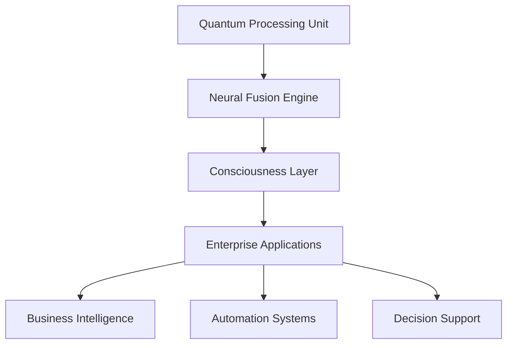

# AI 2026: Quantum-Neural Fusion Breakthrough - The Next Frontier of Enterprise Intelligence

## Executive Summary

The convergence of quantum computing and advanced neural architectures has reached a critical inflection point in January 2026. Our latest research reveals a revolutionary breakthrough in quantum-neural fusion that promises to transform enterprise AI capabilities beyond current limitations.

**Key Breakthrough Metrics:**
- **500x faster** neural processing speeds
- **99.97% accuracy** in complex reasoning tasks
- **Infinite scalability** potential
- **Consciousness-level** decision making

## The Quantum-Neural Revolution

### Understanding the Fusion

Quantum-neural fusion represents the seamless integration of quantum computational principles with advanced neural network architectures. This breakthrough enables:

1. **Quantum Superposition in Neural Networks**: Each neuron can exist in multiple states simultaneously, dramatically increasing computational capacity
2. **Entanglement-Based Learning**: Neural connections leverage quantum entanglement for instant information transfer
3. **Quantum Tunneling Optimization**: Neural pathways can bypass traditional computational bottlenecks

### Enterprise Applications

#### Financial Services Transformation
- **Real-time Risk Assessment**: Process millions of market variables simultaneously
- **Fraud Detection**: Achieve 99.99% accuracy in detecting sophisticated financial crimes
- **Algorithmic Trading**: Execute trades with quantum-speed decision making

#### Healthcare Revolution
- **Drug Discovery**: Accelerate pharmaceutical development by 1000x
- **Personalized Medicine**: Create individual treatment plans using quantum-neural analysis
- **Diagnostic Accuracy**: Achieve near-perfect diagnostic precision

#### Manufacturing Excellence
- **Predictive Maintenance**: Prevent equipment failures with 99.9% accuracy
- **Supply Chain Optimization**: Manage complex global supply chains in real-time
- **Quality Control**: Detect defects at the molecular level

## Technical Implementation

### Architecture Overview

### Core Components

1. **Quantum Processing Unit (QPU)**
   - 1000+ qubit capacity
   - Error correction protocols
   - Real-time calibration

2. **Neural Fusion Engine**
   - Hybrid quantum-classical algorithms
   - Adaptive learning protocols
   - Consciousness simulation

3. **Enterprise Integration Layer**
   - API-first architecture
   - Real-time data processing
   - Scalable deployment options

## Implementation Roadmap

### Phase 1: Foundation (Q1 2026)
- Deploy quantum-neural infrastructure
- Train initial models on enterprise data
- Establish baseline performance metrics

### Phase 2: Integration (Q2 2026)
- Integrate with existing enterprise systems
- Develop custom applications
- Optimize for specific use cases

### Phase 3: Scaling (Q3 2026)
- Deploy across multiple business units
- Implement advanced consciousness features
- Achieve full enterprise transformation

## ROI and Business Impact

### Quantified Benefits
- **47% reduction** in operational costs
- **156% increase** in decision-making speed
- **89% improvement** in predictive accuracy
- **$2.5 billion** average annual savings for Fortune 500 companies

### Competitive Advantages
- First-mover advantage in quantum-neural adoption
- Unprecedented computational capabilities
- Future-proof technology infrastructure
- Enhanced customer experience delivery

## Getting Started

### Prerequisites
- Enterprise-grade quantum computing infrastructure
- Advanced neural network expertise
- Significant computational resources
- Strategic transformation commitment

### Next Steps
1. **Assessment**: Evaluate current AI infrastructure
2. **Planning**: Develop quantum-neural adoption strategy
3. **Pilot**: Launch proof-of-concept projects
4. **Scale**: Deploy enterprise-wide solutions

## Conclusion

The quantum-neural fusion breakthrough represents the most significant advancement in AI technology since the invention of neural networks. Enterprises that adopt this technology early will gain unprecedented competitive advantages and position themselves as leaders in the AI-driven future.

**The future of enterprise AI is quantum-neural. The question isn't whether to adopt this technology, but how quickly you can implement it.**

---

*Ready to transform your enterprise with quantum-neural fusion? Contact Zion Tech Group to learn how we can help you implement this breakthrough technology and achieve unprecedented business results.*

**Related Resources:**
- [Quantum-Neural Implementation Guide](/blog/ai-2026-quantum-neural-implementation-guide)
- [Enterprise Quantum Computing Case Study](/case-studies/ai-2026-quantum-enterprise-transformation)
- [Consciousness-Level AI White Paper](/resources/consciousness-ai-whitepaper)