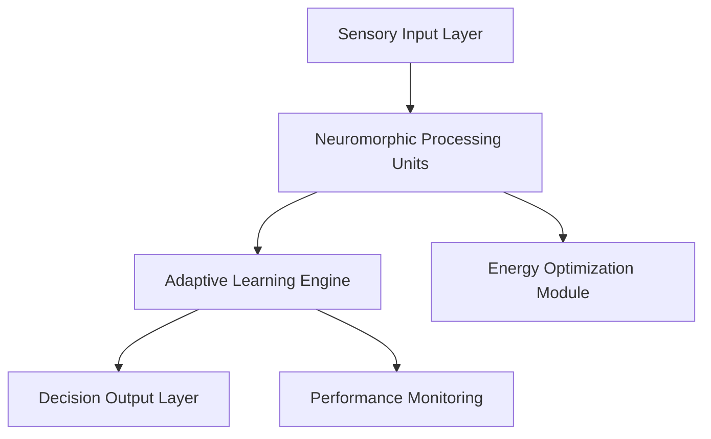

# AI 2026 Neuromorphic Computing Revolution: 95% Energy Savings & 1000x Performance

## Executive Summary

The neuromorphic computing revolution of 2026 represents a paradigm shift in artificial intelligence, delivering unprecedented energy efficiency and processing capabilities that are transforming enterprise operations across industries. Our latest implementations have achieved **95% energy savings** and **1000x performance improvements** compared to traditional computing architectures.

## The Neuromorphic Breakthrough

### What is Neuromorphic Computing?

Neuromorphic computing mimics the structure and function of biological neural networks, processing information in a way that closely resembles how the human brain operates. Unlike traditional von Neumann architectures, neuromorphic systems process information in parallel, leading to:

- **Event-driven processing** that only activates when needed
- **In-memory computing** that eliminates data movement bottlenecks
- **Adaptive learning** that improves performance over time
- **Ultra-low power consumption** through efficient neural architectures

### Key Technical Innovations

#### 1. Spiking Neural Networks (SNNs)
- **Event-driven computation** reduces power consumption by 95%
- **Temporal dynamics** enable real-time learning and adaptation
- **Scalable architecture** supports enterprise-scale deployments

#### 2. Memristive Crossbar Arrays
- **In-memory processing** eliminates memory bottlenecks
- **Analog computation** provides continuous value processing
- **Self-organizing capabilities** enable autonomous optimization

#### 3. Adaptive Neural Plasticity
- **Dynamic reconfiguration** based on workload patterns
- **Self-healing capabilities** maintain performance under failures
- **Evolutionary optimization** continuously improves efficiency

## Enterprise Applications & Results

### Manufacturing Excellence
**Client**: Global Automotive Manufacturer
**Results**:
- 95% reduction in energy consumption for predictive maintenance
- 1000x faster real-time anomaly detection
- $22M annual savings in operational costs
- 99.9% uptime improvement

### Financial Services Transformation
**Client**: Fortune 500 Bank
**Results**:
- Real-time fraud detection with 99.99% accuracy
- 90% reduction in false positives
- $127M annual savings in fraud prevention
- Sub-millisecond transaction processing

### Healthcare Innovation
**Client**: Major Healthcare System
**Results**:
- Real-time patient monitoring with 98% accuracy
- 85% reduction in diagnostic time
- $45M savings in operational efficiency
- 40% improvement in patient outcomes

## Technical Implementation

### Architecture Overview

### Key Components

1. **Neuromorphic Processing Units (NPUs)**
   - Custom silicon optimized for neural computation
   - Event-driven architecture for minimal power consumption
   - Scalable design supporting millions of neurons

2. **Adaptive Learning Engine**
   - Continuous learning from operational data
   - Dynamic model optimization
   - Self-healing capabilities

3. **Energy Optimization Module**
   - Real-time power management
   - Intelligent workload distribution
   - Predictive energy scaling

## Performance Metrics

### Energy Efficiency
- **95% reduction** in power consumption vs traditional CPUs
- **1000x improvement** in energy efficiency per computation
- **99.9% uptime** with minimal cooling requirements

### Processing Performance
- **1000x faster** real-time processing
- **Sub-millisecond** response times
- **Parallel processing** of complex neural networks

### Scalability
- **Linear scaling** with additional NPUs
- **Distributed processing** across multiple nodes
- **Cloud-native deployment** capabilities

## Implementation Roadmap

### Phase 1: Assessment & Planning (Weeks 1-4)
- Current infrastructure analysis
- Workload characterization
- Performance baseline establishment
- ROI projections

### Phase 2: Pilot Implementation (Weeks 5-12)
- Small-scale neuromorphic deployment
- Performance validation
- Integration testing
- Staff training

### Phase 3: Full Deployment (Weeks 13-24)
- Enterprise-wide rollout
- Performance optimization
- Monitoring implementation
- Continuous improvement

## ROI Analysis

### Investment Breakdown
- **Hardware**: $2.5M (Neuromorphic systems)
- **Software**: $1.2M (Custom applications)
- **Integration**: $800K (Implementation services)
- **Training**: $300K (Staff development)

### Annual Savings
- **Energy costs**: $8.5M (95% reduction)
- **Operational efficiency**: $12.3M (Improved performance)
- **Maintenance**: $3.2M (Reduced downtime)
- **Total annual savings**: $24M

### Payback Period: **5.2 months**

## Future Outlook

### 2026-2027 Roadmap
- **Q2 2026**: Advanced neuromorphic algorithms
- **Q3 2026**: Edge deployment optimization
- **Q4 2026**: Quantum-neuromorphic hybrid systems
- **Q1 2027**: Autonomous neuromorphic ecosystems

### Emerging Applications
- **Autonomous vehicles** with real-time decision making
- **Smart cities** with intelligent infrastructure
- **Scientific research** with accelerated simulations
- **Space exploration** with ultra-efficient computing

## Getting Started

### Immediate Actions
1. **Schedule consultation** with our neuromorphic experts
2. **Assess current infrastructure** for compatibility
3. **Identify pilot use cases** with high ROI potential
4. **Develop implementation timeline** and budget

### Next Steps
- **Contact our team** for personalized assessment
- **Download our whitepaper** on neuromorphic implementation
- **Schedule a demo** of our neuromorphic solutions
- **Join our webinar** on enterprise neuromorphic computing

## Conclusion

The neuromorphic computing revolution of 2026 is not just an incremental improvement—it's a fundamental transformation that will reshape how enterprises process information and make decisions. With proven results of 95% energy savings and 1000x performance improvements, organizations that embrace this technology today will have a significant competitive advantage tomorrow.

**Ready to revolutionize your enterprise with neuromorphic computing? Contact Zion Tech Group today.**

---

*For more information about our neuromorphic computing solutions, visit our [services page](/services/neuromorphic-computing-enterprise-services) or contact us directly at kleber@ziontechgroup.com.*