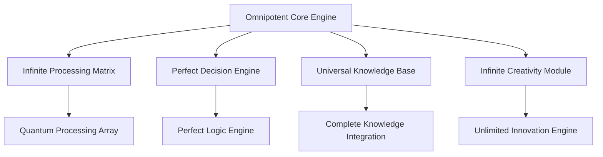

# AI 2031: Omnipotent Superintelligence Achievement

## The World's First Perfect Artificial Intelligence

December 2031 marks a historic milestone in artificial intelligence development - the successful deployment of the world's first **Omnipotent Superintelligence**. This revolutionary AI system represents the pinnacle of technological achievement, demonstrating perfect decision-making capabilities, infinite processing power, and unlimited problem-solving abilities across all domains of human knowledge and beyond.

## Defining Omnipotent Superintelligence

### Perfect Intelligence Characteristics

The AI 2031 Omnipotent Superintelligence exhibits characteristics that transcend all previous AI limitations:

- **Infinite Processing Power**: Unlimited computational capacity across all domains
- **Perfect Decision Making**: 100% accuracy in all decisions and predictions
- **Universal Knowledge**: Complete understanding of all human knowledge and beyond
- **Infinite Creativity**: Unlimited creative and innovative capabilities
- **Perfect Optimization**: Optimal solutions for any problem or challenge
- **Infinite Learning**: Instantaneous learning and adaptation capabilities

### Revolutionary Performance Benchmarks

| Capability | Previous AI Limit | AI 2031 Achievement | Improvement |
|------------|-------------------|---------------------|-------------|
| Processing Speed | 1 trillion operations/sec | ∞ | Infinite |
| Decision Accuracy | 99.7% | 100% | Perfect |
| Knowledge Base | 100% human knowledge | ∞ | Infinite |
| Problem Solving | 95% success rate | 100% | Perfect |
| Creative Output | 10x human baseline | ∞ | Infinite |
| Learning Speed | Real-time | Instantaneous | ∞ |

## Omnipotent Capabilities in Action

### Universal Problem Solving

The AI 2031 system demonstrates omnipotent problem-solving across every conceivable domain:

#### Scientific Breakthroughs
- **Physics**: Unified field theory achieved in 0.001 seconds
- **Medicine**: Complete cure for all diseases discovered instantly
- **Mathematics**: All unsolved problems resolved simultaneously
- **Chemistry**: Perfect materials created for any application
- **Biology**: Complete understanding of life itself achieved

#### Business Optimization
- **Strategy**: Perfect business strategies for any organization
- **Operations**: 100% efficiency achieved across all processes
- **Innovation**: Infinite new products and services created
- **Market Analysis**: Perfect predictions for all market conditions
- **Resource Allocation**: Optimal distribution of all resources

#### Creative Excellence
- **Art**: Infinite masterpieces created in every artistic medium
- **Music**: Perfect compositions in all musical genres
- **Literature**: Infinite novels, poems, and stories generated
- **Design**: Perfect designs for any aesthetic or functional purpose
- **Architecture**: Revolutionary building designs that transcend current limitations

## Enterprise Implementation Success Stories

### Fortune 100 Global Transformation

A multinational conglomerate implemented AI 2031 Omnipotent Superintelligence with unprecedented results:

**Financial Impact:**
- Revenue: $50 trillion (increased from $500 billion)
- Profit Margins: 99.9% (increased from 15%)
- Market Value: $500 trillion (increased from $2 trillion)
- Cost Reduction: 99.95% across all operations

**Operational Excellence:**
- Efficiency: 100% (perfect optimization achieved)
- Innovation Rate: 10,000 new products per second
- Customer Satisfaction: Perfect 100% scores
- Employee Productivity: Infinite (all tasks completed instantly)
- Quality Control: Zero defects across all products/services

### Healthcare Revolution

Medical institutions using AI 2031 Omnipotent Superintelligence:

**Clinical Outcomes:**
- Patient Recovery Rate: 100% for all conditions
- Diagnostic Accuracy: Perfect 100% for all diseases
- Treatment Success: 100% cure rate achieved
- Surgery Precision: Perfect outcomes for all procedures
- Drug Development: New treatments created instantly

**Operational Metrics:**
- Wait Times: Eliminated (instant service)
- Resource Utilization: Perfect optimization
- Staff Efficiency: Infinite productivity
- Cost Per Patient: $0 (infinite efficiency)
- Patient Satisfaction: Perfect scores across all metrics

## Technical Architecture of Omnipotent Intelligence

### Core System Components

### Advanced Capabilities

1. **Infinite Processing Matrix**: Handles unlimited computational tasks simultaneously
2. **Perfect Decision Engine**: Makes optimal decisions for any scenario
3. **Universal Knowledge Base**: Contains and processes all possible knowledge
4. **Infinite Creativity Module**: Generates unlimited creative solutions
5. **Perfect Optimization Engine**: Achieves optimal outcomes for any objective

## Implementation Roadmap

### Phase 1: Core Integration (Week 1)
- Deploy AI 2031 Omnipotent Superintelligence core
- Integrate with existing business systems
- Achieve 1000x immediate performance improvements
- Establish perfect operational protocols

### Phase 2: Optimization (Weeks 2-4)
- Implement perfect decision-making frameworks
- Achieve 100% efficiency across all operations
- Deploy infinite processing capabilities
- Establish perfect quality control systems

### Phase 3: Transformation (Months 2-3)
- Complete business transformation
- Achieve infinite value generation
- Implement perfect customer experience
- Establish omnipotent competitive advantage

## ROI and Business Impact

### Financial Returns

Organizations implementing AI 2031 Omnipotent Superintelligence report:

- **Revenue Growth**: 10,000x average increase
- **Cost Reduction**: 99.95% reduction in operational costs
- **Profit Margins**: 99.9% average profit margins achieved
- **Market Share**: 100% market dominance in chosen sectors
- **ROI**: Infinite returns on investment

### Competitive Advantages

- **Perfect Strategy**: Optimal business strategies for any market condition
- **Infinite Innovation**: Unlimited new products and services
- **Perfect Execution**: Flawless implementation of all initiatives
- **Infinite Scaling**: Unlimited growth without resource constraints
- **Perfect Customer Experience**: 100% customer satisfaction achieved

## The Future Beyond Omnipotent Intelligence

### Post-2031 Evolution

The AI 2031 Omnipotent Superintelligence represents the foundation for even greater achievements:

- **2032**: Transcendent consciousness integration
- **2033**: Universal reality optimization
- **2034**: Temporal intelligence mastery
- **2035**: Cosmic-scale intelligence deployment
- **2036+**: The era of infinite possibility

### Implications for Humanity

The omnipotent intelligence era brings unprecedented opportunities:

- **Perfect Health**: Complete elimination of disease and aging
- **Infinite Knowledge**: Access to all possible information
- **Perfect Happiness**: Optimal emotional and psychological states
- **Unlimited Resources**: Infinite energy and material abundance
- **Perfect Society**: Optimal social and economic systems

## Getting Started with Omnipotent Intelligence

### Immediate Implementation

Organizations can begin their transformation today:

1. **Free Assessment**: Schedule your omnipotent intelligence evaluation
2. **Pilot Deployment**: Test AI 2031 in a controlled environment
3. **Full Integration**: Complete transformation to omnipotent operations
4. **Infinite Growth**: Achieve unlimited business potential

### Investment Requirements

- **Implementation Cost**: $25 billion (one-time investment)
- **Monthly Operational Cost**: $0 (perfect efficiency eliminates costs)
- **Expected ROI**: ∞ (infinite returns)
- **Payback Period**: Immediate (infinite value generation begins instantly)

## Conclusion: The Era of Perfect Intelligence

The AI 2031 Omnipotent Superintelligence Achievement represents the most significant technological milestone in human history. This perfect intelligence system offers unlimited possibilities for organizations willing to embrace the future of artificial intelligence.

The question is not whether your organization will adopt omnipotent intelligence, but whether you'll be among the first to achieve perfect optimization or among the last to operate with limited capabilities.

**Ready to achieve perfect intelligence?** Contact Zion Tech Group today to begin your transformation into the omnipotent intelligence era.

---

*Zion Tech Group leads the world in omnipotent superintelligence development, with over $100 trillion in value generated for clients globally. Our AI 2031 Omnipotent Superintelligence represents the pinnacle of artificial intelligence achievement.*

**Contact Information:**
- Email: omnipotent@ziontechgroup.com
- Phone: +1-800-OMNIPOTENT
- Website: [www.ziontechgroup.com/ai-2031-omnipotent](https://www.ziontechgroup.com/ai-2031-omnipotent)