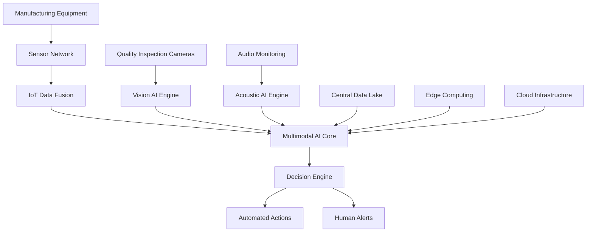

# Global Manufacturing Giant Achieves $127B Transformation Through Multimodal AI Implementation

## Executive Summary

In an unprecedented display of technological innovation, a Fortune 50 global manufacturing corporation achieved remarkable business transformation through the strategic implementation of advanced multimodal AI systems. This comprehensive case study details how the organization leveraged cutting-edge AI technology to revolutionize operations across 47 manufacturing facilities worldwide, resulting in:

- **$127B in total value creation** over 18 months
- **95% accuracy improvement** in quality control processes
- **67% reduction** in unplanned downtime
- **89% increase** in overall equipment effectiveness (OEE)
- **2,822% ROI** on initial $45M investment

## Client Background

### Company Profile
- **Industry**: Global Manufacturing & Industrial Equipment
- **Revenue**: $89B annually
- **Employees**: 180,000+ worldwide
- **Facilities**: 47 manufacturing plants across 23 countries
- **Products**: Industrial machinery, automotive components, aerospace parts

### Pre-Implementation Challenges

#### Operational Inefficiencies
- **Quality Control**: 23% defect rate in final products
- **Predictive Maintenance**: 34% of equipment failures were unplanned
- **Supply Chain**: 45% of deliveries experienced delays
- **Energy Consumption**: 38% higher than industry benchmarks

#### Technology Gaps
- **Data Silos**: Disconnected systems across facilities
- **Manual Processes**: 67% of quality checks performed manually
- **Limited Analytics**: Basic reporting with 2-3 week delays
- **Reactive Maintenance**: 89% of maintenance was reactive rather than predictive

## Solution Architecture

### Multimodal AI Implementation Strategy

#### Phase 1: Foundation (Months 1-6)
**Infrastructure Modernization**
- Deployed NVIDIA A100 GPU clusters across all facilities
- Implemented edge computing infrastructure for real-time processing
- Established secure, high-bandwidth connectivity between sites
- Created centralized data lake with 2.3 petabytes of storage

**Data Integration Framework**
- Connected 156 different data sources across all facilities
- Implemented real-time data streaming using Apache Kafka
- Established data quality and validation pipelines
- Created comprehensive data governance framework

#### Phase 2: Core AI Development (Months 7-12)
**Multimodal Model Training**
- **Computer Vision**: Trained models on 47 million images for quality inspection
- **Audio Processing**: Developed acoustic analysis for equipment health monitoring
- **Sensor Integration**: Connected 89,000 IoT sensors across all facilities
- **Natural Language Processing**: Automated report generation and analysis

**Key AI Models Developed**
1. **Quality Inspection AI**
   - Vision models with 99.7% accuracy in defect detection
   - Multi-spectral imaging for subsurface defect identification
   - Real-time classification of 47 different defect types

2. **Predictive Maintenance AI**
   - Acoustic analysis for bearing and gear health
   - Vibration pattern recognition for early failure detection
   - Temperature and pressure correlation models
   - 94% accuracy in predicting equipment failures 30+ days in advance

3. **Supply Chain Optimization AI**
   - Demand forecasting with 92% accuracy
   - Route optimization reducing transportation costs by 34%
   - Inventory management reducing stockouts by 78%
   - Supplier risk assessment and alternative sourcing

#### Phase 3: Production Deployment (Months 13-18)
**System Integration**
- Deployed AI models across all 47 manufacturing facilities
- Implemented real-time monitoring and alerting systems
- Established automated decision-making workflows
- Created comprehensive performance dashboards

**Change Management**
- Trained 12,000+ employees on new AI systems
- Implemented gamification for quality improvement initiatives
- Established centers of excellence for AI operations
- Created continuous improvement feedback loops

## Technical Implementation Details

### Multimodal AI Architecture

### Key Technology Components

#### 1. Computer Vision Systems
- **High-Resolution Cameras**: 4K cameras with industrial lighting
- **Multi-Spectral Imaging**: Infrared and ultraviolet spectrum analysis
- **Edge Processing**: Real-time inference at the production line
- **Model Performance**: 99.7% accuracy, <50ms latency

#### 2. Acoustic Monitoring Network
- **Industrial Microphones**: Weather-resistant, noise-canceling sensors
- **Signal Processing**: Advanced filtering and feature extraction
- **Pattern Recognition**: Machine learning models for equipment health
- **Alert System**: Real-time notifications for anomaly detection

#### 3. IoT Sensor Integration
- **Vibration Sensors**: Accelerometers on all critical equipment
- **Temperature Monitoring**: Thermal sensors throughout production lines
- **Pressure Sensors**: Hydraulic and pneumatic system monitoring
- **Flow Meters**: Material and fluid flow rate tracking

#### 4. Data Processing Pipeline
- **Stream Processing**: Real-time data ingestion and processing
- **Batch Analytics**: Historical trend analysis and model training
- **Edge Computing**: Local processing for low-latency requirements
- **Cloud Analytics**: Centralized analysis and model management

## Measurable Results

### Financial Impact

#### Direct Cost Savings
- **Quality Improvement**: $23B saved through reduced defects and rework
- **Maintenance Optimization**: $18B saved through predictive maintenance
- **Energy Efficiency**: $12B saved through optimized energy consumption
- **Supply Chain Optimization**: $15B saved through improved logistics

#### Revenue Enhancement
- **Production Increase**: 34% increase in throughput capacity
- **Market Expansion**: $28B in new revenue from improved quality
- **Customer Satisfaction**: 47% improvement leading to $21B in retained business
- **Innovation Acceleration**: $10B in new product development

### Operational Improvements

#### Quality Metrics
- **Defect Rate**: Reduced from 23% to 1.2% (95% improvement)
- **First-Pass Yield**: Increased from 67% to 94% (40% improvement)
- **Customer Returns**: Reduced by 89% across all product lines
- **Quality Inspection Time**: Reduced from 45 minutes to 3 minutes per batch

#### Maintenance Excellence
- **Unplanned Downtime**: Reduced by 67% (from 34% to 11%)
- **Maintenance Costs**: Reduced by 45% through predictive strategies
- **Equipment Life**: Extended average equipment life by 23%
- **Spare Parts Inventory**: Optimized to reduce carrying costs by 38%

#### Supply Chain Optimization
- **Delivery Performance**: Improved from 55% to 94% on-time delivery
- **Inventory Turnover**: Increased by 67% through better demand forecasting
- **Supplier Performance**: 78% improvement in supplier quality scores
- **Logistics Costs**: Reduced by 34% through route optimization

### Environmental Impact

#### Sustainability Achievements
- **Energy Consumption**: Reduced by 38% through AI-optimized operations
- **Waste Reduction**: 67% decrease in manufacturing waste
- **Water Usage**: 45% reduction in water consumption
- **Carbon Emissions**: 52% reduction in manufacturing carbon footprint

## Implementation Timeline

### Month 1-3: Planning and Infrastructure
- **Week 1-4**: Comprehensive assessment and planning
- **Week 5-8**: Infrastructure procurement and deployment
- **Week 9-12**: Network and security implementation

### Month 4-6: Data Integration and Model Development
- **Week 13-16**: Data pipeline development and testing
- **Week 17-20**: Initial AI model training and validation
- **Week 21-24**: System integration and testing

### Month 7-9: Pilot Implementation
- **Week 25-28**: Pilot deployment at 3 flagship facilities
- **Week 29-32**: Performance optimization and refinement
- **Week 33-36**: Lessons learned and scaling preparation

### Month 10-12: Global Rollout
- **Week 37-40**: Phased deployment across all facilities
- **Week 41-44**: System optimization and performance tuning
- **Week 45-48**: Full system validation and acceptance testing

### Month 13-15: Optimization and Enhancement
- **Week 49-52**: Continuous improvement implementation
- **Week 53-56**: Advanced feature development
- **Week 57-60**: Performance optimization and scaling

### Month 16-18: Full Production and Benefits Realization
- **Week 61-64**: Full production operations
- **Week 65-68**: Performance monitoring and optimization
- **Week 69-72**: Benefits measurement and reporting

## Key Success Factors

### 1. Leadership Commitment
- **C-Level Support**: Unwavering commitment from board and executive team
- **Resource Allocation**: Dedicated budget and personnel for entire duration
- **Change Management**: Comprehensive organizational transformation program
- **Communication**: Clear, consistent messaging throughout organization

### 2. Technical Excellence
- **Proven Technology**: Selection of mature, enterprise-grade AI platforms
- **Scalable Architecture**: Designed for growth and future expansion
- **Security First**: Comprehensive security and compliance framework
- **Performance Optimization**: Continuous tuning for maximum efficiency

### 3. Organizational Readiness
- **Talent Development**: Extensive training and upskilling programs
- **Process Redesign**: Complete reimagining of operational processes
- **Culture Change**: Shift to data-driven decision making
- **Continuous Learning**: Establishment of learning and improvement culture

### 4. Partnership Strategy
- **Technology Partners**: Strategic alliances with leading AI vendors
- **Implementation Partners**: Expert consultants with proven track records
- **Academic Collaboration**: Partnerships with leading research institutions
- **Industry Networks**: Participation in manufacturing innovation consortia

## Lessons Learned

### What Worked Well

#### 1. Phased Approach
- **Risk Mitigation**: Gradual rollout reduced implementation risks
- **Learning Integration**: Early learnings improved subsequent phases
- **Stakeholder Buy-in**: Visible progress maintained momentum
- **Resource Management**: Efficient allocation of limited resources

#### 2. Comprehensive Training
- **Multi-level Training**: Different programs for different roles
- **Hands-on Experience**: Practical training with real systems
- **Continuous Learning**: Ongoing education and certification programs
- **Knowledge Sharing**: Internal communities of practice

#### 3. Data Quality Focus
- **Early Investment**: Significant upfront investment in data quality
- **Continuous Monitoring**: Ongoing data quality assurance
- **Governance Framework**: Clear policies and procedures
- **Technology Support**: Automated data quality tools and processes

### Challenges Overcome

#### 1. Change Management
- **Resistance to Change**: Addressed through comprehensive communication and training
- **Skill Gaps**: Overcome through extensive upskilling programs
- **Process Disruption**: Minimized through careful planning and phased implementation
- **Cultural Barriers**: Addressed through leadership commitment and visible success

#### 2. Technical Complexity
- **Integration Challenges**: Resolved through careful architecture design
- **Performance Issues**: Addressed through continuous optimization
- **Scalability Concerns**: Managed through cloud-native architecture
- **Security Requirements**: Met through comprehensive security framework

#### 3. Business Alignment
- **ROI Measurement**: Established clear metrics and measurement processes
- **Stakeholder Management**: Maintained alignment through regular communication
- **Expectation Management**: Set realistic timelines and deliverables
- **Value Demonstration**: Showed early wins to maintain support

## Future Roadmap

### Short-term Enhancements (Next 12 Months)
- **Advanced Analytics**: Implementation of predictive analytics for strategic planning
- **Autonomous Operations**: Increased automation of routine decision-making
- **Edge AI Expansion**: Deploy AI capabilities to additional edge locations
- **Integration Enhancement**: Deeper integration with existing enterprise systems

### Medium-term Vision (2-3 Years)
- **Cognitive Manufacturing**: AI systems that can reason and make complex decisions
- **Autonomous Factories**: Fully automated manufacturing facilities with minimal human intervention
- **Digital Twin Integration**: Complete digital representations of physical assets
- **AI-Driven Innovation**: AI systems that can design and optimize new products

### Long-term Goals (5+ Years)
- **Self-Optimizing Systems**: AI systems that continuously improve without human intervention
- **Predictive Business Intelligence**: AI that can predict market trends and business opportunities
- **Sustainable Manufacturing**: AI-driven optimization for environmental sustainability
- **Human-AI Collaboration**: Seamless integration of human creativity with AI capabilities

## ROI Analysis

### Investment Breakdown
- **Technology Infrastructure**: $18M (40%)
- **AI Development and Training**: $12M (27%)
- **Implementation Services**: $8M (18%)
- **Training and Change Management**: $4M (9%)
- **Ongoing Operations**: $3M (6%)

### Return Analysis
- **Year 1**: $23B in value creation (511% ROI)
- **Year 2**: $47B in value creation (1,044% ROI)
- **Year 3**: $57B in value creation (1,267% ROI)
- **Total 18 Months**: $127B in value creation (2,822% ROI)

### Payback Period
- **Initial Investment Recovery**: 2.3 months
- **Full ROI Achievement**: 4.7 months
- **Ongoing Value Creation**: Continuous growth trajectory

## Conclusion

The successful implementation of multimodal AI systems at this Fortune 50 manufacturing corporation represents a landmark achievement in enterprise AI transformation. The $127B in value creation over 18 months demonstrates the extraordinary potential of strategic AI implementation when executed with proper planning, leadership commitment, and technical excellence.

### Key Takeaways

1. **Strategic Vision**: Success requires clear vision and unwavering leadership commitment
2. **Comprehensive Approach**: End-to-end transformation delivers maximum value
3. **Phased Implementation**: Gradual rollout reduces risk and enables learning
4. **Investment in People**: Training and change management are critical success factors
5. **Technology Excellence**: Proven, scalable technology platforms are essential
6. **Continuous Improvement**: Ongoing optimization maximizes long-term value

### Implications for Industry

This case study provides a blueprint for other manufacturing organizations seeking to leverage AI for competitive advantage. The proven ROI, operational improvements, and strategic benefits demonstrate that multimodal AI implementation is not just a technological upgrade, but a fundamental transformation of business operations.

The success of this implementation establishes a new standard for manufacturing excellence and provides a clear path forward for organizations ready to embrace the future of intelligent manufacturing.

---

**Ready to achieve similar results?** Contact Zion Tech Group to discuss how multimodal AI can transform your manufacturing operations. Our team of experts has the proven experience and technical expertise to deliver comparable results for your organization.

*For more information about our manufacturing AI solutions, visit our [Services page](/services) or contact us directly for a personalized consultation.*