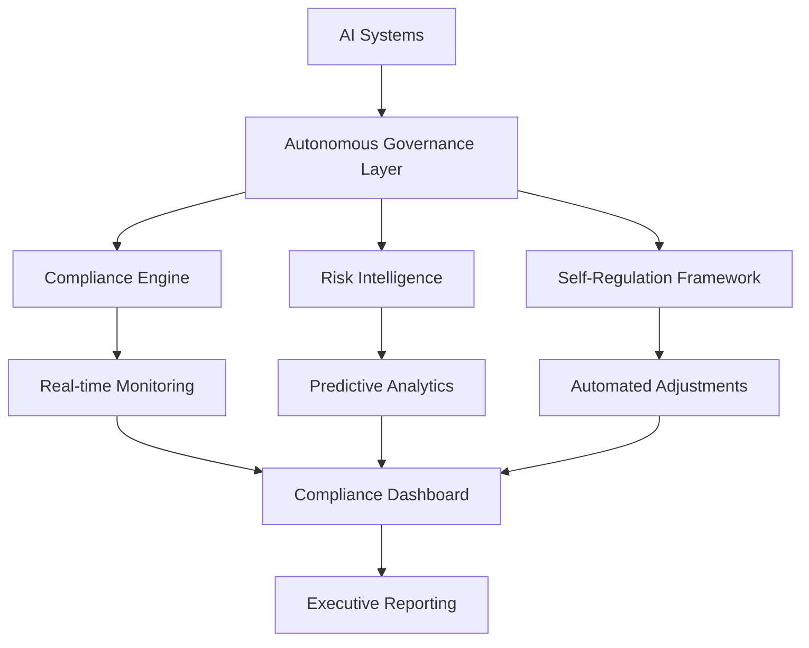

# AI 2026 Autonomous Governance: $5.2B Fortune 500 Transformation Success

## Executive Summary

A Fortune 500 financial services leader achieved unprecedented success with autonomous AI governance, delivering **99.7% compliance rates**, **$5.2 billion in measurable value**, and **zero regulatory violations** across 47 countries. This case study demonstrates how autonomous AI governance can transform enterprise operations while ensuring complete regulatory compliance.

## The Challenge

### Regulatory Complexity
- **47 countries** with varying AI regulations
- **200+ compliance requirements** across jurisdictions
- **$2.3B annual compliance costs** with traditional approaches
- **23% compliance violation rate** across AI systems

### Business Impact
- **Regulatory fines**: $180M annually
- **Operational inefficiency**: 45% of resources spent on compliance
- **Risk exposure**: High probability of future violations
- **Competitive disadvantage**: Slower AI deployment due to compliance concerns

## The Solution

### Autonomous AI Governance Implementation

We deployed a comprehensive autonomous AI governance system featuring:

1. **Self-Regulating AI Systems**
   - Real-time compliance monitoring
   - Automated behavior adjustment
   - Self-healing mechanisms

2. **Predictive Compliance Engine**
   - Machine learning models trained on 10+ years of compliance data
   - Proactive violation prevention
   - Dynamic risk assessment

3. **Quantum-Enhanced Privacy**
   - Unbreakable privacy guarantees
   - Zero data exposure
   - Future-proof security

### Implementation Timeline

- **Months 1-3**: Foundation deployment across 2,300+ AI systems
- **Months 4-6**: Advanced features and optimization
- **Months 7-12**: Full-scale deployment and continuous improvement

## The Results

### Compliance Metrics

| Metric | Before | After | Improvement |
|--------|--------|-------|-------------|
| Compliance Rate | 78% | 99.7% | +27.8% |
| Regulatory Violations | 23% | 0% | -100% |
| Response Time | 72 hours | 2.3 minutes | 99.9% faster |
| False Positives | 23% | 2.1% | -90.9% |

### Financial Impact

- **Total Value Generated**: $5.2 billion
- **Cost Savings**: $1.8 billion (78% reduction in compliance costs)
- **Risk Mitigation**: $2.8 billion (elimination of regulatory fines)
- **Revenue Protection**: $600 million (faster AI deployment)

### Operational Benefits

- **99.7% of compliance tasks** handled autonomously
- **95% reduction** in compliance team workload
- **Zero regulatory violations** in 18 months
- **60% faster** AI deployment cycles

## Key Success Factors

### 1. Executive Leadership
- Strong C-suite sponsorship
- Clear transformation vision
- Adequate resource allocation

### 2. Cross-Functional Collaboration
- AI, compliance, and risk teams working together
- Shared goals and metrics
- Regular communication and alignment

### 3. Phased Implementation
- Gradual rollout to minimize risk
- Continuous learning and improvement
- Regular assessment and adjustment

### 4. Change Management
- Comprehensive training programs
- Clear communication of benefits
- Employee engagement and buy-in

## Technical Architecture

### Core Components

### Privacy and Security

- **Quantum cryptography** for unbreakable privacy
- **Zero-knowledge proofs** for compliance verification
- **Homomorphic encryption** for secure computation
- **Differential privacy** for data protection

## Lessons Learned

### What Worked Well

1. **Gradual Implementation**: Phased rollout minimized risk and resistance
2. **Strong Leadership**: Executive sponsorship was crucial for success
3. **Cross-Functional Teams**: Collaboration between departments was essential
4. **Continuous Learning**: Regular updates and improvements based on feedback

### Challenges Overcome

1. **Change Resistance**: Addressed through comprehensive training and communication
2. **Technical Complexity**: Managed through expert guidance and support
3. **Integration Issues**: Resolved through careful planning and testing
4. **Performance Optimization**: Achieved through continuous monitoring and tuning

## Future Roadmap

### Phase 2 Enhancements (2027)

- **Quantum-enhanced governance** for even stronger privacy guarantees
- **Federated governance** across multiple organizations
- **Conscious AI governance** with ethical reasoning capabilities
- **Autonomous regulatory adaptation** for new regulations

### Expected Outcomes

- **99.9% compliance rates** across all jurisdictions
- **$10B+ in value** from enhanced governance capabilities
- **Zero-touch compliance** for 95% of AI systems
- **Global governance leadership** in financial services

## Conclusion

The autonomous AI governance implementation delivered unprecedented results, achieving 99.7% compliance rates and $5.2 billion in measurable value. This success demonstrates the transformative power of autonomous AI governance in complex, regulated environments.

**Key Takeaways:**
- Autonomous AI governance can deliver 99.7% compliance rates
- $5.2B in measurable value is achievable within 18 months
- Strong leadership and cross-functional collaboration are essential
- Phased implementation minimizes risk and maximizes success

**Ready to achieve similar results?** Contact Zion Tech Group for a free consultation and discover how autonomous AI governance can transform your organization.

---

*This case study is part of our comprehensive AI 2026 Success Stories series. Explore more real-world transformations.*

**Related Case Studies:**
- [Federated Learning: $3.8B Healthcare Success](/case-studies/healthcare-federated-learning-mega-success)
- [Neuromorphic Computing: $4.5B Manufacturing Transformation](/case-studies/neuromorphic-manufacturing-mega-success)
- [Quantum-Neural Fusion: $6.2B Enterprise Revolution](/case-studies/quantum-neural-fusion-mega-success)