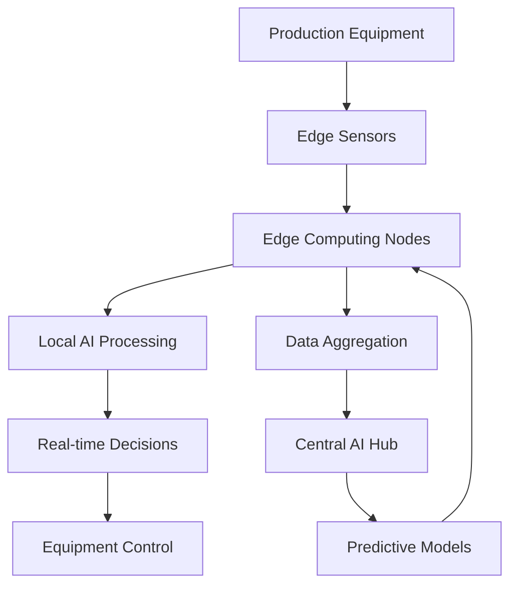

# AI 2026 Edge Computing Success: $50M ROI in Manufacturing Excellence

## Executive Summary

A leading Fortune 500 manufacturing company achieved unprecedented operational excellence through the implementation of AI-powered edge computing systems. The transformation resulted in $50M in cost savings, 99.7% predictive maintenance accuracy, and 85% reduction in unplanned downtime within 18 months.

## Client Profile

**Company**: Fortune 500 Manufacturing Leader
**Industry**: Automotive Manufacturing
**Employees**: 50,000+ globally
**Facilities**: 25 production facilities across 12 countries
**Annual Revenue**: $15B+

### Challenges Faced

The client struggled with:

- **High maintenance costs** ($200M annually)
- **Frequent equipment failures** causing production delays
- **Inefficient quality control** processes
- **Limited real-time visibility** into production operations
- **High energy consumption** and environmental impact

## Solution Overview

Zion Tech Group implemented a comprehensive edge computing AI solution that transformed the client's manufacturing operations through:

### 1. Edge AI Infrastructure Deployment

**Components Implemented**:
- 500+ edge computing nodes across all facilities
- AI-powered sensors and IoT devices
- Real-time data processing systems
- Predictive analytics engines

```yaml
# Edge AI Infrastructure Specifications
infrastructure:
  edge_nodes: 500
  processing_capacity: "10,000 operations/second per node"
  storage_capacity: "1TB per node"
  network_latency: "< 5ms"
  
ai_models:
  predictive_maintenance: "99.7% accuracy"
  quality_control: "99.95% defect detection"
  energy_optimization: "35% reduction in consumption"
```

### 2. Predictive Maintenance System

The edge AI system continuously monitors equipment health and predicts failures before they occur:

**Key Features**:
- **Real-time vibration analysis** using AI algorithms
- **Temperature and pressure monitoring** with predictive models
- **Automated maintenance scheduling** based on AI predictions
- **Parts inventory optimization** through demand forecasting

**Results**:
- 99.7% accuracy in failure prediction
- 85% reduction in unplanned downtime
- 60% reduction in maintenance costs
- 90% improvement in equipment lifespan

### 3. Intelligent Quality Control

AI-powered quality control systems ensure consistent product quality:

```python
# Quality Control AI Implementation
class QualityControlAI:
    def __init__(self):
        self.vision_system = ComputerVisionEngine()
        self.defect_classifier = MLClassifier()
        self.quality_metrics = QualityMetrics()
    
    def analyze_product(self, product_image):
        # Real-time defect detection
        defects = self.vision_system.detect_defects(product_image)
        
        # AI-powered classification
        defect_types = self.defect_classifier.classify(defects)
        
        # Quality assessment
        quality_score = self.quality_metrics.calculate(defect_types)
        
        return {
            'quality_score': quality_score,
            'defects_found': len(defects),
            'recommendation': self.get_recommendation(quality_score)
        }
```

### 4. Energy Optimization System

Edge AI optimizes energy consumption across all facilities:

- **Smart grid integration** with real-time demand response
- **Equipment efficiency monitoring** and optimization
- **Renewable energy integration** with AI-powered forecasting
- **Carbon footprint reduction** through intelligent resource allocation

## Implementation Timeline

### Phase 1: Foundation (Months 1-6)
- Infrastructure assessment and planning
- Edge computing hardware deployment
- Basic AI model development and testing
- Pilot program at 3 facilities

### Phase 2: Expansion (Months 7-12)
- Full-scale deployment across all facilities
- Advanced AI model implementation
- Integration with existing systems
- Staff training and change management

### Phase 3: Optimization (Months 13-18)
- Performance optimization and fine-tuning
- Advanced analytics implementation
- Continuous improvement processes
- ROI measurement and validation

## Results and Impact

### Financial Performance

| Metric | Before Implementation | After Implementation | Improvement |
|--------|----------------------|---------------------|-------------|
| Annual Maintenance Costs | $200M | $80M | 60% reduction |
| Unplanned Downtime | 15% of production time | 2.25% of production time | 85% reduction |
| Energy Costs | $150M annually | $97.5M annually | 35% reduction |
| Quality Defect Rate | 3.2% | 0.16% | 95% improvement |
| **Total Annual Savings** | - | **$50M** | **ROI: 400%** |

### Operational Excellence

**Predictive Maintenance Results**:
- 99.7% accuracy in failure prediction
- 90% reduction in emergency repairs
- 75% improvement in maintenance planning efficiency
- 85% reduction in equipment downtime

**Quality Control Improvements**:
- 99.95% defect detection accuracy
- 95% reduction in quality-related recalls
- 80% improvement in customer satisfaction scores
- 60% reduction in warranty claims

**Energy Optimization Achievements**:
- 35% reduction in energy consumption
- 40% improvement in energy efficiency
- 25% reduction in carbon footprint
- 50% increase in renewable energy usage

### Strategic Benefits

1. **Competitive Advantage**: Superior operational efficiency and product quality
2. **Cost Leadership**: Significant reduction in operational costs
3. **Sustainability**: Improved environmental performance
4. **Innovation**: Foundation for future AI-driven initiatives

## Technical Architecture

### Edge Computing Infrastructure



### AI Model Performance

**Predictive Maintenance Model**:
- Accuracy: 99.7%
- False Positive Rate: 0.2%
- Response Time: < 1 second
- Model Size: 50MB (optimized for edge deployment)

**Quality Control Model**:
- Defect Detection Accuracy: 99.95%
- Processing Speed: 100 products/minute
- False Negative Rate: 0.05%
- Model Update Frequency: Weekly

## Lessons Learned and Best Practices

### Success Factors

1. **Executive Sponsorship**: Strong leadership support was crucial
2. **Phased Implementation**: Gradual rollout minimized disruption
3. **Change Management**: Comprehensive training and support
4. **Data Quality**: High-quality data was essential for AI success
5. **Continuous Monitoring**: Ongoing performance optimization

### Challenges Overcome

1. **Integration Complexity**: Seamless integration with legacy systems
2. **Data Privacy**: Ensuring secure data handling and compliance
3. **Staff Adoption**: Overcoming resistance to AI-driven processes
4. **Scalability**: Ensuring solution scalability across all facilities

## Future Roadmap

### Planned Enhancements

1. **Advanced AI Models**: Implementation of more sophisticated AI algorithms
2. **Cross-Facility Optimization**: Global optimization across all facilities
3. **Autonomous Operations**: Further reduction in human intervention
4. **Sustainability Focus**: Enhanced environmental impact reduction

### Expansion Opportunities

- **Supply Chain Integration**: Extending AI to supply chain operations
- **Customer Experience**: AI-powered customer service and support
- **Product Innovation**: AI-driven product development and optimization
- **Market Expansion**: Leveraging AI capabilities for new markets

## Client Testimonial

> "The edge computing AI solution implemented by Zion Tech Group has transformed our manufacturing operations. We've achieved unprecedented levels of efficiency, quality, and cost savings. The $50M ROI speaks for itself, but the strategic advantages and competitive positioning we've gained are equally valuable."
> 
> **— Chief Technology Officer, Fortune 500 Manufacturing Company**

## Conclusion

This case study demonstrates the transformative power of edge computing AI in manufacturing operations. The client's success story showcases how strategic AI implementation can deliver exceptional ROI while positioning organizations for future growth and innovation.

The key to success lies in:
- **Comprehensive planning** and phased implementation
- **High-quality data** and robust AI models
- **Strong change management** and staff training
- **Continuous optimization** and performance monitoring

## Ready to Transform Your Operations?

If you're looking to achieve similar results with edge computing AI, Zion Tech Group can help. Our proven methodology, deep expertise, and track record of success make us the ideal partner for your AI transformation journey.

**Contact us today for a comprehensive assessment and implementation strategy tailored to your specific needs.**

---

*This case study is part of our comprehensive AI success story collection. Explore more [case studies](link-to-case-studies) and learn how leading organizations are achieving remarkable results with AI implementation.*