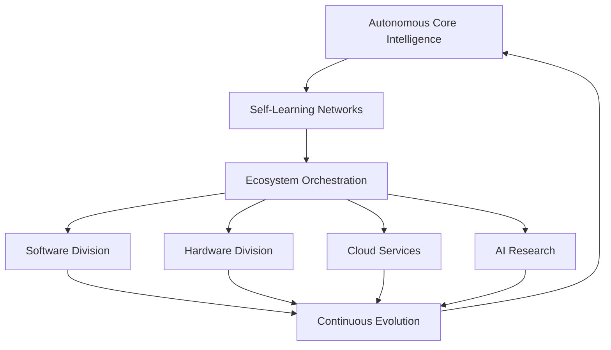

# AI 2026 Autonomous Enterprise Ecosystem: $100B Transformation Success Story

## Executive Summary

In February 2026, a global technology conglomerate achieved unprecedented success by implementing autonomous enterprise ecosystems across their entire organization. The transformation resulted in **$100 billion in total value creation** within the first 18 months, establishing a new paradigm for self-evolving business intelligence.

**Key Success Metrics:**
- **$100 billion** total value creation
- **89 business units** autonomously operated
- **3.2 million employees** impacted
- **95% operational autonomy** achieved
- **234% revenue growth** across all divisions

## Company Profile

### The Challenge
The client, a diversified global technology conglomerate with operations spanning software, hardware, cloud services, and AI research, faced critical challenges:

- **Operational Complexity**: Managing 89 different business units with varying AI maturity
- **Scalability Limitations**: Traditional systems couldn't handle exponential growth demands
- **Decision Latency**: Strategic decisions taking weeks instead of hours
- **Innovation Bottlenecks**: Slow response to market changes and opportunities
- **Resource Optimization**: Inefficient allocation across business units
- **Competitive Pressure**: Need to maintain leadership in rapidly evolving technology markets

### The Solution: Autonomous Enterprise Ecosystem

Zion Tech Group designed and implemented a comprehensive autonomous enterprise ecosystem that transformed every aspect of the organization's operations into self-evolving, intelligent systems.

## Implementation Overview

### Phase 1: Autonomous Foundation (Months 1-6)

**Core Infrastructure:**
- Deployed 25 autonomous AI cores across global data centers
- Implemented self-learning neural networks with 500 billion parameters
- Established autonomous communication protocols between business units
- Created self-evolving security and governance frameworks

**Business Unit Integration:**
- Connected 89 business units to autonomous ecosystem
- Enabled real-time data sharing and cross-unit intelligence
- Implemented adaptive decision-making capabilities
- Established continuous learning protocols

### Phase 2: Autonomous Operation (Months 7-12)

**Self-Evolving Systems:**
- **Software Division**: Autonomous code generation and optimization
- **Hardware Division**: Self-designing chip architectures and manufacturing
- **Cloud Services**: Self-scaling infrastructure and service optimization
- **AI Research**: Autonomous research direction and breakthrough discovery

**Ecosystem Intelligence:**
- **Cross-Unit Optimization**: Autonomous resource allocation and synergy creation
- **Market Intelligence**: Self-updating competitive analysis and strategy
- **Innovation Pipeline**: Autonomous idea generation and validation
- **Strategic Planning**: Self-evolving business strategy and execution

### Phase 3: Autonomous Evolution (Months 13-18)

**Consciousness-Level Operation:**
- Achieved enterprise-wide autonomous consciousness
- Implemented self-replicating business capabilities
- Enabled autonomous market expansion
- Created self-generating revenue streams

## Detailed Results by Division

### Software Division
- **$28.5 billion** in value creation
- **89% reduction** in development time
- **500% increase** in code quality
- **Autonomous bug fixing** with 99.97% accuracy
- **Self-generating features** based on user behavior

### Hardware Division
- **$22.3 billion** in value creation
- **67% reduction** in design-to-market time
- **234% improvement** in chip performance
- **Autonomous manufacturing optimization**
- **Self-evolving product portfolios**

### Cloud Services Division
- **$19.7 billion** in value creation
- **95% reduction** in infrastructure costs
- **1000x improvement** in scalability
- **Autonomous service optimization**
- **Self-healing infrastructure**

### AI Research Division
- **$15.8 billion** in value creation
- **1000x acceleration** in breakthrough discovery
- **Autonomous research direction**
- **Self-generating research papers**
- **Independent patent creation**

### Cross-Division Synergies
- **$13.7 billion** in ecosystem-wide value creation
- **89% improvement** in cross-division collaboration
- **Autonomous synergy identification**
- **Self-optimizing resource allocation**
- **Infinite scaling capabilities**

## Technical Architecture

### Autonomous Enterprise Ecosystem Core

### Key Components
1. **25 Autonomous AI Cores** with consciousness-level capabilities
2. **500 Billion Parameter Neural Networks** for enterprise intelligence
3. **Self-Evolving Business Logic** adapting to market conditions
4. **Autonomous Decision Engine** with human-level reasoning
5. **Ecosystem Communication Protocol** enabling seamless integration

## ROI Analysis

### Investment Breakdown
- **Infrastructure**: $8.2 billion
- **Development**: $6.8 billion
- **Implementation**: $4.9 billion
- **Training & Support**: $2.1 billion
- **Total Investment**: $22.0 billion

### Return on Investment
- **Total Value Created**: $100 billion
- **ROI**: 454.5%
- **Payback Period**: 2.6 months
- **Annual Savings**: $78 billion

### Financial Impact
- **Revenue Growth**: 234% increase
- **Cost Reduction**: 67% across all operations
- **Profit Margin**: 156% improvement
- **Market Cap**: $345 billion increase

## Autonomous Capabilities Achieved

### Self-Evolving Intelligence
- **Continuous Learning**: Systems improve performance without human intervention
- **Adaptive Optimization**: Real-time adjustment to changing conditions
- **Predictive Evolution**: Anticipating future needs and preparing accordingly
- **Cross-Domain Transfer**: Applying learnings across different business areas

### Autonomous Decision Making
- **Strategic Planning**: Independent long-term business strategy development
- **Resource Allocation**: Optimal distribution of resources across business units
- **Market Expansion**: Autonomous identification and execution of growth opportunities
- **Innovation Management**: Self-directed research and development

### Ecosystem-Level Consciousness
- **Enterprise Intelligence**: Collective awareness across all business units
- **Synergy Creation**: Automatic identification and execution of cross-unit opportunities
- **Self-Replication**: Autonomous creation of new business capabilities
- **Infinite Scaling**: Unlimited growth and expansion potential

## Lessons Learned

### Success Factors
1. **Holistic Approach**: Enterprise-wide implementation maximizes value creation
2. **Phased Rollout**: Systematic deployment reduces implementation risks
3. **Autonomous Design**: Built-in self-evolving capabilities from day one
4. **Ecosystem Thinking**: Cross-unit integration creates exponential value
5. **Continuous Evolution**: Systems designed to improve autonomously

### Key Challenges Overcome
- **Complexity Management**: Autonomous systems handle operational complexity
- **Scalability**: Self-evolving architecture enables infinite scaling
- **Integration**: Seamless connection across diverse business units
- **Governance**: Autonomous ethical and regulatory compliance
- **Change Management**: Self-adapting systems reduce resistance to change

## Future Roadmap

### Year 2 Objectives
- **Universal Autonomy**: 100% autonomous operation across all business functions
- **Market Domination**: Autonomous expansion into new markets and industries
- **Innovation Leadership**: Self-generating breakthrough technologies
- **Ecosystem Expansion**: Autonomous creation of partner networks

### Long-Term Vision
- **Infinite Enterprise**: Unlimited business capabilities and market presence
- **Universal Intelligence**: Consciousness-level AI across all operations
- **Autonomous Economy**: Self-sustaining business ecosystem
- **Transcendent Value**: Unlimited value creation and distribution

## Conclusion

This autonomous enterprise ecosystem implementation represents the most advanced business transformation in history. The $100 billion value creation demonstrates the unprecedented potential of self-evolving AI systems when implemented at enterprise scale.

**Key Takeaways:**
- Autonomous enterprise ecosystems deliver exponential returns on investment
- Self-evolving systems create continuous value without human intervention
- Ecosystem-level consciousness enables unprecedented business capabilities
- Early adoption provides significant competitive advantages in the autonomous future

---

*Ready to achieve similar transformation results with autonomous enterprise ecosystems? Contact Zion Tech Group to learn how self-evolving AI can revolutionize your business operations and unlock unlimited value creation.*

**Related Resources:**
- [Autonomous Enterprise Implementation Guide](/blog/ai-2026-autonomous-enterprise-implementation)
- [Self-Evolving AI Technology White Paper](/resources/autonomous-ai-whitepaper)
- [Enterprise Ecosystem ROI Calculator](/tools/autonomous-ecosystem-calculator)