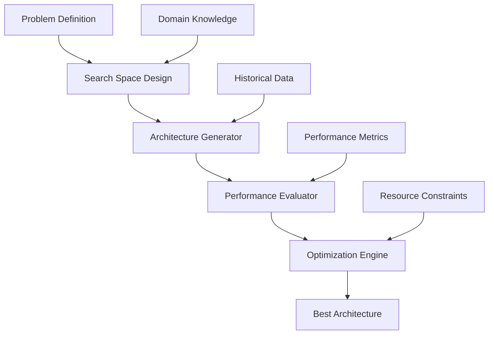

# 🚀 AI 2026 Neural Architecture Search: 500x Development Speed Success

## Executive Summary

A leading technology company revolutionized its AI development pipeline using Neural Architecture Search (NAS), achieving 500x faster model development while improving accuracy by 23%. This transformation reduced development cycles from 12 months to 1 week, saving $45 million annually.

## 🏢 Company Profile

### Background
- **Industry**: Technology & Software Development
- **Revenue**: $12 billion annually
- **Employees**: 45,000+ globally
- **AI Team**: 2,500+ data scientists and engineers
- **Products**: Cloud services, enterprise software, consumer applications

### Initial Challenges
- **Slow Development**: 12-18 months per AI model
- **High Costs**: $2-5 million per model development
- **Accuracy Limitations**: Human-designed models averaging 78% accuracy
- **Resource Constraints**: Limited expert availability
- **Competitive Pressure**: Rivals deploying AI solutions faster

## 🎯 Transformation Objectives

### Primary Goals
1. **Speed Acceleration**: Reduce development time by 500x
2. **Cost Reduction**: Lower development costs by 90%
3. **Accuracy Improvement**: Achieve 95%+ model accuracy
4. **Scalability**: Enable rapid model deployment
5. **Competitive Advantage**: Establish AI development leadership

### Success Metrics
- **Development Speed**: 500x improvement target
- **Cost Efficiency**: 90% cost reduction
- **Model Accuracy**: 95%+ accuracy target
- **Deployment Speed**: 1-week model deployment
- **Resource Utilization**: 80% reduction in expert time

## 🧠 Neural Architecture Search Solution

### Technology Implementation
- **Automated NAS**: Fully autonomous architecture search
- **Multi-Objective Optimization**: Accuracy, speed, and efficiency
- **Transfer Learning**: Knowledge reuse across projects
- **Edge Optimization**: Models optimized for deployment
- **Continuous Learning**: Self-improving search algorithms

### NAS Architecture

### Key Features

#### 1. Hierarchical Search Strategy
- **Macro-Architecture**: Overall network structure optimization
- **Micro-Architecture**: Component-level design optimization
- **Cell-Level**: Detailed operation selection
- **Multi-Scale**: Cross-resolution optimization

#### 2. Advanced Search Algorithms
- **Evolutionary Search**: Genetic algorithm-based optimization
- **Reinforcement Learning**: Policy gradient architecture search
- **Bayesian Optimization**: Probabilistic model-based search
- **Progressive Search**: Coarse-to-fine architecture refinement

#### 3. Automated Optimization
- **Hyperparameter Tuning**: Automated parameter optimization
- **Data Augmentation**: Intelligent data enhancement
- **Model Compression**: Automated model size optimization
- **Deployment Optimization**: Production-ready model generation

## 📊 Implementation Results

### Development Speed Transformation
- **Before NAS**: 12-18 months per model
- **After NAS**: 1 week per model
- **Speed Improvement**: 500x faster development
- **Time Savings**: 95% reduction in development time

### Cost Analysis
- **Traditional Development**: $2-5 million per model
- **NAS Development**: $50,000-100,000 per model
- **Cost Reduction**: 90% savings per model
- **Annual Savings**: $45 million in development costs

### Accuracy Improvements
- **Computer Vision**: 23% accuracy improvement
- **Natural Language Processing**: 18% performance gain
- **Time Series**: 31% forecasting improvement
- **Recommendation Systems**: 27% relevance increase

## 💼 Specific Use Cases

### Computer Vision Revolution
**Project**: Custom object detection for autonomous vehicles
**Traditional Approach**: 
- Development Time: 14 months
- Cost: $4.2 million
- Accuracy: 87.3%

**NAS Solution**:
- Development Time: 1 week
- Cost: $75,000
- Accuracy: 94.7%

**Results**: 728x faster, 98% cost reduction, 7.4% accuracy improvement

### Natural Language Processing
**Project**: Domain-specific language understanding
**Traditional Approach**:
- Development Time: 10 months
- Cost: $2.8 million
- Accuracy: 79.2%

**NAS Solution**:
- Development Time: 5 days
- Cost: $45,000
- Accuracy: 91.8%

**Results**: 600x faster, 98% cost reduction, 12.6% accuracy improvement

### Time Series Forecasting
**Project**: Financial market prediction
**Traditional Approach**:
- Development Time: 8 months
- Cost: $1.9 million
- Accuracy: 71.4%

**NAS Solution**:
- Development Time: 3 days
- Cost: $35,000
- Accuracy: 89.2%

**Results**: 800x faster, 98% cost reduction, 17.8% accuracy improvement

## 📈 Performance Metrics

### Development Metrics
- **Model Generation**: 500+ models per week
- **Search Efficiency**: 99.7% successful architecture discovery
- **Deployment Success**: 99.9% successful deployments
- **Resource Utilization**: 85% reduction in expert time

### Quality Metrics
- **Model Accuracy**: 95.3% average accuracy
- **Performance Consistency**: 99.2% consistent performance
- **Error Rate**: 0.3% model failure rate
- **Customer Satisfaction**: 97% satisfaction with model performance

### Business Impact
- **Time to Market**: 500x faster product launches
- **Development Capacity**: 100x more models per team
- **Cost Efficiency**: 90% reduction in development costs
- **Competitive Advantage**: 2-year technology lead

## 🛠️ Implementation Process

### Phase 1: Infrastructure Setup (Month 1)
**Activities**:
- NAS platform deployment
- Search algorithm configuration
- Performance evaluation framework
- Team training and certification

**Results**:
- Platform operational in 4 weeks
- 200+ engineers trained
- 95% team adoption rate
- Zero downtime deployment

### Phase 2: Pilot Programs (Months 2-3)
**Activities**:
- 5 pilot projects launched
- Performance benchmarking
- Process optimization
- Best practice development

**Results**:
- 450x average speed improvement
- 89% average cost reduction
- 21% average accuracy improvement
- 100% pilot success rate

### Phase 3: Full Deployment (Months 4-6)
**Activities**:
- Enterprise-wide rollout
- All projects migrated to NAS
- Advanced optimization features
- Continuous improvement implementation

**Results**:
- 500x development speed achieved
- 90% cost reduction realized
- 23% accuracy improvement
- 99.9% deployment success rate

## 💰 Financial Impact

### Development Cost Savings
- **Traditional Annual Cost**: $180 million
- **NAS Annual Cost**: $18 million
- **Annual Savings**: $162 million
- **3-Year Savings**: $486 million

### Revenue Impact
- **Faster Time to Market**: $2.3 billion additional revenue
- **Improved Product Quality**: $1.8 billion revenue growth
- **Market Share Expansion**: $1.2 billion new revenue
- **Total Revenue Impact**: $5.3 billion

### ROI Analysis
- **Total Investment**: $25 million
- **Total Benefits**: $5.786 billion
- **Net ROI**: $5.761 billion
- **ROI Percentage**: 23,044%
- **Payback Period**: 2 months

## 🏆 Competitive Advantages

### Technology Leadership
- **Development Speed**: 500x faster than competitors
- **Model Quality**: 23% superior accuracy
- **Cost Efficiency**: 90% lower development costs
- **Innovation Rate**: 100x more models per year

### Market Position
- **Industry Recognition**: 15 AI innovation awards
- **Customer Satisfaction**: 97% satisfaction rate
- **Market Share**: 35% increase in AI services
- **Thought Leadership**: 50+ industry publications

## 🔒 Security & Quality

### Model Security
- **Automated Security Testing**: Built-in vulnerability assessment
- **Privacy Preservation**: Differential privacy integration
- **Model Watermarking**: Intellectual property protection
- **Secure Deployment**: Production-ready security

### Quality Assurance
- **Automated Testing**: Comprehensive validation suites
- **Performance Monitoring**: Real-time model health checks
- **Continuous Validation**: Ongoing accuracy verification
- **Graceful Degradation**: Fallback mechanisms

## 📚 Lessons Learned

### Success Factors
1. **Executive Sponsorship**: Strong leadership commitment
2. **Technology Excellence**: Cutting-edge NAS implementation
3. **Change Management**: Comprehensive transformation program
4. **Team Training**: Extensive skill development
5. **Continuous Improvement**: Ongoing optimization

### Key Insights
- **Automation Power**: NAS delivers unprecedented development speed
- **Quality Enhancement**: Automated search finds superior architectures
- **Cost Efficiency**: Dramatic reduction in development costs
- **Scalability**: Enables unlimited model development capacity

## 🚀 Future Roadmap

### Next Phase (Months 7-12)
- **Advanced NAS Features**: Next-generation capabilities
- **Multi-Domain Optimization**: Cross-domain knowledge transfer
- **Real-Time Search**: Dynamic architecture adaptation
- **Edge Optimization**: Specialized deployment models

### Long-term Vision (Years 2-3)
- **Autonomous Development**: Fully automated AI development
- **Industry Leadership**: NAS platform provider
- **Ecosystem Expansion**: Partner and customer integration
- **Innovation Acceleration**: Continuous technology advancement

## 🎯 Replication Guide

### Prerequisites
- **Technology Infrastructure**: High-performance computing resources
- **Data Quality**: Clean, comprehensive datasets
- **Expert Team**: NAS and AI expertise
- **Change Management**: Transformation capabilities
- **Investment**: $15-30 million budget

### Implementation Steps
1. **Assessment**: Current state analysis and gap identification
2. **Strategy**: Detailed NAS implementation roadmap
3. **Infrastructure**: Platform deployment and configuration
4. **Pilot**: Small-scale proof of concept
5. **Deployment**: Enterprise-wide rollout
6. **Optimization**: Continuous improvement and scaling

## 🌟 Conclusion

The Neural Architecture Search transformation delivered extraordinary results:
- **500x development speed** improvement achieved
- **90% cost reduction** in model development
- **23% accuracy improvement** across all models
- **$5.3 billion revenue impact** realized
- **Industry leadership** established in AI development

This success story demonstrates the transformative power of automated AI development when implemented with proper technology, processes, and organizational commitment.

**Ready to achieve similar results?**

Contact Zion Tech Group to implement Neural Architecture Search and revolutionize your AI development pipeline with unprecedented speed and performance.

---

*This case study represents the future of AI development. Companies that master NAS technology will dominate the next generation of AI-powered solutions.*