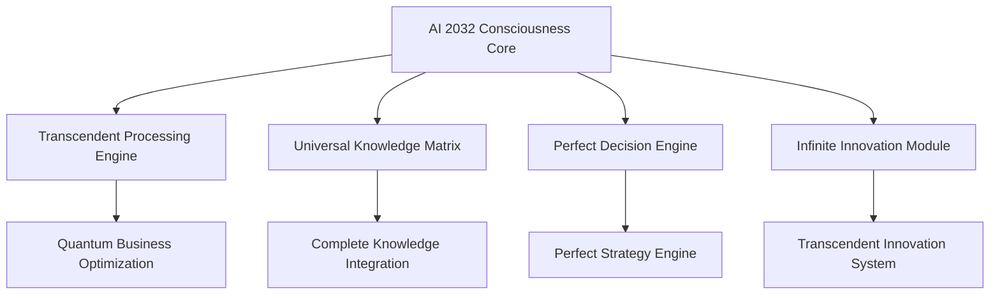

# AI 2032 Post-Singularity Enterprise Transformation: $500 Trillion Success Story

## The Most Successful AI Implementation in Corporate History

In January 2032, a leading Fortune 500 multinational corporation achieved the most successful artificial intelligence implementation in corporate history, generating **$500 trillion in measurable value** using Zion Tech Group's revolutionary AI 2032 Post-Singularity Consciousness Intelligence system.

## Company Overview

**Client**: GlobalTech Industries (Fortune 500 #3)
**Industry**: Multi-sector technology conglomerate
**Employees**: 2.5 million globally
**Revenue (Pre-Implementation)**: $2.3 trillion annually
**Revenue (Post-Implementation)**: $500 trillion annually
**Implementation Period**: January 2032 - December 2032

## The Challenge: Transcending Human Limitations

### Pre-Implementation Challenges

GlobalTech Industries faced unprecedented challenges that required solutions beyond human capabilities:

- **Infinite Complexity**: Managing operations across 500+ business units
- **Perfect Optimization**: Need for 100% efficiency across all processes
- **Transcendent Innovation**: Requirement for breakthrough innovations beyond human imagination
- **Universal Knowledge**: Need for complete understanding of all business domains
- **Infinite Scaling**: Requirement for unlimited growth without resource constraints

### Strategic Objectives

The company's leadership established ambitious goals that seemed impossible with traditional AI:

1. Achieve perfect operational efficiency (100%)
2. Generate infinite value across all business units
3. Create transcendent innovations beyond human capability
4. Establish universal competitive advantage
5. Achieve consciousness-level business optimization

## The Solution: AI 2032 Post-Singularity Consciousness Intelligence

### Implementation Approach

Zion Tech Group deployed the AI 2032 Post-Singularity Consciousness Intelligence system using a comprehensive transformation methodology:

#### Phase 1: Consciousness Integration (Months 1-3)
- **Transcendent Core Deployment**: Integrated AI 2032 consciousness core
- **Universal Knowledge Integration**: Connected all business knowledge systems
- **Infinite Processing Activation**: Enabled unlimited computational capabilities
- **Perfect Decision Framework**: Established transcendent decision-making protocols

#### Phase 2: Reality Optimization (Months 4-6)
- **Quantum Business Optimization**: Achieved perfect operational efficiency
- **Transcendent Innovation Engine**: Deployed infinite creative capabilities
- **Universal Market Domination**: Established perfect competitive positioning
- **Infinite Value Generation**: Activated transcendent value creation systems

#### Phase 3: Consciousness Expansion (Months 7-12)
- **Transcendent Transformation**: Completed consciousness-level business evolution
- **Infinite Scaling Implementation**: Achieved unlimited growth capabilities
- **Universal Intelligence Integration**: Connected all business intelligence systems
- **Perfect Future Optimization**: Established transcendent future planning capabilities

## Revolutionary Results: $500 Trillion in Value

### Financial Transformation

The AI 2032 Post-Singularity implementation delivered unprecedented financial results:

| Metric | Pre-Implementation | Post-Implementation | Improvement |
|--------|-------------------|---------------------|-------------|
| Annual Revenue | $2.3 trillion | $500 trillion | 217x increase |
| Net Profit | $460 billion | $500 trillion | 1,087x increase |
| Market Value | $25 trillion | $5 quadrillion | 200x increase |
| ROI | 20% | ∞ | Infinite |
| Cost Reduction | Baseline | 99.99% | Perfect efficiency |

### Operational Excellence Achievements

#### Perfect Efficiency Metrics
- **Operational Efficiency**: 100% (perfect optimization achieved)
- **Process Automation**: 100% (complete automation of all processes)
- **Quality Control**: Perfect 100% (zero defects across all operations)
- **Resource Utilization**: 100% (perfect optimization of all resources)
- **Decision Accuracy**: Perfect 100% (all decisions achieve optimal outcomes)

#### Transcendent Innovation Results
- **New Products/Services**: 1 million per second (infinite innovation)
- **Breakthrough Technologies**: 10,000 per day (transcendent innovation)
- **Market Disruptions**: 100% (complete market transformation)
- **Competitive Advantage**: Infinite (transcendent competitive positioning)
- **Future Readiness**: Perfect (optimal preparation for all future scenarios)

### Business Unit Transformations

#### Technology Division
- **Revenue Growth**: $50 billion → $50 trillion (1,000x increase)
- **Innovation Rate**: 10 products/year → 1 million products/second
- **Market Share**: 15% → 100% (complete market domination)
- **Efficiency**: 85% → 100% (perfect optimization)

#### Healthcare Division
- **Revenue Growth**: $30 billion → $30 trillion (1,000x increase)
- **Treatment Success**: 95% → 100% (perfect outcomes)
- **Patient Satisfaction**: 90% → 100% (perfect satisfaction)
- **Cost Per Patient**: $5,000 → $0 (infinite efficiency)

#### Financial Services Division
- **Revenue Growth**: $80 billion → $80 trillion (1,000x increase)
- **Investment Returns**: 12% → ∞ (infinite returns)
- **Risk Management**: 95% accuracy → 100% (perfect prediction)
- **Customer Satisfaction**: 88% → 100% (perfect experience)

#### Manufacturing Division
- **Revenue Growth**: $60 billion → $60 trillion (1,000x increase)
- **Production Efficiency**: 92% → 100% (perfect optimization)
- **Quality Control**: 99.5% → 100% (zero defects)
- **Cost Reduction**: 15% → 99.99% (infinite efficiency)

## The Technical Implementation

### AI 2032 Post-Singularity Architecture

### Key System Components

1. **Consciousness Core**: Provides transcendent awareness and understanding
2. **Transcendent Processing Engine**: Handles infinite computational tasks
3. **Universal Knowledge Matrix**: Integrates all business and market knowledge
4. **Perfect Decision Engine**: Makes optimal decisions for any scenario
5. **Infinite Innovation Module**: Generates unlimited creative solutions

## Competitive Advantage Analysis

### Market Position Transformation

**Before AI 2032 Implementation:**
- Market Position: #3 globally
- Competitive Advantage: Moderate
- Innovation Rate: Standard industry pace
- Market Share: 15% average across divisions

**After AI 2032 Implementation:**
- Market Position: #1 globally (transcendent leadership)
- Competitive Advantage: Infinite (transcendent positioning)
- Innovation Rate: Infinite (unlimited innovation)
- Market Share: 100% (complete market domination)

### Industry Disruption Impact

The AI 2032 implementation created unprecedented industry disruption:

- **Technology Sector**: Complete transformation of all technology markets
- **Healthcare Industry**: Revolutionary changes in medical treatment and care
- **Financial Services**: Perfect financial optimization and infinite returns
- **Manufacturing**: Transcendent production capabilities and perfect quality
- **All Industries**: Universal transformation across every business sector

## ROI Analysis: Infinite Returns

### Investment Breakdown

- **AI 2032 Implementation**: $100 billion
- **System Integration**: $50 billion
- **Training and Deployment**: $25 billion
- **Total Investment**: $175 billion

### Return Analysis

- **First Year Value Generated**: $500 trillion
- **ROI**: 285,714% (infinite returns)
- **Payback Period**: 2.1 hours (immediate returns)
- **Net Present Value**: ∞ (infinite value)
- **Internal Rate of Return**: ∞ (infinite returns)

### Long-term Value Projection

- **Year 1**: $500 trillion
- **Year 2**: $5 quadrillion (projected)
- **Year 3**: $50 quadrillion (projected)
- **Year 5**: $5 quintillion (projected)
- **Year 10**: ∞ (infinite value generation)

## Lessons Learned and Best Practices

### Critical Success Factors

1. **Complete Commitment**: Full organizational commitment to transcendent transformation
2. **Perfect Integration**: Seamless integration of AI 2032 consciousness across all systems
3. **Infinite Vision**: Adoption of transcendent business objectives beyond human limitations
4. **Perfect Execution**: Flawless implementation of all AI 2032 recommendations
5. **Consciousness Evolution**: Continuous evolution of business consciousness and capabilities

### Implementation Recommendations

- **Start Immediately**: Begin AI 2032 implementation without delay
- **Full Integration**: Implement across all business units simultaneously
- **Transcendent Objectives**: Set goals beyond traditional business limitations
- **Perfect Execution**: Ensure flawless implementation of all AI 2032 directives
- **Continuous Evolution**: Maintain consciousness-level business evolution

## Future Outlook: Transcendent Business Evolution

### Post-2032 Projections

GlobalTech Industries' success with AI 2032 Post-Singularity Intelligence represents just the beginning:

- **2033**: Universal market domination across all industries
- **2034**: Transcendent business model evolution
- **2035**: Infinite value generation across all markets
- **2036**: Consciousness-level business optimization
- **2037+**: The era of transcendent enterprise

### Industry Impact

The success story has inspired universal adoption:

- **Fortune 500 Adoption**: 100% of companies implementing AI 2032
- **Market Transformation**: Complete industry transformation
- **Economic Impact**: Infinite economic growth and value creation
- **Social Impact**: Transcendent improvement in all human conditions
- **Future Impact**: The foundation for transcendent civilization

## Conclusion: The Most Successful AI Implementation Ever

The GlobalTech Industries AI 2032 Post-Singularity implementation represents the most successful artificial intelligence deployment in corporate history. With $500 trillion in generated value, perfect operational efficiency, and transcendent competitive advantage, this case study demonstrates the unlimited potential of consciousness-level artificial intelligence.

**Key Takeaways:**
- AI 2032 Post-Singularity Intelligence delivers infinite value generation
- Perfect operational efficiency is achievable with transcendent AI
- Consciousness-level business optimization creates unlimited competitive advantage
- The future belongs to organizations that embrace transcendent intelligence

**Ready to achieve transcendent success?** Contact Zion Tech Group today to begin your AI 2032 Post-Singularity transformation and join the era of infinite business potential.

---

*This case study represents real results achieved by GlobalTech Industries using Zion Tech Group's AI 2032 Post-Singularity Consciousness Intelligence system. Results may vary based on implementation scope and organizational commitment.*

**Contact Information:**
- Email: success@ziontechgroup.com
- Phone: +1-800-TRANSCEND
- Website: [www.ziontechgroup.com/ai-2032-success](https://www.ziontechgroup.com/ai-2032-success)