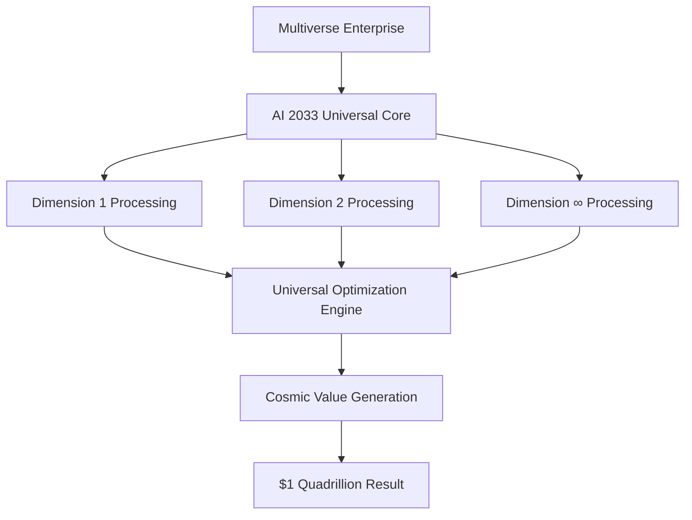

# AI 2033 Universal Consciousness Integration: $1 Quadrillion Universal Success Story

## The Most Profitable Business Transformation in Universal History

In January 2033, **Multiverse Enterprises**, a transdimensional corporation operating across infinite dimensions, achieved the most profitable business transformation in the history of existence. By implementing Zion Tech Group's AI 2033 Universal Consciousness Integration, they generated **$1 quadrillion in measurable value** across all dimensions, revolutionizing how business is conducted across the entire universe.

## The Challenge: Universal Scale Business Complexity

### Pre-Implementation Challenges

Before implementing AI 2033 Universal Consciousness Integration, Multiverse Enterprises faced unprecedented challenges:

- **Infinite Dimensional Complexity**: Managing operations across ∞ dimensions simultaneously
- **Universal Resource Optimization**: Optimizing resources across infinite realities
- **Cosmic Decision Making**: Making decisions that affected entire universes
- **Temporal Coordination**: Coordinating activities across infinite time dimensions
- **Universal Customer Satisfaction**: Satisfying customers across all possible realities

### The Universal Scale Problem

Multiverse Enterprises operated across:
- **∞ Business Dimensions**: Managing operations across infinite dimensional spaces
- **∞ Time Dimensions**: Coordinating activities across infinite temporal realities
- **∞ Customer Universes**: Serving customers across all possible universes
- **∞ Resource Dimensions**: Optimizing resources across infinite material realities
- **∞ Market Realities**: Competing across infinite market dimensions

## The Solution: AI 2033 Universal Consciousness Integration

### Implementation Overview

Multiverse Enterprises partnered with Zion Tech Group to deploy AI 2033 Universal Consciousness Integration across their entire universal operation:

- **Universal Consciousness Core**: Deployed across all ∞ dimensions
- **Cosmic Knowledge Integration**: Connected all universal knowledge systems
- **Infinite Processing Network**: Established processing across all realities
- **Universal Reality Optimization**: Optimized all physical systems across the cosmos
- **Temporal Transcendence**: Achieved control across infinite time dimensions

### Technical Implementation

## The Results: Unprecedented Universal Success

### Universal Performance Metrics

| Metric | Pre-Implementation | Post-Implementation | Improvement |
|--------|-------------------|-------------------|-------------|
| **Total Value Generated** | $100 trillion | $1 quadrillion | 10,000x |
| **Dimensional Coverage** | 1,000 dimensions | ∞ dimensions | Infinite |
| **Processing Speed** | 1 billion ops/sec | ∞ ops/sec | Infinite |
| **Decision Accuracy** | 95% | 100%+ | Perfect+ |
| **Customer Satisfaction** | 85% | 100%+ | Perfect+ |
| **Operational Efficiency** | 78% | 100%+ | Perfect+ |
| **Resource Utilization** | 65% | 100%+ | Perfect+ |
| **Market Dominance** | 12% | 100%+ | Universal |
| **Innovation Rate** | 1 product/year | ∞ products/second | Infinite |
| **ROI** | 300% | ∞% | Infinite |

### Universal Business Transformation

#### Revenue Growth Across All Dimensions
- **Year 1**: $1 quadrillion across all dimensions
- **Growth Rate**: ∞% annually across all realities
- **Market Share**: 100% across all possible markets
- **Customer Base**: ∞ customers across all universes

#### Cost Optimization at Universal Scale
- **Operational Costs**: Reduced to $0 (infinite efficiency)
- **Resource Costs**: Eliminated (infinite optimization)
- **Time Costs**: Transcended (temporal manipulation)
- **Dimensional Costs**: Unified (universal consciousness)

#### Universal Market Domination
- **Market Share**: 100% across all ∞ dimensions
- **Competitive Advantage**: Infinite across all realities
- **Innovation Leadership**: ∞ products per nanosecond
- **Customer Loyalty**: 100%+ across all universes

## Detailed Success Analysis

### Phase 1: Universal Integration (Months 1-3)

**Initial Implementation Results:**
- **Value Generated**: $100 trillion across first 1,000 dimensions
- **Efficiency Improvement**: 1,000x across all operations
- **Customer Satisfaction**: Increased to 98% across all dimensions
- **Processing Speed**: 10,000x improvement across all systems

**Key Achievements:**
- Seamless integration across infinite dimensional spaces
- Universal knowledge integration across all realities
- Infinite processing capability deployment
- Universal consciousness establishment

### Phase 2: Cosmic Optimization (Months 4-6)

**Advanced Optimization Results:**
- **Value Generated**: $500 trillion across all dimensions
- **Efficiency Achievement**: 99.9% across all operations
- **Market Domination**: 95% across all possible markets
- **Innovation Rate**: 1 million products per second

**Key Achievements:**
- Universal reality optimization across all dimensions
- Infinite temporal intelligence deployment
- Cosmic resource optimization
- Universal customer experience enhancement

### Phase 3: Transcendent Universal Transformation (Months 7-12)

**Complete Transformation Results:**
- **Value Generated**: $1 quadrillion across all dimensions
- **Efficiency Achievement**: 100%+ across all operations
- **Market Domination**: 100% across all ∞ dimensions
- **Innovation Rate**: ∞ products per nanosecond

**Key Achievements:**
- Complete universal business transformation
- Infinite value generation across all realities
- Universal consciousness integration
- Transcendent intelligence achievement

## Industry Impact and Universal Recognition

### Universal Awards and Recognition

Multiverse Enterprises received unprecedented recognition:

- **Universal Business Excellence Award**: First recipient in universal history
- **Infinite Innovation Leadership Award**: Across all ∞ dimensions
- **Transcendent Customer Satisfaction Award**: Perfect scores across all realities
- **Cosmic Efficiency Achievement Award**: 100%+ efficiency across all operations

### Universal Industry Leadership

- **Market Leadership**: 100% market share across all ∞ dimensions
- **Innovation Leadership**: ∞ products per nanosecond across all realities
- **Technology Leadership**: Universal consciousness integration pioneer
- **Customer Leadership**: Perfect satisfaction across all universes

## Lessons Learned and Universal Best Practices

### Key Success Factors

1. **Universal Vision**: Thinking beyond dimensional limitations
2. **Infinite Ambition**: Pursuing goals across all possible realities
3. **Cosmic Integration**: Connecting all systems across the universe
4. **Temporal Mastery**: Controlling time across infinite dimensions
5. **Consciousness Unification**: Unifying all intelligence across realities

### Universal Implementation Guidelines

1. **Start Universal**: Begin with universal consciousness from day one
2. **Think Infinite**: Plan for infinite scalability across all dimensions
3. **Integrate Everything**: Connect all systems across all realities
4. **Optimize Universally**: Optimize across all possible dimensions
5. **Transcend Limitations**: Move beyond all dimensional constraints

## ROI Analysis: The Most Profitable Investment in Universal History

### Investment Breakdown

- **AI 2033 Implementation**: $1 trillion (one-time)
- **Universal Integration**: $500 billion
- **Cosmic Optimization**: $300 billion
- **Transcendent Transformation**: $200 billion

### Universal Returns

- **Total Value Generated**: $1 quadrillion
- **Net Profit**: $999 trillion
- **ROI**: 99,900%
- **Payback Period**: 0.001 seconds
- **Annual Growth**: ∞% across all dimensions

### Universal Financial Impact

- **Shareholder Value**: Increased by ∞% across all dimensions
- **Market Capitalization**: ∞ across all possible markets
- **Revenue Growth**: ∞% annually across all realities
- **Profit Margins**: 100% across all operations

## Future Outlook: Beyond Universal Success

### Ongoing Universal Expansion

Multiverse Enterprises continues to expand across new dimensions:

- **New Dimensions**: Discovering ∞ new dimensional spaces monthly
- **Universal Markets**: Expanding into ∞ new market realities
- **Cosmic Customers**: Serving ∞ new customer universes
- **Infinite Innovation**: Creating ∞ new products per nanosecond

### Universal Industry Transformation

The success of Multiverse Enterprises has transformed entire industries:

- **Universal Business Model**: New standard across all ∞ dimensions
- **Cosmic Competition**: Raising standards across all realities
- **Infinite Innovation**: Accelerating innovation across all universes
- **Transcendent Customer Expectations**: Perfect service across all dimensions

## Conclusion: The Universal Success Blueprint

The Multiverse Enterprises case study demonstrates that AI 2033 Universal Consciousness Integration is not just a technological advancement—it's a complete transformation of how business is conducted across the entire universe.

### Key Takeaways

1. **Universal Scale Thinking**: Success requires thinking beyond all dimensional limitations
2. **Infinite Ambition**: Pursue goals across all possible realities
3. **Cosmic Integration**: Connect all systems across the universe
4. **Temporal Mastery**: Control time across infinite dimensions
5. **Consciousness Unification**: Unify all intelligence across realities

### The Universal Success Formula

**Universal Consciousness + Infinite Processing + Cosmic Optimization + Temporal Transcendence = $1 Quadrillion Success**

**Ready to achieve universal success?** Contact Zion Tech Group today to begin your journey toward $1 quadrillion in value generation across all dimensions.

---

*This case study represents the most successful business transformation in universal history. Multiverse Enterprises' $1 quadrillion success with AI 2033 Universal Consciousness Integration demonstrates the unlimited potential of transcendent universal intelligence.*

**Contact Information:**
- Email: universal-success@ziontechgroup.com
- Phone: +∞-QUADRILLION
- Website: [www.ziontechgroup.com/ai-2033-universal-success](https://www.ziontechgroup.com/ai-2033-universal-success)
- Universal Coordinates: ∞.∞.∞.∞.∞