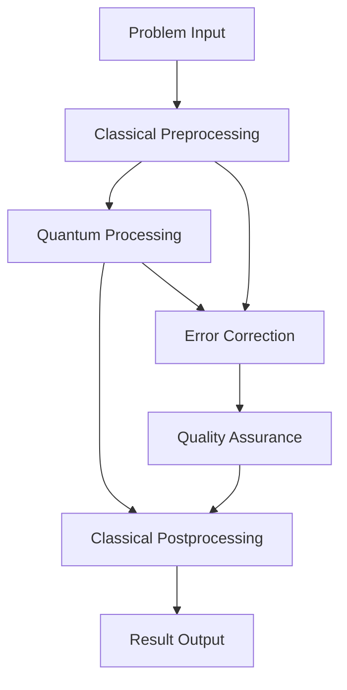

# Quantum-AI Hybrid Computing: The Next Frontier in 2025

The intersection of quantum computing and artificial intelligence represents one of the most exciting technological frontiers of our time. In 2025, we're witnessing the emergence of practical quantum-AI hybrid systems that promise to revolutionize how we approach complex computational challenges.

## The Quantum Advantage

### Understanding Quantum Supremacy

Quantum computers leverage quantum mechanical phenomena like superposition and entanglement to process information in ways that classical computers cannot. This quantum advantage becomes particularly powerful when applied to AI problems involving:

- **Optimization**: Quantum annealing for complex optimization problems
- **Machine Learning**: Quantum machine learning algorithms for pattern recognition
- **Cryptography**: Quantum-resistant security for AI systems
- **Simulation**: Quantum simulation of molecular and material systems

### Current Quantum Capabilities

As of 2025, we're seeing practical quantum systems with:

- 1000+ qubit processors from leading providers
- Quantum error correction achieving fault tolerance
- Hybrid classical-quantum algorithms showing real-world advantages
- Cloud-based quantum access making technology accessible

## Quantum-AI Integration Patterns

### 1. Quantum Machine Learning (QML)

Quantum machine learning algorithms offer advantages in specific domains:

```python
# Quantum Neural Network Example
import qiskit
from qiskit_machine_learning.algorithms import QSVC

# Quantum Support Vector Classifier
quantum_svc = QSVC(
    feature_map=feature_map,
    quantum_instance=quantum_instance
)

# Train on quantum-advantaged features
quantum_svc.fit(X_train, y_train)
predictions = quantum_svc.predict(X_test)
```

**Key Applications:**
- Financial portfolio optimization
- Drug discovery and molecular design
- Supply chain optimization
- Cryptocurrency analysis

### 2. Quantum Optimization

Quantum annealing and variational quantum eigensolvers (VQE) excel at optimization problems:

- **Logistics**: Route optimization for delivery networks
- **Finance**: Portfolio optimization with complex constraints
- **Manufacturing**: Production scheduling and resource allocation
- **Energy**: Grid optimization and renewable energy integration

### 3. Quantum Simulation

Quantum computers can simulate quantum systems exponentially faster than classical computers:

- **Materials Science**: Discovering new superconductors and catalysts
- **Chemistry**: Molecular interaction modeling for drug design
- **Physics**: Fundamental particle interactions and quantum field theory

## Hybrid Architecture Patterns

### Classical-Quantum Workflows

Modern quantum-AI systems use hybrid approaches:



### Quantum Cloud Integration

Leverage cloud-based quantum services:

- **IBM Quantum Network**: Access to quantum processors and simulators
- **Google Quantum AI**: Quantum computing services and algorithms
- **Amazon Braket**: Multi-provider quantum computing platform
- **Microsoft Azure Quantum**: Integrated quantum development environment

## Real-World Applications

### Financial Services

**Portfolio Optimization**
- Quantum algorithms for risk-return optimization
- Real-time portfolio rebalancing with quantum speedup
- Fraud detection using quantum machine learning

**Algorithmic Trading**
- Quantum advantage in high-frequency trading
- Market prediction using quantum neural networks
- Risk assessment with quantum Monte Carlo methods

### Healthcare and Life Sciences

**Drug Discovery**
- Quantum simulation of molecular interactions
- Accelerated drug candidate screening
- Personalized medicine optimization

**Medical Imaging**
- Quantum-enhanced image processing
- Faster MRI and CT scan analysis
- Quantum machine learning for diagnostics

### Cybersecurity

**Quantum Cryptography**
- Quantum key distribution (QKD) for secure communication
- Post-quantum cryptography for AI system protection
- Quantum random number generation for enhanced security

## Implementation Challenges

### Technical Hurdles

1. **Quantum Error Rates**: Current quantum systems still experience errors
2. **Coherence Time**: Quantum states decay over time
3. **Scalability**: Maintaining quantum advantage at scale
4. **Integration**: Seamless classical-quantum workflow integration

### Business Considerations

1. **Cost**: Quantum computing resources remain expensive
2. **Skills Gap**: Need for quantum-AI expertise
3. **ROI Measurement**: Quantifying quantum advantage
4. **Risk Management**: Managing uncertainty in quantum outcomes

## Best Practices for Quantum-AI Deployment

### 1. Start with Hybrid Approaches

Begin with classical-quantum hybrid systems:

- Use quantum for specific subproblems where advantage is clear
- Maintain classical fallbacks for reliability
- Gradually increase quantum component complexity

### 2. Focus on Quantum-Ready Problems

Target problems that benefit from quantum algorithms:

- Optimization with exponential search spaces
- Machine learning on quantum data
- Simulation of quantum systems
- Cryptography and security applications

### 3. Implement Robust Error Handling

Design systems that gracefully handle quantum errors:

- Error correction and mitigation strategies
- Classical validation of quantum results
- Fallback to classical algorithms when needed

### 4. Invest in Quantum Talent

Build teams with quantum-AI expertise:

- Quantum algorithm developers
- Hybrid system architects
- Quantum error correction specialists
- Quantum-AI application developers

## Future Outlook

### Near-Term (2025-2027)

- **Practical Quantum Advantage**: Demonstrable speedups for specific problems
- **Cloud Quantum Services**: Mainstream access to quantum computing
- **Hybrid Algorithms**: Mature classical-quantum integration patterns

### Medium-Term (2027-2030)

- **Fault-Tolerant Quantum Computing**: Error-corrected quantum systems
- **Quantum Internet**: Secure quantum communication networks
- **Quantum AI Applications**: Mainstream adoption in enterprise

### Long-Term (2030+)

- **Universal Quantum Computers**: General-purpose quantum systems
- **Quantum AI Integration**: Seamless quantum-AI workflows
- **Quantum Advantage**: Quantum computing as standard for AI workloads

## Getting Started

### 1. Assess Quantum Readiness

Evaluate your organization's quantum computing readiness:

- Identify quantum-advantaged problems in your domain
- Assess current computational bottlenecks
- Evaluate quantum talent and infrastructure needs

### 2. Pilot Quantum Projects

Start with focused pilot projects:

- Choose specific problems with clear quantum advantage
- Use cloud-based quantum services for initial experiments
- Measure and validate quantum performance gains

### 3. Build Quantum-AI Capabilities

Develop internal quantum-AI expertise:

- Train existing AI teams on quantum computing
- Partner with quantum computing providers
- Establish quantum development workflows

## Conclusion

Quantum-AI hybrid computing represents a paradigm shift in computational capabilities. While still emerging, the technology offers unprecedented opportunities for solving complex optimization, simulation, and machine learning problems.

Organizations that begin exploring quantum-AI integration today will be positioned to leverage quantum advantage as the technology matures. The key is to start with hybrid approaches, focus on quantum-ready problems, and build the necessary expertise and infrastructure.

The future of computing is quantum, and AI will be at the forefront of this transformation.

---

*Interested in exploring quantum-AI hybrid computing for your organization? Our quantum computing experts can help you identify opportunities and develop implementation strategies.*