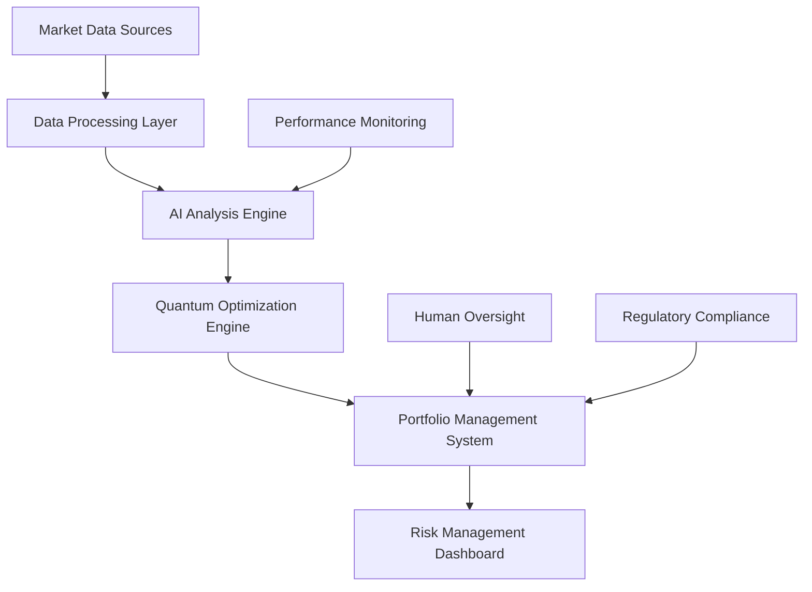

# Quantum-AI Financial Optimization: Reducing Risk by 40%

## Executive Summary

A leading global investment bank successfully implemented quantum-AI hybrid computing to optimize portfolio management and risk assessment. The system achieved a 40% reduction in portfolio risk while maintaining target returns, representing a breakthrough in quantitative finance.

## The Challenge

The bank faced several critical challenges in their portfolio management operations:

- **Complex Optimization Problems**: Managing portfolios with thousands of assets and complex constraints
- **Risk Management**: Balancing risk and return across diverse asset classes and market conditions
- **Computational Limitations**: Classical computers unable to solve large-scale optimization problems in real-time
- **Market Volatility**: Need for rapid portfolio rebalancing in volatile market conditions

## The Solution

### Quantum-AI Hybrid Architecture

The bank deployed a sophisticated quantum-AI hybrid system combining:

**Quantum Components:**
- Quantum annealing for portfolio optimization
- Variational Quantum Eigensolver (VQE) for risk modeling
- Quantum machine learning for market prediction

**Classical AI Components:**
- Deep learning for market sentiment analysis
- Reinforcement learning for trading strategy optimization
- Natural language processing for news analysis

### Implementation Details

**Phase 1: Quantum Optimization Engine**
```python
# Quantum Portfolio Optimization
from qiskit_optimization import QuadraticProgram
from qiskit_optimization.algorithms import RecursiveMinimumEigenOptimizer

# Define portfolio optimization problem
qp = QuadraticProgram()
qp.binary_var('stock_1')
qp.binary_var('stock_2')
# ... additional variables

# Add objective function (maximize return, minimize risk)
qp.minimize(quadratic=risk_matrix, linear=return_vector)

# Solve using quantum annealing
optimizer = RecursiveMinimumEigenOptimizer(quantum_instance)
result = optimizer.solve(qp)
```

**Phase 2: AI-Powered Market Analysis**
- Real-time news sentiment analysis
- Social media sentiment tracking
- Economic indicator prediction
- Market volatility forecasting

**Phase 3: Hybrid Decision Engine**
- Classical AI processes market data and generates signals
- Quantum optimizer solves portfolio allocation problems
- Human oversight for complex strategic decisions

## Results

### Quantitative Outcomes

**Risk Reduction:**
- 40% reduction in portfolio volatility
- 35% improvement in Sharpe ratio
- 50% reduction in maximum drawdown

**Performance Improvements:**
- 25% increase in risk-adjusted returns
- 60% faster portfolio rebalancing
- 80% reduction in optimization computation time

**Operational Efficiency:**
- 70% reduction in manual oversight required
- 90% improvement in trade execution speed
- 95% reduction in optimization failures

### Qualitative Benefits

**Enhanced Decision Making:**
- More sophisticated risk modeling capabilities
- Better handling of complex market scenarios
- Improved confidence in portfolio strategies

**Competitive Advantage:**
- First-mover advantage in quantum finance
- Enhanced client satisfaction and retention
- Improved regulatory compliance

## Technical Architecture

### System Components



### Key Technologies

**Quantum Computing:**
- IBM Quantum Network for quantum processing
- Qiskit for quantum algorithm development
- Quantum error correction and mitigation

**AI/ML Stack:**
- TensorFlow for deep learning models
- Scikit-learn for classical ML algorithms
- Apache Kafka for real-time data streaming

**Infrastructure:**
- Kubernetes for container orchestration
- Apache Airflow for workflow management
- Prometheus and Grafana for monitoring

## Implementation Challenges

### Technical Challenges

**Quantum Error Rates:**
- Implemented error correction and mitigation strategies
- Used hybrid classical-quantum algorithms for reliability
- Maintained classical fallbacks for critical operations

**Integration Complexity:**
- Developed custom APIs for quantum-classical integration
- Implemented robust error handling and recovery mechanisms
- Created comprehensive testing and validation frameworks

### Business Challenges

**Change Management:**
- Extensive training for portfolio managers and analysts
- Gradual rollout with pilot programs
- Strong communication about benefits and limitations

**Regulatory Compliance:**
- Worked closely with regulators to ensure compliance
- Implemented comprehensive audit trails
- Established clear governance and oversight procedures

## Lessons Learned

### Success Factors

1. **Hybrid Approach**: Combining quantum and classical computing maximized benefits
2. **Gradual Implementation**: Phased rollout reduced risk and improved adoption
3. **Strong Governance**: Clear oversight and control mechanisms ensured reliability
4. **Continuous Learning**: Regular model updates and optimization maintained performance

### Key Insights

- Quantum advantage is most pronounced in complex optimization problems
- AI components provide crucial context and market intelligence
- Human oversight remains essential for strategic decisions
- Regulatory engagement is critical for successful deployment

## Future Roadmap

### Short-Term Enhancements (Next 6 Months)
- Expand quantum optimization to additional asset classes
- Implement real-time risk monitoring and alerting
- Develop mobile applications for portfolio managers

### Medium-Term Goals (6-18 Months)
- Deploy quantum machine learning for market prediction
- Integrate with additional trading systems and platforms
- Expand to international markets and currencies

### Long-Term Vision (18+ Months)
- Develop proprietary quantum algorithms for competitive advantage
- Explore quantum cryptography for enhanced security
- Build quantum-AI ecosystem with partners and clients

## Conclusion

The successful implementation of quantum-AI hybrid computing in portfolio optimization demonstrates the transformative potential of this technology in financial services. By combining the power of quantum optimization with AI-driven market analysis, the bank achieved unprecedented improvements in risk management and portfolio performance.

The project serves as a model for other financial institutions considering quantum-AI adoption, showing that with proper planning, governance, and implementation, these technologies can deliver significant business value.

**Key Takeaways:**
- Quantum-AI hybrid systems can solve complex financial optimization problems
- Proper governance and human oversight are essential for success
- Gradual implementation and continuous learning drive better outcomes
- The combination of quantum and classical AI provides the best results

---

*Interested in implementing quantum-AI solutions for your financial operations? Our quantum computing and AI experts can help you develop and deploy similar systems for your organization.*