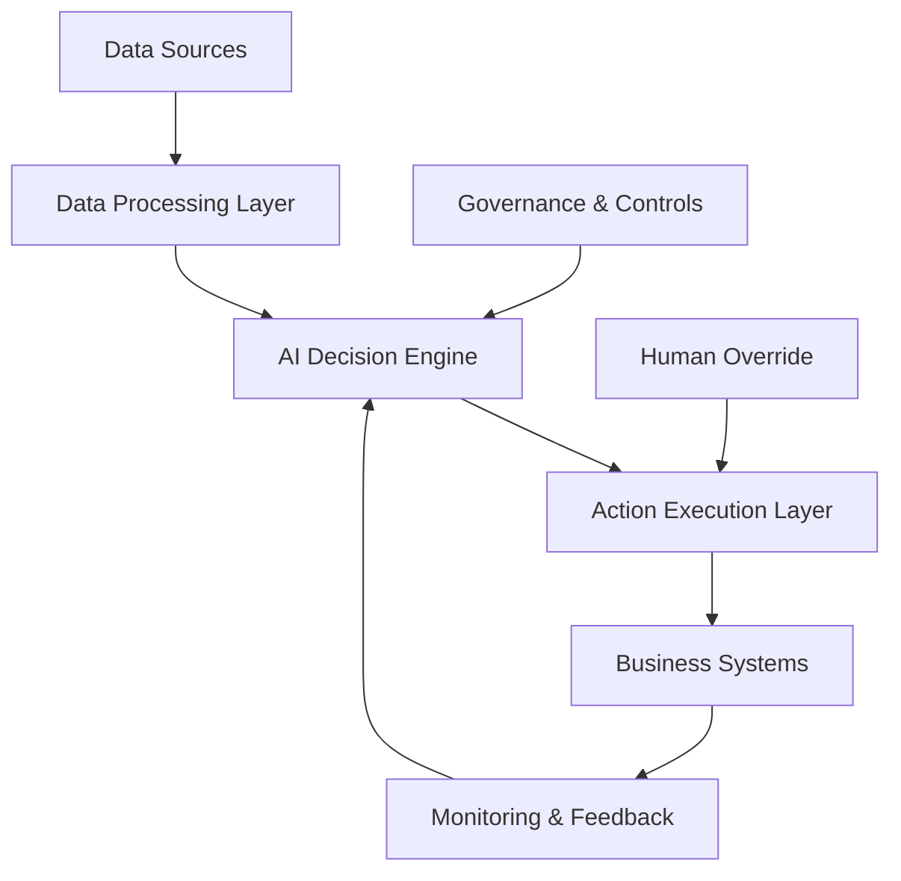

# AI-Powered Autonomous Business Operations: The Future of Enterprise Automation

The era of autonomous business operations is here. Organizations are deploying AI systems that can independently manage complex business processes, make decisions, and adapt to changing conditions without human intervention. This transformation is reshaping how enterprises operate, compete, and deliver value.

## The Autonomous Business Revolution

### From Automation to Autonomy

Traditional automation follows predetermined rules and workflows. Autonomous systems go further by:

- **Learning and Adapting**: Continuously improving performance based on outcomes
- **Making Decisions**: Evaluating multiple options and choosing optimal paths
- **Self-Healing**: Detecting and resolving issues without human intervention
- **Predicting and Preventing**: Anticipating problems before they occur

### Core Autonomous Capabilities

Modern autonomous business systems integrate multiple AI technologies:

1. **Machine Learning**: Pattern recognition and predictive analytics
2. **Natural Language Processing**: Understanding and generating human language
3. **Computer Vision**: Interpreting visual information from cameras and sensors
4. **Robotic Process Automation**: Executing digital tasks across systems
5. **Decision Engines**: Making complex business decisions autonomously

## Autonomous Business Domains

### Supply Chain Management

**Intelligent Inventory Management**
- Predictive demand forecasting using ML algorithms
- Automated reorder point calculations with safety stock optimization
- Dynamic pricing based on supply and demand fluctuations
- Supplier performance monitoring and relationship management

**Logistics Optimization**
- Route optimization for delivery networks
- Real-time tracking and exception handling
- Warehouse automation with robotic systems
- Last-mile delivery coordination

### Customer Service Operations

**Intelligent Customer Support**
- AI-powered chatbots handling 80%+ of customer inquiries
- Sentiment analysis for proactive customer outreach
- Automated ticket routing and escalation
- Personalized customer experience delivery

**Sales Automation**
- Lead scoring and qualification
- Automated follow-up sequences
- Dynamic pricing recommendations
- Sales forecasting and pipeline management

### Financial Operations

**Autonomous Financial Management**
- Real-time financial monitoring and reporting
- Automated invoice processing and payment
- Fraud detection and prevention
- Budget optimization and cost control

**Risk Management**
- Credit risk assessment and approval
- Insurance claim processing
- Compliance monitoring and reporting
- Market risk analysis and hedging

### Human Resources

**Intelligent Talent Management**
- Resume screening and candidate matching
- Automated interview scheduling
- Employee performance monitoring
- Predictive analytics for retention and development

## Implementation Architecture

### Autonomous System Components

### Key Architectural Principles

1. **Modularity**: Independent, composable autonomous components
2. **Observability**: Comprehensive monitoring and logging
3. **Safety**: Built-in safeguards and human override capabilities
4. **Scalability**: Designed to handle increasing complexity and volume
5. **Adaptability**: Systems that can evolve with changing requirements

## Real-World Case Studies

### Autonomous Retail Operations

**Case Study: Smart Store Management**

A major retailer implemented autonomous systems for:

- **Inventory Management**: AI systems automatically reorder products based on sales patterns, seasonality, and supplier lead times
- **Price Optimization**: Dynamic pricing algorithms adjust prices in real-time based on demand, competition, and inventory levels
- **Customer Experience**: AI-powered recommendation engines personalize the shopping experience for each customer
- **Store Operations**: Automated scheduling, energy management, and maintenance coordination

**Results:**
- 25% reduction in stockouts
- 15% increase in profit margins
- 40% improvement in customer satisfaction scores
- 30% reduction in operational costs

### Autonomous Manufacturing

**Case Study: Smart Factory Operations**

An automotive manufacturer deployed autonomous systems for:

- **Production Planning**: AI optimizes production schedules based on demand, resource availability, and quality metrics
- **Quality Control**: Computer vision systems automatically detect defects and trigger corrective actions
- **Predictive Maintenance**: ML models predict equipment failures and schedule maintenance proactively
- **Supply Chain Coordination**: Autonomous systems manage supplier relationships and logistics

**Results:**
- 35% reduction in production downtime
- 20% improvement in product quality
- 45% reduction in maintenance costs
- 50% faster time-to-market for new products

## Governance and Control Frameworks

### Autonomous System Governance

Implement comprehensive governance for autonomous operations:

1. **Decision Boundaries**: Define clear limits on autonomous decision-making
2. **Audit Trails**: Maintain complete logs of autonomous actions and decisions
3. **Performance Monitoring**: Track KPIs and outcomes of autonomous systems
4. **Human Oversight**: Ensure human operators can intervene when necessary

### Risk Management

**Operational Risks**
- System failures and cascading effects
- Unintended consequences of autonomous decisions
- Loss of human expertise and oversight
- Regulatory compliance challenges

**Mitigation Strategies**
- Gradual rollout with human oversight
- Comprehensive testing and validation
- Regular performance reviews and adjustments
- Strong change management processes

## Technology Stack

### Core Technologies

**AI/ML Platforms**
- TensorFlow and PyTorch for model development
- AutoML platforms for rapid model deployment
- MLOps tools for model lifecycle management

**Integration Platforms**
- API gateways for system connectivity
- Message queues for asynchronous processing
- Event streaming for real-time data processing

**Monitoring and Observability**
- Application performance monitoring (APM)
- Business intelligence and analytics
- Alerting and notification systems

### Implementation Roadmap

**Phase 1: Foundation (Months 1-6)**
- Establish data infrastructure and governance
- Deploy basic automation and monitoring
- Train teams on autonomous system concepts

**Phase 2: Pilot Programs (Months 7-12)**
- Launch pilot autonomous systems in specific domains
- Measure performance and gather feedback
- Refine governance and control frameworks

**Phase 3: Scale and Optimize (Months 13-18)**
- Expand autonomous systems across the organization
- Integrate systems for end-to-end automation
- Continuously optimize and improve performance

## Best Practices

### 1. Start with High-Impact, Low-Risk Areas

Begin with processes that have:
- Clear, measurable outcomes
- Limited downside risk
- High potential for improvement
- Strong data availability

### 2. Maintain Human-AI Collaboration

Design systems that enhance human capabilities:
- AI handles routine decisions and tasks
- Humans focus on strategic and creative work
- Clear escalation paths for complex situations
- Regular human review and validation

### 3. Invest in Change Management

Prepare your organization for autonomous operations:
- Communicate benefits and address concerns
- Provide comprehensive training and support
- Establish new roles and responsibilities
- Celebrate successes and learn from failures

### 4. Prioritize Data Quality and Governance

Ensure autonomous systems have access to:
- Clean, accurate, and timely data
- Comprehensive data governance policies
- Strong data security and privacy controls
- Regular data quality monitoring

## Future Trends

### Emerging Capabilities

**Multi-Agent Systems**
- Coordination between multiple autonomous agents
- Distributed decision-making across organizations
- Emergent behaviors from agent interactions

**Cognitive Automation**
- Natural language understanding and generation
- Complex reasoning and problem-solving
- Emotional intelligence and social awareness

**Edge Autonomy**
- Autonomous systems operating at the edge
- Reduced latency and improved reliability
- Enhanced privacy and security

### Industry Evolution

**Business Model Innovation**
- New revenue streams from autonomous capabilities
- Shift from products to autonomous services
- Platform-based business models

**Competitive Advantage**
- First-mover advantages in autonomous operations
- Network effects from autonomous ecosystem participation
- Continuous innovation through autonomous optimization

## Conclusion

AI-powered autonomous business operations represent a fundamental shift in how organizations operate. By deploying intelligent systems that can learn, adapt, and make decisions autonomously, enterprises can achieve unprecedented levels of efficiency, agility, and innovation.

The key to success lies in thoughtful implementation, strong governance, and continuous optimization. Organizations that embrace autonomous operations today will be positioned to thrive in the increasingly complex and competitive business environment of tomorrow.

The future of business is autonomous, and the time to start is now.

---

*Ready to transform your business operations with autonomous AI systems? Our experts can help you identify opportunities, develop implementation strategies, and deploy autonomous solutions that drive real business value.*