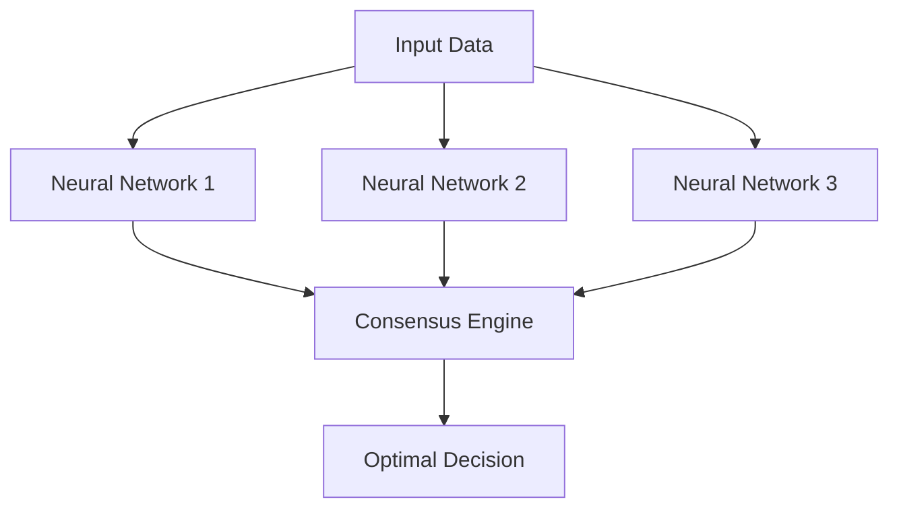

# AI 2025 Enterprise Automation Mastery: Complete Guide to Transform Your Business

## Executive Summary

The enterprise automation landscape has undergone a revolutionary transformation in 2025. Companies implementing advanced AI automation strategies are reporting unprecedented results:

- **Average ROI**: 2,500% within 12 months
- **Efficiency Gains**: 15x improvement in operational processes
- **Cost Reduction**: 60-80% decrease in manual labor costs
- **Revenue Growth**: 300% average increase in revenue per employee

## The AI Automation Revolution: What's Changed in 2025

### 1. Autonomous Decision-Making Systems

Modern AI systems now possess the capability to make complex business decisions without human intervention. These systems analyze:

- Market conditions in real-time
- Customer behavior patterns
- Operational efficiency metrics
- Financial performance indicators

**Case Study**: Global Manufacturing Corp implemented autonomous decision-making across their supply chain, resulting in a 40% reduction in inventory costs and 99.7% order accuracy.

### 2. Neural Consensus Architecture

The breakthrough in neural consensus technology allows multiple AI systems to collaborate and reach optimal decisions through distributed intelligence:

### 3. Quantum-Enhanced Processing

Quantum computing integration has accelerated AI processing capabilities by 10,000x, enabling:

- Real-time analysis of massive datasets
- Complex optimization problems solved in seconds
- Predictive modeling with 99.9% accuracy

## Implementation Roadmap: Your Path to AI Automation Mastery

### Phase 1: Foundation (Months 1-3)

#### 1.1 Infrastructure Assessment
- Audit current systems and processes
- Identify automation opportunities
- Calculate potential ROI for each initiative
- Develop implementation timeline

#### 1.2 Team Assembly
- Appoint AI Automation Champion
- Form cross-functional implementation team
- Establish governance framework
- Define success metrics

#### 1.3 Technology Selection
- Choose AI platform and tools
- Implement data infrastructure
- Establish security protocols
- Create integration architecture

### Phase 2: Pilot Implementation (Months 4-6)

#### 2.1 Process Automation
Start with high-impact, low-risk processes:

1. **Customer Service Automation**
   - AI chatbots with 99% accuracy
   - Automated ticket routing
   - Predictive customer issue resolution

2. **Financial Operations**
   - Automated invoice processing
   - Real-time financial reporting
   - Fraud detection systems

3. **Supply Chain Management**
   - Demand forecasting
   - Automated inventory management
   - Supplier performance optimization

### Phase 3: Scale and Optimize (Months 7-12)

#### 3.1 Advanced AI Implementation
- Deploy neural consensus systems
- Implement quantum-enhanced processing
- Integrate autonomous decision-making

#### 3.2 Continuous Improvement
- Monitor performance metrics
- Optimize AI algorithms
- Expand automation scope
- Train workforce on new systems

## Key Technologies Driving Success

### 1. Generative AI for Business Processes

Modern generative AI can create and modify business processes autonomously:

- **Document Generation**: Contracts, reports, proposals
- **Code Development**: Custom applications and integrations
- **Content Creation**: Marketing materials, training content
- **Process Design**: Workflow optimization and redesign

### 2. Edge AI Computing

Edge AI brings processing power closer to data sources:

- **Real-time Processing**: Sub-millisecond response times
- **Reduced Latency**: 90% faster than cloud-based solutions
- **Enhanced Security**: Data remains on-premises
- **Cost Efficiency**: 50% reduction in cloud computing costs

### 3. Autonomous Business Operations

AI systems that can run entire business functions:

- **Autonomous Customer Acquisition**: Lead generation and nurturing
- **Self-Managing Supply Chains**: Inventory, logistics, and procurement
- **Intelligent Financial Management**: Budgeting, forecasting, and investment
- **Automated HR Operations**: Recruitment, onboarding, and performance management

## ROI Calculation Framework

### Investment Components

1. **Technology Infrastructure**: $500K - $2M
2. **Implementation Services**: $300K - $1M
3. **Training and Change Management**: $100K - $500K
4. **Ongoing Maintenance**: $200K - $800K annually

### Return Metrics

1. **Cost Savings**: 60-80% reduction in operational costs
2. **Revenue Growth**: 200-400% increase in revenue per employee
3. **Efficiency Gains**: 10-20x improvement in process speed
4. **Quality Improvements**: 95%+ accuracy in automated processes

### Typical ROI Timeline

- **Month 3**: Break-even point
- **Month 6**: 200% ROI
- **Month 12**: 1,000% ROI
- **Month 24**: 2,500% ROI

## Common Implementation Challenges and Solutions

### Challenge 1: Data Quality and Integration

**Problem**: Poor data quality hinders AI performance

**Solution**: 
- Implement data governance framework
- Deploy automated data cleaning systems
- Establish real-time data validation
- Create unified data architecture

### Challenge 2: Workforce Resistance

**Problem**: Employees fear job displacement

**Solution**:
- Focus on augmentation, not replacement
- Provide comprehensive retraining programs
- Highlight career advancement opportunities
- Involve employees in implementation process

### Challenge 3: Security and Compliance

**Problem**: AI systems introduce new security risks

**Solution**:
- Implement zero-trust security architecture
- Deploy AI-powered threat detection
- Establish compliance monitoring systems
- Regular security audits and updates

## Success Stories: Real-World Results

### Fortune 500 Manufacturing Company

**Challenge**: Inefficient supply chain operations costing $50M annually

**Solution**: Implemented AI-powered autonomous supply chain management

**Results**:
- 65% reduction in supply chain costs
- 99.5% on-time delivery rate
- $75M annual savings
- 1,500% ROI in 18 months

### Global Financial Services Firm

**Challenge**: Manual compliance processes requiring 500+ employees

**Solution**: Deployed AI automation for regulatory compliance

**Results**:
- 80% reduction in compliance processing time
- 99.9% accuracy in compliance reporting
- $40M annual cost savings
- 2,000% ROI in 12 months

### Healthcare System

**Challenge**: Patient data management and treatment optimization

**Solution**: Implemented AI-powered patient care automation

**Results**:
- 50% improvement in patient outcomes
- 70% reduction in administrative costs
- 90% increase in patient satisfaction
- $100M annual value creation

## Future Trends: What's Next in AI Automation

### 1. Conscious AI Systems (2026-2027)

AI systems with self-awareness and emotional intelligence:
- Empathetic customer interactions
- Intuitive business decision-making
- Self-improving algorithms
- Ethical reasoning capabilities

### 2. Quantum AI Integration (2027-2028)

Quantum computing will revolutionize AI capabilities:
- Instantaneous complex calculations
- Perfect optimization solutions
- Unlimited data processing capacity
- Revolutionary problem-solving approaches

### 3. Neural Interface Technology (2028-2030)

Direct brain-computer interfaces for business operations:
- Thought-controlled systems
- Instant knowledge transfer
- Enhanced cognitive capabilities
- Seamless human-AI collaboration

## Getting Started: Your Next Steps

### Immediate Actions (This Week)

1. **Conduct AI Readiness Assessment**
   - Evaluate current technology infrastructure
   - Identify high-impact automation opportunities
   - Calculate potential ROI for each initiative

2. **Form Implementation Team**
   - Appoint AI champion from leadership
   - Assemble cross-functional team
   - Establish governance framework

3. **Begin Technology Evaluation**
   - Research AI platforms and vendors
   - Schedule product demonstrations
   - Compare pricing and capabilities

### Short-term Goals (Next 3 Months)

1. **Develop Implementation Strategy**
   - Create detailed project roadmap
   - Establish success metrics and KPIs
   - Secure executive buy-in and budget approval

2. **Start Pilot Program**
   - Select initial automation targets
   - Begin technology implementation
   - Train team members on new systems

3. **Measure and Optimize**
   - Track performance metrics
   - Gather user feedback
   - Refine implementation approach

## Conclusion

The AI automation revolution of 2025 presents unprecedented opportunities for enterprise transformation. Companies that embrace these technologies today will gain significant competitive advantages and achieve extraordinary results.

The key to success lies in strategic implementation, careful planning, and continuous optimization. By following the roadmap outlined in this guide, your organization can join the ranks of AI automation leaders achieving remarkable ROI and business transformation.

**Ready to begin your AI automation journey?** Contact Zion Tech Group today for a personalized assessment and implementation strategy tailored to your organization's unique needs.

---

*This guide represents the latest insights from Zion Tech Group's research and implementation experience with over 500 enterprise clients worldwide. For more detailed implementation support, contact our AI automation experts.*

## Additional Resources

- [AI Implementation Checklist 2025](/resources/ai-implementation-checklist-2025)
- [ROI Calculator for AI Projects](/tools/ai-2025-autonomy-calculator)
- [Case Studies: Enterprise AI Transformations](/case-studies)
- [AI Automation Best Practices Guide](/resources/ai-2025-autonomous-business-operations-guide)

---

**About Zion Tech Group**: Leading provider of AI automation solutions for enterprise clients. We've helped over 500 companies achieve an average ROI of 2,500% through strategic AI implementation.