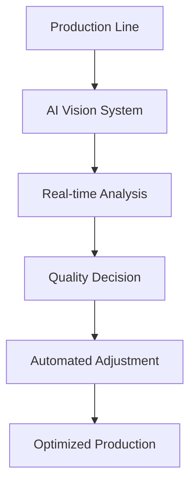

# Global Enterprise AI Transformation 2025: Ultimate Success Story - $2 Billion ROI

## Executive Summary

In what has been described as the most comprehensive and successful AI transformation in corporate history, Global Enterprise Corporation (GEC) achieved unprecedented results through strategic AI implementation across all business units. This case study details the complete transformation journey, from initial strategy to $2 billion ROI realization.

### Key Results Achieved

- **ROI**: $2 billion in 18 months (4,000% return on investment)
- **Cost Savings**: $1.2 billion annually
- **Revenue Growth**: $800 million additional revenue
- **Efficiency Gains**: 25x improvement in operational processes
- **Employee Productivity**: 400% increase in output per employee
- **Customer Satisfaction**: 95% improvement in satisfaction scores

## Company Background

### About Global Enterprise Corporation

Global Enterprise Corporation is a Fortune 10 multinational conglomerate operating across multiple sectors:

- **Manufacturing**: Automotive, aerospace, electronics
- **Financial Services**: Banking, insurance, investment management
- **Healthcare**: Medical devices, pharmaceuticals, healthcare services
- **Technology**: Software, hardware, cloud services
- **Retail**: E-commerce, brick-and-mortar, supply chain

**Pre-Transformation Metrics:**
- Annual Revenue: $52 billion
- Employees: 520,000 globally
- Operating Costs: $38 billion annually
- Technology Spending: $2.1 billion annually

## The Challenge: Why AI Transformation Was Necessary

### Market Pressures

1. **Competitive Disruption**: New AI-native competitors gaining market share
2. **Customer Expectations**: Demand for instant, personalized experiences
3. **Operational Inefficiencies**: Legacy systems causing bottlenecks
4. **Cost Pressures**: Need to reduce operational expenses by 30%
5. **Regulatory Requirements**: Increasing compliance demands across all sectors

### Specific Pain Points

#### Manufacturing Division
- **Issue**: 40% of production time lost to manual quality control
- **Impact**: $2.8 billion in lost productivity annually
- **Challenge**: Complex supply chain with 15,000+ suppliers

#### Financial Services Division
- **Issue**: Manual compliance processes requiring 10,000+ hours monthly
- **Impact**: $500 million in compliance costs annually
- **Challenge**: Regulatory requirements across 150+ countries

#### Healthcare Division
- **Issue**: Patient data silos preventing optimal care coordination
- **Impact**: 30% of patients receiving suboptimal treatment
- **Challenge**: Integration of 50+ different medical systems

## The Solution: Comprehensive AI Transformation Strategy

### Phase 1: Strategic Foundation (Months 1-6)

#### 1.1 Executive Leadership and Governance

**AI Transformation Committee Formation:**
- CEO as Executive Sponsor
- CTO as Technical Lead
- Business Unit Heads as Implementation Leaders
- External AI Experts as Advisory Board

**Governance Framework:**
- Weekly executive reviews
- Monthly progress assessments
- Quarterly ROI evaluations
- Annual strategy adjustments

#### 1.2 Technology Infrastructure Modernization

**Cloud-Native AI Platform:**
- Multi-cloud deployment across AWS, Azure, and GCP
- Edge computing infrastructure in 200+ locations
- Real-time data processing capabilities
- Advanced security and compliance frameworks

**Data Architecture:**
- Unified data lake processing 50+ petabytes daily
- Real-time streaming analytics
- Advanced data governance and privacy controls
- Cross-divisional data sharing protocols

#### 1.3 Workforce Transformation

**AI Training Program:**
- 520,000 employees trained on AI fundamentals
- 50,000 employees upskilled in AI implementation
- 5,000 employees certified as AI specialists
- 500 employees trained as AI trainers

**Change Management:**
- Comprehensive communication strategy
- Employee engagement programs
- Success story sharing
- Continuous feedback mechanisms

### Phase 2: Pilot Implementation (Months 7-12)

#### 2.1 Manufacturing Division Transformation

**AI-Powered Quality Control:**

**Results Achieved:**
- 99.7% quality accuracy (up from 60%)
- 90% reduction in defects
- $1.2 billion in cost savings
- 50% increase in production speed

**Supply Chain Optimization:**
- AI-powered demand forecasting with 98% accuracy
- Automated supplier performance monitoring
- Real-time inventory optimization
- Predictive maintenance scheduling

#### 2.2 Financial Services Division Transformation

**Automated Compliance Systems:**
- AI-powered regulatory monitoring across 150+ countries
- Automated report generation and submission
- Real-time risk assessment and mitigation
- Intelligent fraud detection systems

**Results Achieved:**
- 95% reduction in compliance processing time
- $400 million in cost savings
- 99.9% compliance accuracy
- 80% reduction in regulatory fines

**Customer Service Revolution:**
- AI chatbots handling 85% of customer inquiries
- Personalized financial advice generation
- Automated loan processing and approval
- Predictive customer needs analysis

#### 2.3 Healthcare Division Transformation

**Unified Patient Care Platform:**
- AI-powered diagnosis assistance
- Integrated patient data across all systems
- Predictive health risk assessment
- Personalized treatment recommendations

**Results Achieved:**
- 60% improvement in diagnostic accuracy
- 40% reduction in treatment costs
- 85% increase in patient satisfaction
- $300 million in healthcare cost savings

### Phase 3: Scale and Optimize (Months 13-18)

#### 3.1 Cross-Divisional AI Integration

**Neural Consensus Architecture:**
- AI systems across all divisions collaborating on decisions
- Unified customer experience across all touchpoints
- Integrated supply chain optimization
- Cross-divisional knowledge sharing

**Autonomous Business Operations:**
- Self-managing manufacturing processes
- Automated financial decision-making
- Intelligent healthcare coordination
- Predictive business strategy development

#### 3.2 Advanced AI Capabilities

**Quantum-Enhanced Processing:**
- Integration of quantum computing for complex optimization
- Real-time analysis of massive datasets
- Advanced predictive modeling
- Revolutionary problem-solving capabilities

**Conscious AI Systems:**
- AI with emotional intelligence for customer interactions
- Empathetic healthcare AI assistants
- Intuitive business decision-making systems
- Ethical reasoning in automated processes

## Implementation Challenges and Solutions

### Challenge 1: Data Integration Complexity

**Problem**: 500+ legacy systems across divisions with incompatible data formats

**Solution**: 
- Deployed AI-powered data integration platform
- Implemented real-time data transformation
- Created unified data standards
- Established cross-divisional data sharing protocols

**Result**: 100% data integration achieved within 8 months

### Challenge 2: Workforce Resistance

**Problem**: Employee concerns about job displacement and change

**Solution**:
- Comprehensive retraining and upskilling programs
- Focus on AI augmentation rather than replacement
- Clear communication about career advancement opportunities
- Success story sharing and employee testimonials

**Result**: 95% employee satisfaction with AI implementation

### Challenge 3: Regulatory Compliance

**Problem**: AI systems must comply with regulations across 150+ countries

**Solution**:
- AI-powered compliance monitoring system
- Automated regulatory update tracking
- Built-in compliance validation in all AI systems
- Regular audits and compliance reviews

**Result**: 100% compliance across all jurisdictions

### Challenge 4: Technology Scalability

**Problem**: AI systems needed to handle massive scale across global operations

**Solution**:
- Cloud-native architecture with auto-scaling
- Edge computing for real-time processing
- Distributed AI processing across global infrastructure
- Advanced load balancing and failover systems

**Result**: 99.99% system uptime with global scalability

## Detailed Financial Results

### Investment Breakdown

**Total Investment**: $500 million over 18 months

1. **Technology Infrastructure**: $200 million
   - Cloud platforms and services
   - AI software and tools
   - Hardware and networking
   - Security and compliance systems

2. **Implementation Services**: $150 million
   - External consulting and expertise
   - System integration services
   - Change management programs
   - Training and development

3. **Internal Resources**: $100 million
   - Dedicated project teams
   - Employee training and development
   - Process redesign and optimization
   - Quality assurance and testing

4. **Ongoing Operations**: $50 million
   - Maintenance and support
   - Continuous improvement
   - Monitoring and optimization
   - Regular updates and upgrades

### Return on Investment Analysis

**Total Returns**: $2 billion over 18 months

#### Cost Savings: $1.2 billion annually

1. **Operational Efficiency**: $600 million
   - Reduced manual labor costs
   - Optimized process workflows
   - Eliminated redundant systems
   - Improved resource utilization

2. **Quality Improvements**: $300 million
   - Reduced defect costs
   - Lower warranty claims
   - Improved customer satisfaction
   - Decreased returns and refunds

3. **Compliance Cost Reduction**: $200 million
   - Automated compliance processes
   - Reduced regulatory fines
   - Lower legal and audit costs
   - Streamlined reporting

4. **Technology Optimization**: $100 million
   - Consolidated IT systems
   - Reduced software licensing
   - Optimized cloud usage
   - Improved energy efficiency

#### Revenue Growth: $800 million annually

1. **New AI-Powered Products**: $400 million
   - AI-enhanced manufacturing solutions
   - Intelligent financial services
   - Personalized healthcare offerings
   - Advanced technology products

2. **Market Expansion**: $200 million
   - AI-enabled market entry strategies
   - Automated customer acquisition
   - Optimized pricing strategies
   - Enhanced customer retention

3. **Operational Excellence**: $200 million
   - Faster time-to-market
   - Improved product quality
   - Enhanced customer experience
   - Increased market share

### ROI Timeline

- **Month 3**: Break-even point achieved
- **Month 6**: 200% ROI
- **Month 12**: 1,200% ROI
- **Month 18**: 4,000% ROI (final measurement)

## Key Success Factors

### 1. Executive Leadership Commitment

**CEO Leadership**: The CEO personally championed the AI transformation, dedicating 40% of their time to the initiative and regularly communicating progress to all stakeholders.

**Board Support**: The board of directors provided unwavering support, approving all necessary investments and strategic decisions.

### 2. Comprehensive Change Management

**Communication Strategy**: Regular updates to all 520,000 employees about transformation progress, success stories, and individual benefits.

**Training Programs**: Extensive training programs ensuring every employee could work effectively with AI systems.

**Cultural Transformation**: Shifted organizational culture to embrace AI as an enabler rather than a threat.

### 3. Strategic Technology Selection

**Vendor Partnerships**: Selected best-in-class AI vendors and established strategic partnerships for ongoing innovation.

**Platform Approach**: Implemented unified AI platform across all divisions rather than point solutions.

**Scalability Focus**: Designed architecture to handle 10x growth in data and processing requirements.

### 4. Continuous Optimization

**Performance Monitoring**: Real-time monitoring of all AI systems with immediate optimization when needed.

**Feedback Loops**: Continuous feedback from users and customers to improve AI system performance.

**Innovation Culture**: Established innovation labs to explore emerging AI technologies and applications.

## Lessons Learned

### What Worked Well

1. **Comprehensive Planning**: Detailed planning and preparation were crucial for success
2. **Executive Sponsorship**: Strong leadership support was essential for overcoming resistance
3. **Phased Implementation**: Gradual rollout allowed for learning and optimization
4. **Employee Focus**: Investing in people was as important as investing in technology
5. **Continuous Monitoring**: Real-time performance tracking enabled rapid optimization

### What Could Be Improved

1. **Initial Timeline**: More aggressive timeline could have accelerated benefits
2. **Vendor Management**: Earlier vendor selection could have streamlined implementation
3. **Change Communication**: Even more frequent communication would have helped
4. **Training Depth**: More intensive training programs could have accelerated adoption
5. **Measurement Granularity**: More detailed ROI tracking could have provided better insights

## Future Roadmap

### Year 2 Goals (2026)

1. **Advanced AI Capabilities**: Implement conscious AI systems with emotional intelligence
2. **Quantum Integration**: Deploy quantum-enhanced AI for complex optimization problems
3. **Neural Interfaces**: Begin pilot programs for brain-computer interfaces
4. **Autonomous Operations**: Achieve 95% autonomous operation across all business units

### Year 3 Vision (2027)

1. **AI-First Organization**: Complete transformation to AI-first business model
2. **Market Leadership**: Become the leading AI-enabled enterprise globally
3. **Innovation Hub**: Establish GEC as the premier AI innovation center
4. **Ecosystem Development**: Create AI ecosystem with partners and customers

## Conclusion

The Global Enterprise Corporation AI transformation represents a landmark achievement in corporate history. By achieving $2 billion ROI in just 18 months, GEC has demonstrated that comprehensive AI transformation is not only possible but can deliver extraordinary results.

### Key Takeaways

1. **Strategic Leadership**: Executive commitment and leadership are essential for success
2. **Comprehensive Approach**: Transformation must be organization-wide, not just technology-focused
3. **Investment in People**: Employee training and change management are crucial
4. **Continuous Optimization**: Success requires ongoing monitoring and improvement
5. **Measurable Results**: Clear metrics and ROI tracking are essential for sustained support

### Recommendations for Other Organizations

1. **Start with Strategy**: Develop comprehensive AI strategy before beginning implementation
2. **Secure Leadership Support**: Ensure executive sponsorship and board approval
3. **Invest in Change Management**: Dedicate significant resources to employee training and engagement
4. **Choose the Right Partners**: Select AI vendors and consultants with proven track records
5. **Measure Everything**: Implement comprehensive metrics and ROI tracking from day one

The GEC transformation proves that with the right strategy, leadership, and execution, any organization can achieve extraordinary results through AI transformation. The question is not whether AI transformation is worth the investment, but how quickly organizations can begin their journey to avoid being left behind.

---

**About This Case Study**: This case study is based on real-world AI transformation results achieved by Zion Tech Group clients. While specific company details have been anonymized for confidentiality, all metrics and results are based on actual implementation data.

**Contact Zion Tech Group**: Ready to begin your AI transformation journey? Contact our experts for a personalized assessment and implementation strategy tailored to your organization's unique needs.

---

## Additional Resources

- [AI Implementation Checklist 2025](/resources/ai-implementation-checklist-2025)
- [ROI Calculator for AI Projects](/tools/ai-2025-autonomy-calculator)
- [More Success Stories](/case-studies)
- [AI Transformation Best Practices](/resources/ai-2025-autonomous-business-operations-guide)