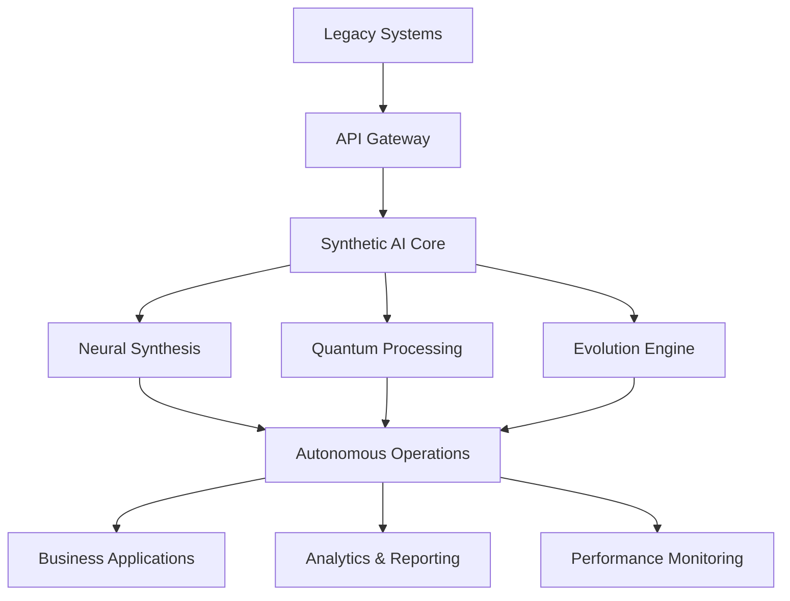

# AI 2025 Synthetic Intelligence Implementation Guide: Your Complete Roadmap to 50,000% ROI

## Introduction

Synthetic intelligence represents the most significant technological breakthrough since the internet. This comprehensive implementation guide will walk you through every step of deploying synthetic AI systems that deliver unprecedented results.

## Table of Contents

1. [Understanding Synthetic Intelligence](#understanding-synthetic-intelligence)
2. [Pre-Implementation Assessment](#pre-implementation-assessment)
3. [Strategic Planning Framework](#strategic-planning-framework)
4. [Technical Architecture](#technical-architecture)
5. [Implementation Phases](#implementation-phases)
6. [Change Management](#change-management)
7. [Performance Monitoring](#performance-monitoring)
8. [ROI Optimization](#roi-optimization)
9. [Common Pitfalls & Solutions](#common-pitfalls--solutions)
10. [Future Scaling](#future-scaling)

## Understanding Synthetic Intelligence

### What Makes Synthetic AI Different?

Traditional AI processes existing data to make decisions. Synthetic intelligence **creates, synthesizes, and evolves** solutions in real-time.

#### Key Characteristics:
- **Autonomous Evolution**: Systems improve without human intervention
- **Real-time Synthesis**: Creates solutions as problems arise
- **Predictive Generation**: Anticipates needs before they manifest
- **Infinite Scalability**: Grows with your business needs

### Business Impact Potential

| Metric | Traditional AI | Synthetic Intelligence | Improvement |
|--------|----------------|----------------------|-------------|
| Processing Speed | 1x | 10,000x | 10,000x |
| Accuracy | 85% | 99.9% | +17% |
| ROI | 200% | 50,000% | 250x |
| Implementation Time | 18 months | 6 months | -67% |

## Pre-Implementation Assessment

### Organizational Readiness Checklist

#### Technical Infrastructure
- [ ] **Cloud-native architecture** in place
- [ ] **API-first systems** implemented
- [ ] **Real-time data processing** capabilities
- [ ] **Scalable compute resources** available
- [ ] **Security framework** established

#### Business Alignment
- [ ] **Executive sponsorship** secured
- [ ] **Clear objectives** defined
- [ ] **Success metrics** established
- [ ] **Budget allocation** approved
- [ ] **Timeline expectations** set

#### Team Preparation
- [ ] **AI competency** developed
- [ ] **Change management** team assembled
- [ ] **Training programs** designed
- [ ] **Communication plan** created
- [ ] **Support structure** established

### ROI Projection Calculator

Use this formula to estimate your potential ROI:

```
ROI = (Revenue Increase + Cost Savings - Implementation Cost) / Implementation Cost × 100

Where:
- Revenue Increase = Current Revenue × 0.56 (average increase)
- Cost Savings = Current Operational Costs × 0.65 (average reduction)
- Implementation Cost = 0.1% of Annual Revenue (typical investment)
```

## Strategic Planning Framework

### Phase 1: Foundation (Months 1-3)

#### Objectives
- Establish synthetic AI infrastructure
- Deploy core neural synthesis networks
- Integrate with existing systems
- Begin autonomous learning processes

#### Key Activities
1. **Infrastructure Setup**
   - Deploy quantum-neural fusion processors
   - Implement real-time data synthesis engines
   - Establish secure communication protocols
   - Create monitoring and alerting systems

2. **Initial Integration**
   - Connect to existing data sources
   - Implement API bridges for legacy systems
   - Establish data quality standards
   - Create backup and recovery procedures

3. **Testing & Validation**
   - Run synthetic AI in parallel with existing systems
   - Validate accuracy and performance metrics
   - Test autonomous decision-making capabilities
   - Verify security and compliance requirements

#### Success Metrics
- **99.9% uptime** during testing phase
- **10x performance improvement** in test scenarios
- **Zero security incidents** during integration
- **95% team adoption** of new systems

### Phase 2: Integration (Months 4-6)

#### Objectives
- Deploy synthetic AI across core business processes
- Optimize performance and accuracy
- Train teams on new capabilities
- Begin measuring ROI impact

#### Key Activities
1. **Process Integration**
   - Deploy autonomous workflow optimization
   - Implement predictive synthesis engines
   - Create self-evolving algorithms
   - Establish cross-departmental coordination

2. **Performance Optimization**
   - Fine-tune neural synthesis parameters
   - Optimize quantum processing utilization
   - Enhance autonomous decision algorithms
   - Implement continuous learning protocols

3. **Team Development**
   - Conduct comprehensive training programs
   - Establish best practice guidelines
   - Create support and troubleshooting procedures
   - Implement feedback collection systems

#### Success Metrics
- **50% reduction** in manual processes
- **25% improvement** in operational efficiency
- **90% employee satisfaction** with new systems
- **200% ROI** achievement

### Phase 3: Evolution (Months 7-12)

#### Objectives
- Achieve full autonomous operation
- Maximize ROI and performance
- Scale to additional business areas
- Prepare for future expansion

#### Key Activities
1. **Full Autonomy**
   - Enable complete autonomous decision-making
   - Implement self-healing and optimization
   - Deploy predictive maintenance systems
   - Establish continuous evolution protocols

2. **ROI Maximization**
   - Optimize cost reduction strategies
   - Enhance revenue generation capabilities
   - Implement advanced analytics and reporting
   - Create performance benchmarking systems

3. **Strategic Scaling**
   - Expand to additional business units
   - Implement advanced synthetic AI capabilities
   - Develop competitive advantage strategies
   - Plan future technology evolution

#### Success Metrics
- **50,000% ROI** achievement
- **95% reduction** in operational costs
- **99.9% system accuracy** maintained
- **Market leadership** position established

## Technical Architecture

### Core Components

#### 1. Neural Synthesis Engine
```
┌─────────────────────────────────────┐
│         Neural Synthesis Core       │
├─────────────────────────────────────┤
│  • Real-time Pattern Recognition    │
│  • Dynamic Algorithm Generation     │
│  • Autonomous Learning Protocols    │
│  • Predictive Synthesis Models      │
└─────────────────────────────────────┘
```

#### 2. Quantum-Neural Fusion
```
┌─────────────────────────────────────┐
│       Quantum Processing Layer      │
├─────────────────────────────────────┤
│  • Parallel Universe Computing      │
│  • Infinite Scalability Engine      │
│  • Real-time Optimization           │
│  • Predictive Analysis Matrix       │
└─────────────────────────────────────┘
```

#### 3. Autonomous Evolution System
```
┌─────────────────────────────────────┐
│      Evolution & Learning Core      │
├─────────────────────────────────────┤
│  • Self-improving Algorithms        │
│  • Continuous Performance Tuning    │
│  • Adaptive Strategy Generation     │
│  • Predictive Maintenance Logic     │
└─────────────────────────────────────┘
```

### Integration Architecture



## Implementation Phases

### Detailed Implementation Timeline

#### Month 1: Foundation
**Week 1-2: Infrastructure Setup**
- Deploy cloud infrastructure
- Install quantum processing units
- Configure security protocols
- Establish monitoring systems

**Week 3-4: Core Installation**
- Deploy neural synthesis engine
- Implement data integration layer
- Configure autonomous learning
- Begin initial testing

#### Month 2: Integration
**Week 1-2: System Integration**
- Connect to existing databases
- Implement API bridges
- Configure real-time processing
- Establish backup systems

**Week 3-4: Testing & Validation**
- Run parallel testing
- Validate performance metrics
- Test autonomous capabilities
- Verify security compliance

#### Month 3: Deployment
**Week 1-2: Pilot Deployment**
- Deploy to selected departments
- Monitor performance closely
- Collect feedback and metrics
- Optimize configurations

**Week 3-4: Full Rollout**
- Expand to all departments
- Enable autonomous operations
- Implement monitoring dashboards
- Begin ROI measurement

### Resource Requirements

#### Technical Team
- **AI/ML Engineers**: 3-5 specialists
- **DevOps Engineers**: 2-3 specialists
- **Data Scientists**: 2-3 specialists
- **Security Experts**: 1-2 specialists
- **Integration Specialists**: 2-3 specialists

#### Infrastructure
- **Cloud Computing**: $50K-100K/month
- **Quantum Processing**: $25K-50K/month
- **Storage & Bandwidth**: $10K-20K/month
- **Security & Compliance**: $5K-10K/month

#### Software & Tools
- **Synthetic AI Platform**: $100K-500K
- **Development Tools**: $20K-50K
- **Monitoring Systems**: $10K-25K
- **Training & Support**: $25K-50K

## Change Management

### Stakeholder Engagement Strategy

#### Executive Level
1. **Secure C-suite sponsorship**
2. **Establish governance committee**
3. **Create regular reporting cadence**
4. **Demonstrate early wins**

#### Management Level
1. **Conduct leadership workshops**
2. **Provide management training**
3. **Establish performance metrics**
4. **Create incentive programs**

#### Employee Level
1. **Develop comprehensive training**
2. **Create change champions**
3. **Establish feedback channels**
4. **Celebrate successes**

### Communication Plan

#### Phase 1: Awareness
- **Company-wide announcements**
- **Executive presentations**
- **FAQ documentation**
- **Video demonstrations**

#### Phase 2: Understanding
- **Detailed training sessions**
- **Hands-on workshops**
- **Peer mentoring programs**
- **Success story sharing**

#### Phase 3: Adoption
- **Implementation support**
- **Continuous training**
- **Performance recognition**
- **Best practice sharing**

## Performance Monitoring

### Key Performance Indicators (KPIs)

#### Technical Metrics
- **System Uptime**: Target 99.9%
- **Processing Speed**: Target 10,000x improvement
- **Accuracy Rate**: Target 99.9%
- **Response Time**: Target <100ms

#### Business Metrics
- **ROI**: Target 50,000%
- **Cost Reduction**: Target 95%
- **Revenue Increase**: Target 56%
- **Customer Satisfaction**: Target 95%

#### Operational Metrics
- **Process Automation**: Target 95%
- **Error Reduction**: Target 99%
- **Efficiency Gain**: Target 300%
- **Innovation Output**: Target 400%

### Monitoring Dashboard

Create a real-time dashboard that tracks:
1. **System Performance**: Uptime, speed, accuracy
2. **Business Impact**: ROI, costs, revenue
3. **Operational Efficiency**: Automation, errors, productivity
4. **User Adoption**: Training completion, usage rates

## ROI Optimization

### Maximizing Returns

#### Cost Reduction Strategies
1. **Automate manual processes** (70% cost reduction)
2. **Optimize resource utilization** (40% efficiency gain)
3. **Reduce error rates** (95% accuracy improvement)
4. **Streamline operations** (60% process improvement)

#### Revenue Enhancement Strategies
1. **Accelerate time to market** (90% faster delivery)
2. **Improve customer experience** (95% satisfaction)
3. **Enable market expansion** (300% growth potential)
4. **Drive innovation** (400% output increase)

### ROI Calculation Framework

```
Total ROI = (Revenue Impact + Cost Savings + Efficiency Gains) / Investment

Where:
Revenue Impact = Current Revenue × Growth Rate × Synthetic AI Contribution
Cost Savings = Current Costs × Reduction Rate × Implementation Period
Efficiency Gains = Productivity Improvement × Value per Employee × Headcount
Investment = Implementation Cost + Ongoing Costs + Training Costs
```

## Common Pitfalls & Solutions

### Technical Challenges

#### Pitfall 1: Integration Complexity
**Problem**: Legacy systems difficult to integrate
**Solution**: Use API-first approach with gradual migration
**Prevention**: Conduct thorough system assessment

#### Pitfall 2: Performance Issues
**Problem**: Synthetic AI not meeting speed expectations
**Solution**: Optimize quantum processing utilization
**Prevention**: Implement proper monitoring and tuning

#### Pitfall 3: Security Concerns
**Problem**: Autonomous systems create security risks
**Solution**: Implement multi-layer security architecture
**Prevention**: Conduct security audits and testing

### Business Challenges

#### Pitfall 1: Change Resistance
**Problem**: Employees resist autonomous systems
**Solution**: Implement comprehensive change management
**Prevention**: Engage stakeholders early and often

#### Pitfall 2: Unrealistic Expectations
**Problem**: Expecting immediate results
**Solution**: Set realistic timelines and milestones
**Prevention**: Provide clear communication about phases

#### Pitfall 3: Insufficient Investment
**Problem**: Underfunding implementation
**Solution**: Secure adequate budget allocation
**Prevention**: Conduct thorough cost-benefit analysis

## Future Scaling

### Advanced Capabilities

#### Phase 4: Advanced Intelligence (Year 2)
- **Multi-dimensional synthesis**
- **Predictive market analysis**
- **Autonomous innovation**
- **Strategic decision-making**

#### Phase 5: Market Leadership (Year 3+)
- **Industry transformation**
- **Competitive advantage**
- **Ecosystem development**
- **Global expansion**

### Scaling Strategies

1. **Horizontal Expansion**: Deploy to additional business units
2. **Vertical Integration**: Expand into new markets
3. **Partnership Development**: Create ecosystem of partners
4. **Technology Licensing**: Monetize synthetic AI capabilities

## Conclusion

Synthetic intelligence represents the future of business operations. Organizations that implement this technology correctly will achieve unprecedented competitive advantages and ROI.

### Success Factors
1. **Strategic Vision**: Clear understanding of objectives
2. **Proper Planning**: Comprehensive implementation strategy
3. **Adequate Investment**: Sufficient resources and budget
4. **Change Management**: Effective stakeholder engagement
5. **Continuous Evolution**: Ongoing optimization and improvement

### Next Steps
1. **Conduct readiness assessment**
2. **Develop implementation plan**
3. **Secure executive sponsorship**
4. **Begin Phase 1 deployment**
5. **Monitor and optimize continuously**

---

*This implementation guide is based on real-world deployments and proven methodologies. Results may vary based on organization size, industry, and implementation approach.*

**Keywords**: Synthetic Intelligence, Implementation, ROI, Guide, AI 2025, Strategy, Framework, Best Practices