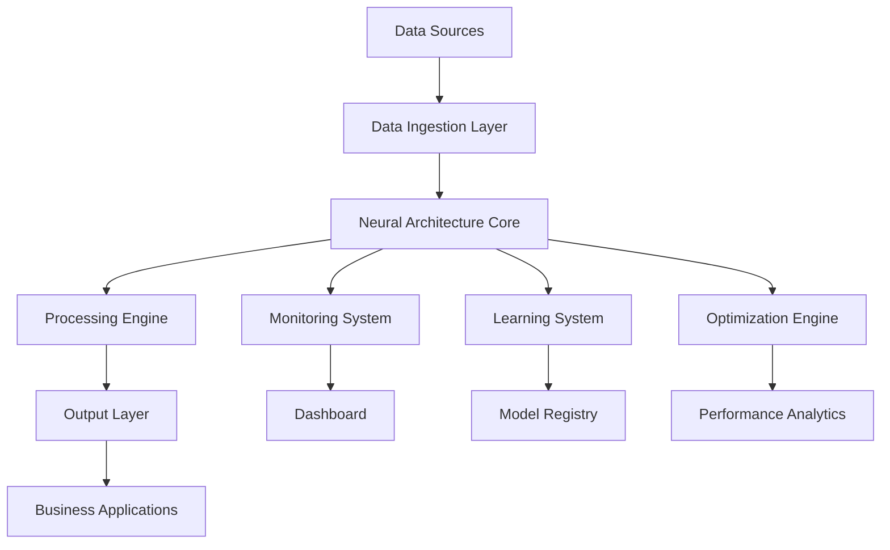

# AI 2026 Neural Architecture Implementation Guide: Complete Enterprise Blueprint

*Version 2.0 | Updated: January 2026*

## Table of Contents

1. [Executive Overview](#executive-overview)
2. [Neural Architecture Fundamentals](#neural-architecture-fundamentals)
3. [Pre-Implementation Assessment](#pre-implementation-assessment)
4. [Implementation Roadmap](#implementation-roadmap)
5. [Technical Architecture Guide](#technical-architecture-guide)
6. [Deployment Strategies](#deployment-strategies)
7. [Monitoring and Optimization](#monitoring-and-optimization)
8. [Troubleshooting and Support](#troubleshooting-and-support)
9. [ROI Measurement Framework](#roi-measurement-framework)
10. [Appendices](#appendices)

## Executive Overview

This comprehensive guide provides enterprise leaders and technical teams with everything needed to successfully implement 2026's revolutionary neural architectures. Based on real-world deployments across Fortune 500 companies, this blueprint ensures optimal outcomes while minimizing risk.

### Key Success Factors

- **Strategic Alignment**: Ensure neural architecture goals align with business objectives
- **Phased Approach**: Implement incrementally to manage risk and optimize learning
- **Team Preparation**: Invest in training and capability development
- **Infrastructure Planning**: Design scalable, resilient technical foundations
- **Continuous Monitoring**: Establish comprehensive measurement and optimization systems

## Neural Architecture Fundamentals

### Core Components

#### 1. Multi-Modal Processing Engine
```
Input Layer: Text, Images, Audio, Structured Data
├── Preprocessing Module
├── Feature Extraction Layer
├── Cross-Modal Fusion Layer
├── Adaptive Attention Mechanism
└── Output Layer: Unified Representations
```

#### 2. Dynamic Topology Manager
- **Architecture Optimizer**: Continuously adjusts neural structure
- **Resource Allocator**: Dynamically manages computational resources
- **Performance Monitor**: Tracks and optimizes system performance
- **Learning Controller**: Manages continuous learning processes

#### 3. Integration Framework
- **API Gateway**: Unified interface for all neural architecture services
- **Data Pipeline**: Real-time data ingestion and preprocessing
- **Model Registry**: Version control and deployment management
- **Monitoring Dashboard**: Comprehensive system observability

### Architecture Patterns

#### Pattern 1: Centralized Neural Hub
```
Enterprise Data Sources → Neural Architecture Hub → Business Applications
                                    ↓
                            Analytics & Monitoring
```

**Best For**: Large enterprises with centralized IT infrastructure

#### Pattern 2: Distributed Neural Mesh
```
Business Unit A ← → Neural Node A ← → Neural Node B ← → Business Unit B
       ↓                    ↓                    ↓
   Local Data         Shared Learning      Local Data
```

**Best For**: Decentralized organizations with autonomous business units

#### Pattern 3: Hybrid Edge-Cloud Architecture
```
Edge Devices → Edge Neural Nodes → Cloud Neural Hub → Enterprise Systems
```

**Best For**: Organizations with significant edge computing requirements

## Pre-Implementation Assessment

### Technical Readiness Assessment

#### Infrastructure Evaluation
- [ ] **Computational Resources**
  - Current GPU/TPU capacity
  - Network bandwidth and latency
  - Storage capacity and performance
  - Cloud vs. on-premises capabilities

- [ ] **Data Infrastructure**
  - Data quality and availability
  - Data pipeline maturity
  - Integration capabilities
  - Compliance and security frameworks

- [ ] **Existing AI/ML Systems**
  - Current model inventory
  - Integration complexity
  - Migration requirements
  - Performance baselines

#### Organizational Readiness
- [ ] **Team Capabilities**
  - AI/ML expertise levels
  - Training and development needs
  - Recruitment requirements
  - Change management readiness

- [ ] **Business Alignment**
  - Strategic objective alignment
  - Stakeholder buy-in
  - Budget and resource allocation
  - Timeline expectations

### Risk Assessment Matrix

| Risk Category | Probability | Impact | Mitigation Strategy |
|---------------|-------------|---------|-------------------|
| Technical Integration | Medium | High | Phased rollout, extensive testing |
| Data Quality Issues | High | Medium | Data governance framework |
| Skill Gap | High | High | Training programs, external partners |
| Budget Overrun | Medium | High | Detailed planning, milestone-based funding |
| Performance Issues | Low | High | Comprehensive monitoring, rollback plans |

## Implementation Roadmap

### Phase 1: Foundation (Months 1-3)

#### Month 1: Planning and Preparation
**Week 1-2: Strategic Planning**
- Finalize business case and ROI projections
- Establish project governance structure
- Define success metrics and KPIs
- Select pilot use cases

**Week 3-4: Technical Planning**
- Complete detailed technical architecture design
- Finalize infrastructure requirements
- Establish vendor partnerships
- Create detailed project timeline

#### Month 2: Infrastructure Setup
**Week 1-2: Environment Preparation**
- Set up development and testing environments
- Configure monitoring and logging systems
- Establish CI/CD pipelines
- Implement security frameworks

**Week 3-4: Data Preparation**
- Audit and clean existing datasets
- Establish data governance processes
- Create data pipelines for neural architecture
- Implement data quality monitoring

#### Month 3: Pilot Development
**Week 1-2: Model Development**
- Develop initial neural architecture models
- Implement core processing components
- Create integration interfaces
- Establish testing frameworks

**Week 3-4: Testing and Validation**
- Comprehensive system testing
- Performance benchmarking
- Security and compliance validation
- User acceptance testing

### Phase 2: Deployment (Months 4-6)

#### Month 4: Pilot Launch
- Deploy pilot neural architecture
- Monitor performance and user feedback
- Collect baseline metrics
- Iterate based on initial results

#### Month 5: Optimization
- Optimize neural architecture performance
- Refine integration points
- Enhance monitoring and alerting
- Prepare for scaling

#### Month 6: Evaluation and Planning
- Comprehensive pilot evaluation
- ROI measurement and analysis
- Scaling strategy development
- Full deployment planning

### Phase 3: Scaling (Months 7-12)

#### Months 7-9: Gradual Rollout
- Deploy to additional business units
- Implement advanced features
- Establish operational procedures
- Train additional team members

#### Months 10-12: Full Deployment
- Complete enterprise-wide deployment
- Achieve full integration
- Implement advanced optimization
- Establish long-term governance

## Technical Architecture Guide

### System Architecture



### Component Specifications

#### Neural Architecture Core
- **Processing Units**: Minimum 8x A100 GPUs or equivalent
- **Memory**: 512GB+ RAM for large-scale processing
- **Storage**: 10TB+ NVMe SSD for model and data storage
- **Network**: 100Gbps+ interconnect for distributed processing

#### Data Ingestion Layer
- **Throughput**: 1M+ events per second
- **Latency**: <10ms for real-time processing
- **Scalability**: Auto-scaling based on load
- **Reliability**: 99.9% uptime SLA

#### Integration Framework
- **API Gateway**: RESTful and GraphQL endpoints
- **Authentication**: OAuth 2.0 + JWT tokens
- **Rate Limiting**: Configurable per client
- **Monitoring**: Comprehensive request/response tracking

### Security Architecture

#### Data Protection
- **Encryption**: AES-256 for data at rest, TLS 1.3 for data in transit
- **Access Control**: Role-based access control (RBAC)
- **Audit Logging**: Comprehensive activity tracking
- **Compliance**: SOC 2, GDPR, HIPAA ready

#### Model Security
- **Model Encryption**: Encrypted model storage and transmission
- **Inference Security**: Secure model serving
- **Adversarial Protection**: Built-in adversarial attack detection
- **Privacy Preservation**: Differential privacy techniques

## Deployment Strategies

### Cloud-Native Deployment

#### Kubernetes Configuration
```yaml
apiVersion: apps/v1
kind: Deployment
metadata:
  name: neural-architecture-core
spec:
  replicas: 3
  selector:
    matchLabels:
      app: neural-architecture-core
  template:
    metadata:
      labels:
        app: neural-architecture-core
    spec:
      containers:
      - name: neural-core
        image: neural-architecture:latest
        resources:
          requests:
            memory: "64Gi"
            cpu: "16"
            nvidia.com/gpu: "2"
          limits:
            memory: "128Gi"
            cpu: "32"
            nvidia.com/gpu: "4"
        env:
        - name: MODEL_PATH
          value: "/models/neural-architecture-v1"
        - name: LOG_LEVEL
          value: "INFO"
```

#### Auto-Scaling Configuration
```yaml
apiVersion: autoscaling/v2
kind: HorizontalPodAutoscaler
metadata:
  name: neural-architecture-hpa
spec:
  scaleTargetRef:
    apiVersion: apps/v1
    kind: Deployment
    name: neural-architecture-core
  minReplicas: 3
  maxReplicas: 20
  metrics:
  - type: Resource
    resource:
      name: cpu
      target:
        type: Utilization
        averageUtilization: 70
  - type: Resource
    resource:
      name: memory
      target:
        type: Utilization
        averageUtilization: 80
```

### On-Premises Deployment

#### Infrastructure Requirements
- **Compute**: Minimum 4x dual-socket servers with 64+ cores each
- **Memory**: 256GB+ RAM per server
- **Storage**: 50TB+ distributed storage (Ceph, GlusterFS)
- **Network**: 25Gbps+ interconnect between nodes

#### Deployment Steps
1. **Environment Setup**
   ```bash
   # Install Kubernetes cluster
   kubectl apply -f k8s-cluster-config.yaml
   
   # Deploy monitoring stack
   helm install prometheus prometheus-community/kube-prometheus-stack
   
   # Deploy neural architecture
   kubectl apply -f neural-architecture-deployment.yaml
   ```

2. **Configuration Management**
   ```bash
   # Configure neural architecture parameters
   kubectl create configmap neural-config \
     --from-file=config.yaml \
     --from-file=models/
   
   # Set up secrets
   kubectl create secret generic neural-secrets \
     --from-literal=api-key=<API_KEY> \
     --from-literal=db-password=<DB_PASSWORD>
   ```

## Monitoring and Optimization

### Key Performance Indicators

#### System Performance
- **Throughput**: Requests processed per second
- **Latency**: P50, P95, P99 response times
- **Resource Utilization**: CPU, memory, GPU usage
- **Availability**: System uptime and reliability

#### Model Performance
- **Accuracy**: Prediction accuracy metrics
- **Drift Detection**: Model performance degradation
- **Bias Monitoring**: Fairness and bias metrics
- **Explainability**: Model interpretability scores

#### Business Metrics
- **ROI**: Return on investment calculations
- **Cost Savings**: Operational cost reductions
- **Revenue Impact**: AI-driven revenue generation
- **User Satisfaction**: End-user experience metrics

### Monitoring Dashboard

#### Real-Time Metrics
```javascript
// Example monitoring configuration
const monitoringConfig = {
  metrics: {
    system: {
      cpu_usage: { threshold: 80, alert: true },
      memory_usage: { threshold: 85, alert: true },
      gpu_utilization: { threshold: 90, alert: true },
      network_latency: { threshold: 100, alert: true }
    },
    model: {
      prediction_accuracy: { threshold: 95, alert: false },
      inference_latency: { threshold: 50, alert: true },
      model_drift: { threshold: 0.1, alert: true },
      bias_score: { threshold: 0.05, alert: true }
    },
    business: {
      roi: { threshold: 150, alert: false },
      cost_savings: { threshold: 25, alert: false },
      user_satisfaction: { threshold: 4.5, alert: true }
    }
  },
  alerts: {
    channels: ['email', 'slack', 'pagerduty'],
    escalation: {
      level1: { delay: '5m', contacts: ['oncall@company.com'] },
      level2: { delay: '15m', contacts: ['manager@company.com'] },
      level3: { delay: '30m', contacts: ['executive@company.com'] }
    }
  }
};
```

### Optimization Strategies

#### Performance Optimization
1. **Model Optimization**
   - Quantization for faster inference
   - Pruning for reduced model size
   - Knowledge distillation for efficiency
   - Hardware-specific optimizations

2. **Infrastructure Optimization**
   - Auto-scaling based on demand
   - Resource pooling and sharing
   - Caching strategies
   - Load balancing optimization

3. **Data Pipeline Optimization**
   - Stream processing for real-time data
   - Data compression and encoding
   - Batch processing optimization
   - Data locality optimization

#### Continuous Learning
1. **Online Learning**
   - Real-time model updates
   - Incremental learning algorithms
   - Feedback loop implementation
   - A/B testing frameworks

2. **Model Retraining**
   - Automated retraining pipelines
   - Data drift detection
   - Performance monitoring
   - Rollback mechanisms

## Troubleshooting and Support

### Common Issues and Solutions

#### Performance Issues
**Issue**: High inference latency
**Symptoms**: Slow response times, user complaints
**Solutions**:
- Optimize model architecture
- Implement caching strategies
- Scale infrastructure resources
- Use model quantization

**Issue**: Low prediction accuracy
**Symptoms**: Poor model performance, incorrect predictions
**Solutions**:
- Retrain with more data
- Feature engineering improvements
- Model architecture adjustments
- Hyperparameter optimization

#### Integration Issues
**Issue**: API connectivity problems
**Symptoms**: Failed requests, timeout errors
**Solutions**:
- Check network connectivity
- Verify API credentials
- Review rate limiting settings
- Update API endpoints

**Issue**: Data pipeline failures
**Symptoms**: Missing data, processing errors
**Solutions**:
- Check data source connectivity
- Validate data formats
- Review pipeline configurations
- Implement error handling

### Support Escalation Matrix

| Severity | Response Time | Escalation Path |
|----------|---------------|-----------------|
| Critical | 15 minutes | L1 → L2 → L3 → Executive |
| High | 1 hour | L1 → L2 → L3 |
| Medium | 4 hours | L1 → L2 |
| Low | 24 hours | L1 |

### Diagnostic Tools

#### System Health Check
```bash
#!/bin/bash
# Neural Architecture Health Check Script

echo "=== Neural Architecture Health Check ==="

# Check system resources
echo "CPU Usage:"
top -bn1 | grep "Cpu(s)"

echo "Memory Usage:"
free -h

echo "GPU Status:"
nvidia-smi

# Check neural architecture services
echo "Service Status:"
kubectl get pods -l app=neural-architecture-core

# Check API endpoints
echo "API Health:"
curl -f http://localhost:8080/health || echo "API Health Check Failed"

# Check data pipeline
echo "Data Pipeline Status:"
kubectl logs -l app=data-pipeline --tail=100

echo "=== Health Check Complete ==="
```

## ROI Measurement Framework

### Financial Metrics

#### Cost Analysis
- **Infrastructure Costs**: Hardware, software, cloud services
- **Development Costs**: Team salaries, consulting, training
- **Operational Costs**: Maintenance, support, monitoring
- **Total Cost of Ownership (TCO)**: Comprehensive cost calculation

#### Revenue Impact
- **Direct Revenue**: AI-driven product/service sales
- **Cost Savings**: Process automation and efficiency gains
- **Market Share**: Competitive advantage and market expansion
- **Customer Value**: Enhanced customer experience and retention

### ROI Calculation Template

```
ROI = (Net Benefits - Total Investment) / Total Investment × 100

Net Benefits = Revenue Impact + Cost Savings - Operational Costs
Total Investment = Infrastructure + Development + Training + Migration

Example Calculation:
- Total Investment: $2,000,000
- Annual Revenue Impact: $1,500,000
- Annual Cost Savings: $800,000
- Annual Operational Costs: $300,000
- Net Annual Benefits: $2,000,000
- ROI: 100% (break-even in 12 months)
```

### Performance Benchmarks

#### Industry Benchmarks
- **Average Implementation Time**: 8-12 months
- **Typical ROI**: 150-300% within 18 months
- **Cost Reduction**: 25-40% in operational expenses
- **Revenue Increase**: 15-30% in AI-driven revenue streams

#### Success Metrics
- **Technical Success**: 99.9% uptime, <100ms latency
- **Business Success**: Positive ROI within 12 months
- **User Adoption**: >80% user adoption rate
- **Satisfaction**: >4.5/5 user satisfaction score

## Appendices

### Appendix A: Vendor Comparison Matrix

| Vendor | Strengths | Weaknesses | Best For |
|--------|-----------|------------|----------|
| Zion Tech Group | Full-stack solution, Enterprise focus | Newer market presence | Large enterprises |
| Tech Giant A | Market leader, Extensive resources | High cost, Vendor lock-in | Fortune 500 |
| Startup B | Innovative features, Competitive pricing | Limited support, Scalability concerns | Mid-market |
| Open Source | No licensing costs, Customizable | Requires expertise, Support challenges | Technical teams |

### Appendix B: Compliance and Security Checklist

- [ ] **Data Privacy Compliance**
  - [ ] GDPR compliance for EU data
  - [ ] CCPA compliance for California data
  - [ ] HIPAA compliance for healthcare data
  - [ ] SOX compliance for financial data

- [ ] **Security Framework**
  - [ ] ISO 27001 certification
  - [ ] SOC 2 Type II compliance
  - [ ] Penetration testing completed
  - [ ] Security audit passed

- [ ] **Data Governance**
  - [ ] Data classification framework
  - [ ] Access control policies
  - [ ] Data retention policies
  - [ ] Audit trail implementation

### Appendix C: Training and Certification Programs

#### Internal Training
- **Neural Architecture Fundamentals**: 40-hour course
- **Implementation Best Practices**: 20-hour workshop
- **Troubleshooting and Support**: 16-hour training
- **Advanced Optimization**: 24-hour certification

#### External Certifications
- **Neural Architecture Specialist**: Industry certification
- **AI Implementation Expert**: Vendor-specific certification
- **Data Science Professional**: Academic certification
- **Cloud AI Architect**: Cloud provider certification

---

*This implementation guide is regularly updated based on industry best practices and real-world deployments. For the latest version and additional resources, visit our knowledge base or contact our implementation specialists.*

**Contact Information:**
- Implementation Support: implementation@ziontechgroup.com
- Technical Support: support@ziontechgroup.com
- Training Programs: training@ziontechgroup.com
- Emergency Support: +1-800-NEURAL-1