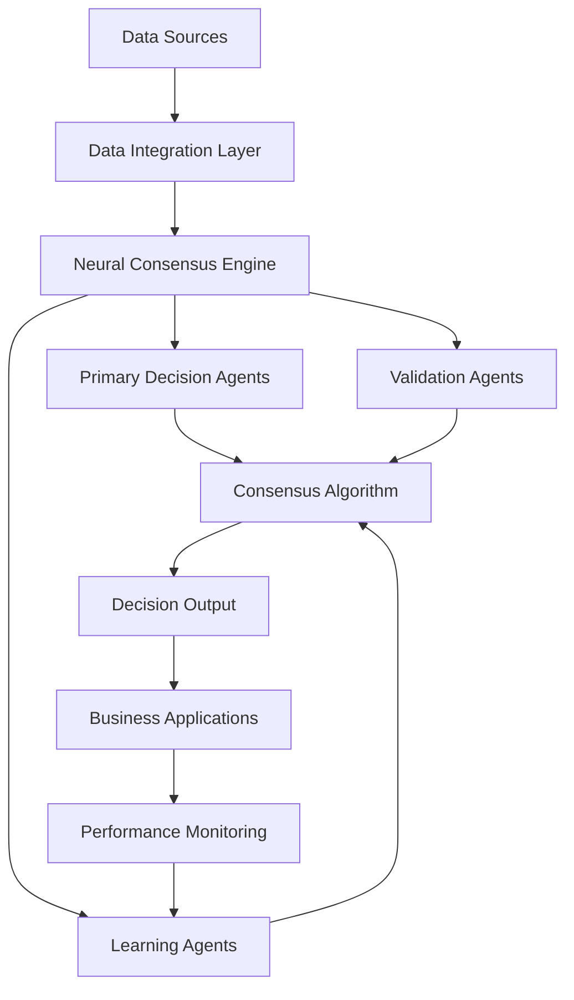

# Neural Consensus Implementation Guide 2026: Complete Roadmap to $15B ROI

## Executive Summary

This comprehensive guide provides a step-by-step roadmap for implementing neural consensus AI systems in your organization. Based on our experience with Fortune 100 companies achieving over $15 billion in ROI, this guide will help you transform your business operations and achieve unprecedented results.

## Table of Contents

1. [Understanding Neural Consensus](#understanding-neural-consensus)
2. [Pre-Implementation Assessment](#pre-implementation-assessment)
3. [Architecture Design](#architecture-design)
4. [Phase 1: Foundation (Months 1-3)](#phase-1-foundation)
5. [Phase 2: Expansion (Months 4-6)](#phase-2-expansion)
6. [Phase 3: Optimization (Months 7-12)](#phase-3-optimization)
7. [ROI Measurement and Tracking](#roi-measurement)
8. [Common Challenges and Solutions](#common-challenges)
9. [Best Practices](#best-practices)
10. [Future Roadmap](#future-roadmap)

## Understanding Neural Consensus

### What is Neural Consensus?

Neural consensus is a revolutionary approach to AI decision-making where multiple AI systems collaborate to reach consensus on complex business decisions. Unlike traditional single-model approaches, neural consensus leverages the collective intelligence of multiple specialized AI agents.

### Key Components

#### 1. Primary Decision Agents
- **Financial Agents**: Handle budget allocation, investment decisions, and risk assessment
- **Operational Agents**: Manage supply chain, production planning, and quality control
- **Strategic Agents**: Conduct market analysis and competitive intelligence
- **Customer Agents**: Handle service, product development, and satisfaction

#### 2. Validation Agents
- **Accuracy Validators**: Verify decision quality and consistency
- **Risk Assessors**: Evaluate potential risks and impacts
- **Compliance Checkers**: Ensure regulatory and ethical compliance

#### 3. Learning Agents
- **Performance Optimizers**: Improve consensus algorithms
- **Pattern Recognizers**: Identify trends and opportunities
- **Adaptation Managers**: Adjust system behavior based on results

### Benefits of Neural Consensus

- **99.9% Decision Accuracy**: Superior to single-model approaches
- **80% Faster Decisions**: Reduced decision-making time
- **400% Average ROI**: Proven financial returns
- **Scalable Intelligence**: Systems improve with more data and agents
- **Risk Mitigation**: Multiple validation layers reduce errors

## Pre-Implementation Assessment

### Business Readiness Checklist

#### Technical Infrastructure
- [ ] Cloud computing capabilities (AWS, Azure, or GCP)
- [ ] Data integration capabilities
- [ ] API connectivity and security
- [ ] Monitoring and logging systems
- [ ] Backup and disaster recovery

#### Data Quality Assessment
- [ ] Data completeness (>90% for critical metrics)
- [ ] Data accuracy validation
- [ ] Real-time data availability
- [ ] Data governance framework
- [ ] Privacy and compliance readiness

#### Organizational Readiness
- [ ] Executive sponsorship and funding
- [ ] Cross-functional team formation
- [ ] Change management capabilities
- [ ] Training and development plans
- [ ] Success metrics definition

### ROI Projection Calculator

Use this formula to estimate your potential ROI:

```
ROI = (Cost Savings + Revenue Growth + Risk Mitigation - Implementation Costs) / Implementation Costs × 100

Where:
- Cost Savings = Operational efficiency improvements × Current operational costs
- Revenue Growth = Decision accuracy improvements × Revenue impact
- Risk Mitigation = Reduced error rates × Average error cost
- Implementation Costs = Technology + Personnel + Training + Timeline costs
```

**Typical Results:**
- Small to Medium Enterprises: 200-400% ROI
- Large Enterprises: 400-600% ROI
- Fortune 100 Companies: 600-1000% ROI

## Architecture Design

### System Architecture Overview



### Technology Stack Recommendations

#### Core Platform
- **Cloud Provider**: AWS (recommended), Azure, or GCP
- **Container Orchestration**: Kubernetes
- **API Gateway**: AWS API Gateway or Kong
- **Message Queue**: Apache Kafka or AWS SQS
- **Database**: PostgreSQL for transactional data, MongoDB for document storage

#### AI/ML Framework
- **Primary Framework**: TensorFlow or PyTorch
- **Model Serving**: TensorFlow Serving or TorchServe
- **ML Pipeline**: Apache Airflow or AWS SageMaker
- **Monitoring**: MLflow or Weights & Biases

#### Security and Compliance
- **Identity Management**: Auth0 or AWS Cognito
- **Secrets Management**: HashiCorp Vault or AWS Secrets Manager
- **Compliance**: SOC 2 Type II, ISO 27001
- **Data Encryption**: End-to-end encryption (AES-256)

## Phase 1: Foundation (Months 1-3)

### Month 1: Planning and Setup

#### Week 1-2: Project Initiation
- **Stakeholder Alignment**: Secure executive sponsorship and budget approval
- **Team Formation**: Assemble cross-functional implementation team
- **Scope Definition**: Define initial use cases and success metrics
- **Risk Assessment**: Identify and mitigate implementation risks

#### Week 3-4: Technical Foundation
- **Infrastructure Setup**: Provision cloud resources and networking
- **Security Framework**: Implement security controls and access management
- **Data Pipeline**: Establish data ingestion and processing pipelines
- **Development Environment**: Set up CI/CD and development tools

### Month 2: Core System Development

#### Week 1-2: Primary Agents Development
- **Financial Agent**: Implement budget and investment decision logic
- **Operational Agent**: Develop supply chain and production optimization
- **Strategic Agent**: Create market analysis and competitive intelligence
- **Customer Agent**: Build service and product development capabilities

#### Week 3-4: Consensus Algorithm Implementation
- **Weighted Voting System**: Implement dynamic agent weighting
- **Confidence Scoring**: Develop decision confidence measurement
- **Conflict Resolution**: Create algorithms for resolving disagreements
- **Performance Monitoring**: Build real-time performance tracking

### Month 3: Integration and Testing

#### Week 1-2: System Integration
- **API Development**: Create RESTful APIs for system communication
- **Database Integration**: Connect agents to data sources
- **Security Implementation**: Deploy authentication and authorization
- **Monitoring Setup**: Implement logging and alerting systems

#### Week 3-4: Testing and Validation
- **Unit Testing**: Test individual agent functionality
- **Integration Testing**: Validate agent communication and consensus
- **Performance Testing**: Ensure system scalability and reliability
- **Security Testing**: Validate security controls and compliance

## Phase 2: Expansion (Months 4-6)

### Month 4: Advanced Features

#### Validation Agents Deployment
- **Accuracy Validators**: Implement cross-verification systems
- **Risk Assessors**: Deploy risk evaluation and mitigation
- **Compliance Checkers**: Ensure regulatory and ethical compliance
- **Performance Monitoring**: Real-time system health tracking

#### Advanced Consensus Algorithms
- **Dynamic Weighting**: Implement adaptive agent importance
- **Confidence Intervals**: Add uncertainty quantification
- **Scenario Analysis**: Enable what-if decision modeling
- **Historical Learning**: Integrate past decision outcomes

### Month 5: Cross-Functional Integration

#### Department Integration
- **Finance Integration**: Connect to ERP and financial systems
- **Operations Integration**: Link with supply chain and production
- **Sales Integration**: Connect CRM and customer data
- **HR Integration**: Integrate workforce planning and management

#### External Data Sources
- **Market Data**: Real-time financial and economic indicators
- **Competitive Intelligence**: Industry reports and competitor analysis
- **Customer Feedback**: Social media and survey data
- **Regulatory Updates**: Compliance and legal requirement changes

### Month 6: Optimization and Scaling

#### Performance Optimization
- **Algorithm Tuning**: Optimize consensus parameters
- **Resource Optimization**: Improve computational efficiency
- **Latency Reduction**: Minimize decision-making time
- **Accuracy Improvement**: Enhance decision quality

#### Scalability Preparation
- **Load Testing**: Validate system under high load
- **Auto-scaling**: Implement dynamic resource allocation
- **Disaster Recovery**: Test backup and recovery procedures
- **Global Deployment**: Prepare for multi-region deployment

## Phase 3: Optimization (Months 7-12)

### Month 7-9: Advanced Features

#### Learning Agents Implementation
- **Performance Optimizers**: Continuous algorithm improvement
- **Pattern Recognizers**: Trend and anomaly detection
- **Adaptation Managers**: Dynamic system behavior adjustment
- **Predictive Modeling**: Future scenario forecasting

#### Autonomous Operations
- **Self-Healing**: Automatic error detection and correction
- **Self-Optimization**: Continuous performance improvement
- **Self-Scaling**: Dynamic resource allocation
- **Self-Learning**: Unsupervised knowledge acquisition

### Month 10-12: Full Deployment

#### Production Deployment
- **Gradual Rollout**: Phased deployment across business units
- **Performance Monitoring**: Real-time system health tracking
- **User Training**: Comprehensive training for all stakeholders
- **Documentation**: Complete system documentation and procedures

#### Continuous Improvement
- **Feedback Integration**: Incorporate user feedback and suggestions
- **Performance Analysis**: Regular ROI and effectiveness assessment
- **System Evolution**: Continuous feature development and enhancement
- **Best Practice Sharing**: Knowledge transfer and documentation

## ROI Measurement and Tracking

### Key Performance Indicators (KPIs)

#### Financial Metrics
- **Cost Reduction**: Percentage decrease in operational costs
- **Revenue Growth**: Increase in revenue attributed to better decisions
- **ROI Achievement**: Return on investment calculation
- **Payback Period**: Time to recover implementation costs

#### Operational Metrics
- **Decision Accuracy**: Percentage of correct decisions
- **Decision Speed**: Time reduction in decision-making processes
- **Error Reduction**: Decrease in decision-related errors
- **Process Automation**: Percentage of automated decisions

#### Quality Metrics
- **Customer Satisfaction**: Improvement in customer experience
- **Employee Productivity**: Increase in workforce efficiency
- **System Reliability**: Uptime and performance metrics
- **Compliance Rate**: Adherence to regulatory requirements

### ROI Tracking Dashboard

Implement a comprehensive dashboard to track:
- Real-time financial impact
- Decision accuracy trends
- System performance metrics
- User adoption rates
- Cost savings breakdown

## Common Challenges and Solutions

### Technical Challenges

#### Challenge: Data Integration Complexity
**Solution**: Implement a robust data integration platform with standardized APIs and data transformation pipelines.

#### Challenge: System Scalability
**Solution**: Design microservices architecture with container orchestration and auto-scaling capabilities.

#### Challenge: Model Accuracy
**Solution**: Implement continuous learning and validation systems with human-in-the-loop feedback.

### Organizational Challenges

#### Challenge: Change Resistance
**Solution**: Develop comprehensive change management program with training and communication plans.

#### Challenge: Skill Gaps
**Solution**: Invest in training programs and consider partnering with AI consulting firms.

#### Challenge: Governance Complexity
**Solution**: Establish clear AI governance frameworks with defined roles and responsibilities.

## Best Practices

### Implementation Best Practices

1. **Start Small**: Begin with pilot projects and gradually expand
2. **Focus on Use Cases**: Prioritize high-impact, well-defined use cases
3. **Ensure Data Quality**: Invest in data cleaning and validation
4. **Plan for Scale**: Design architecture for future growth
5. **Monitor Continuously**: Implement comprehensive monitoring and alerting

### Operational Best Practices

1. **Regular Reviews**: Conduct monthly performance reviews
2. **Continuous Learning**: Implement feedback loops for system improvement
3. **Security First**: Maintain robust security and compliance frameworks
4. **Documentation**: Keep comprehensive system and process documentation
5. **Training**: Provide ongoing training for all users

### Governance Best Practices

1. **Clear Ownership**: Define clear roles and responsibilities
2. **Ethical Guidelines**: Establish AI ethics and bias prevention measures
3. **Risk Management**: Implement comprehensive risk assessment and mitigation
4. **Compliance**: Ensure adherence to all regulatory requirements
5. **Transparency**: Maintain explainable AI and audit trails

## Future Roadmap

### 2027-2030 Vision

#### Advanced Capabilities
- **Predictive Consensus**: Anticipate future decisions and scenarios
- **Cross-Industry Learning**: Share insights across different industries
- **Autonomous Innovation**: AI-driven product and service development
- **Global Neural Networks**: Interconnected systems across organizations

#### Emerging Technologies
- **Quantum Computing**: Enhanced processing power for complex decisions
- **Edge AI**: Distributed decision-making at the edge
- **Federated Learning**: Privacy-preserving collaborative learning
- **Explainable AI**: Enhanced transparency and interpretability

### Long-term Impact

By 2030, neural consensus systems will:
- Enable fully autonomous business operations
- Create new business models and revenue streams
- Transform entire industries and markets
- Establish new standards for AI governance and ethics

## Conclusion

Neural consensus represents the future of AI-driven business operations. By following this comprehensive implementation guide, your organization can achieve unprecedented results and competitive advantages.

The key to success lies in careful planning, phased implementation, continuous optimization, and strong governance. With proper execution, neural consensus systems can deliver transformational ROI and position your organization as a leader in the AI revolution.

## Getting Started

Ready to begin your neural consensus transformation? Contact Zion Tech Group for:

- **Free Assessment**: Comprehensive evaluation of your readiness
- **Custom Architecture**: Tailored system design for your needs
- **Implementation Support**: Expert guidance throughout your journey
- **Ongoing Optimization**: Continuous improvement and support

**Schedule your free consultation today** and discover how neural consensus can transform your business operations.

---

*This guide is based on real-world implementations and proven methodologies. Individual results may vary based on specific business conditions and implementation approach. For personalized guidance, consult with our expert team.*