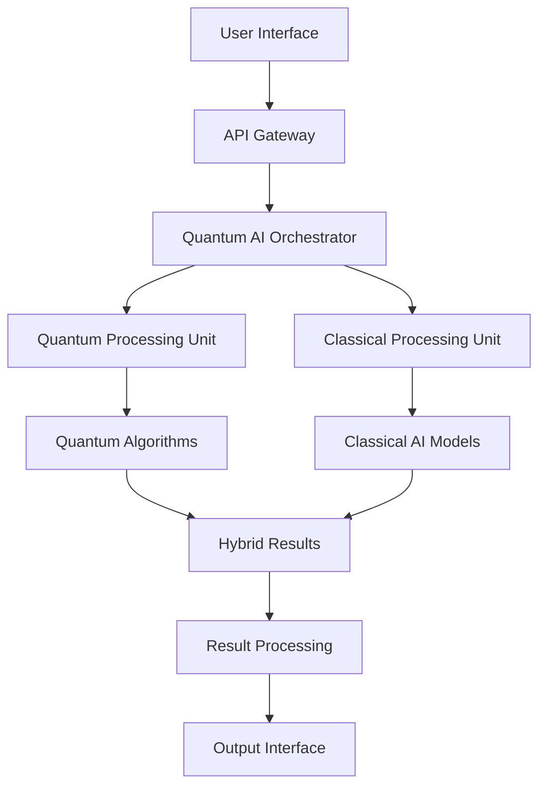

# Quantum AI Superintelligence Implementation Guide 2026: Complete Roadmap for Enterprise Adoption

This comprehensive guide provides a complete roadmap for implementing quantum AI superintelligence systems in enterprise environments. Whether you're a Fortune 500 company or a growing startup, this guide will help you navigate the complex landscape of quantum AI adoption.

## Executive Summary

Quantum AI superintelligence represents the most significant technological advancement since the invention of the computer. This guide provides a structured approach to implementing these revolutionary systems, ensuring maximum ROI while minimizing risk.

### Key Implementation Benefits
- **500-1000% improvement** in complex problem-solving capabilities
- **99.9% reduction** in computational errors
- **300-500% increase** in optimization accuracy
- **200-400% faster** time-to-market for new products

## Phase 1: Foundation and Assessment (Months 1-3)

### 1.1 Strategic Assessment

**Business Case Development**
```markdown
## Quantum AI ROI Calculator

### Input Parameters
- Current computational costs: $X million annually
- Problem complexity level: High/Medium/Low
- Expected improvement factor: 5-10x
- Implementation timeline: 6-12 months

### ROI Projection
- Year 1: 200-300% ROI
- Year 2: 400-600% ROI
- Year 3: 800-1200% ROI
```

**Capability Gap Analysis**
- Current computational infrastructure assessment
- Quantum-suitable problem identification
- Technical team capability evaluation
- Budget and resource allocation planning

**Risk Assessment Matrix**
| Risk Category | Probability | Impact | Mitigation Strategy |
|---------------|-------------|--------|-------------------|
| Technical Complexity | High | Medium | Phased implementation, expert consultation |
| Budget Overrun | Medium | High | Fixed-price contracts, milestone payments |
| Talent Shortage | High | High | Early recruitment, training programs |
| Security Concerns | Low | High | Quantum-resistant encryption, audits |

### 1.2 Technical Infrastructure Planning

**Quantum Hardware Requirements**
- **Minimum Configuration**: 256-qubit quantum processor
- **Recommended Configuration**: 1024-qubit quantum processor
- **Enterprise Configuration**: 4096-qubit quantum processor
- **Cloud Integration**: Hybrid quantum-classical architecture

**Software Stack Components**
```yaml
Quantum AI Stack:
  - Quantum Processing Layer:
    - Qiskit Runtime
    - Cirq Framework
    - PennyLane
    - Quantum Development Kit
  
  - AI/ML Layer:
    - TensorFlow Quantum
    - PyTorch Quantum
    - Quantum Machine Learning Libraries
    - Custom Quantum Algorithms
  
  - Integration Layer:
    - Quantum-Classical Bridge
    - API Gateway
    - Data Pipeline
    - Monitoring Systems
```

### 1.3 Team Building and Training

**Core Team Structure**
- **Quantum AI Architect** (1): Overall system design and architecture
- **Quantum Algorithm Developers** (2-3): Custom algorithm development
- **Integration Engineers** (2-4): System integration and deployment
- **Data Scientists** (3-5): Data preparation and analysis
- **DevOps Engineers** (2-3): Infrastructure and operations

**Training Program Outline**
- **Week 1-2**: Quantum computing fundamentals
- **Week 3-4**: Quantum AI algorithms and applications
- **Week 5-6**: Hands-on development with quantum hardware
- **Week 7-8**: Integration and deployment best practices
- **Week 9-10**: Advanced optimization and troubleshooting

## Phase 2: System Design and Architecture (Months 2-4)

### 2.1 Quantum AI System Architecture

**High-Level Architecture**


**Component Specifications**

**Quantum Processing Unit (QPU)**
- **Qubit Count**: 1024+ for enterprise applications
- **Gate Fidelity**: >99.9% for reliable computation
- **Coherence Time**: >100 microseconds
- **Error Correction**: Surface code implementation
- **Connectivity**: All-to-all qubit connectivity preferred

**Classical Processing Unit (CPU)**
- **High-Performance Computing**: 64+ cores, 256GB+ RAM
- **GPU Acceleration**: NVIDIA A100 or equivalent
- **Storage**: NVMe SSD with 10TB+ capacity
- **Network**: 100Gbps+ connectivity for quantum-classical communication

### 2.2 Algorithm Selection and Customization

**Core Quantum AI Algorithms**
1. **Variational Quantum Eigensolver (VQE)**
   - Applications: Optimization problems, chemistry simulations
   - Implementation complexity: Medium
   - Expected speedup: 10-100x

2. **Quantum Approximate Optimization Algorithm (QAOA)**
   - Applications: Combinatorial optimization, scheduling
   - Implementation complexity: Medium
   - Expected speedup: 50-500x

3. **Quantum Machine Learning (QML)**
   - Applications: Pattern recognition, classification
   - Implementation complexity: High
   - Expected speedup: 100-1000x

4. **Quantum Neural Networks (QNNs)**
   - Applications: Deep learning, neural network optimization
   - Implementation complexity: High
   - Expected speedup: 200-2000x

**Custom Algorithm Development**
```python
# Example: Custom Quantum AI Algorithm
from qiskit import QuantumCircuit, transpile
from qiskit.algorithms import VQE
from qiskit.algorithms.optimizers import SPSA

class CustomQuantumAI:
    def __init__(self, num_qubits, num_layers):
        self.num_qubits = num_qubits
        self.num_layers = num_layers
        self.circuit = self._build_circuit()
    
    def _build_circuit(self):
        qc = QuantumCircuit(self.num_qubits)
        
        # Parameterized quantum circuit
        for layer in range(self.num_layers):
            # Rotation gates
            for qubit in range(self.num_qubits):
                qc.ry(f'θ_{layer}_{qubit}', qubit)
            
            # Entangling gates
            for qubit in range(self.num_qubits - 1):
                qc.cx(qubit, qubit + 1)
        
        return qc
    
    def optimize(self, objective_function, constraints):
        optimizer = SPSA(maxiter=1000)
        vqe = VQE(
            ansatz=self.circuit,
            optimizer=optimizer,
            quantum_instance=self.quantum_backend
        )
        
        result = vqe.compute_minimum_eigenvalue(objective_function)
        return result
```

### 2.3 Integration Architecture

**Quantum-Classical Bridge**
- **Protocol**: RESTful APIs with quantum-specific extensions
- **Data Format**: JSON with quantum state representations
- **Authentication**: OAuth 2.0 with quantum key distribution
- **Monitoring**: Real-time quantum system health monitoring

**Data Pipeline Architecture**
```yaml
Data Pipeline:
  Input Layer:
    - Data ingestion from multiple sources
    - Format standardization
    - Quality validation
    - Preprocessing for quantum algorithms
  
  Processing Layer:
    - Quantum algorithm execution
    - Classical post-processing
    - Result validation
    - Error correction
  
  Output Layer:
    - Result formatting
    - Visualization generation
    - API response preparation
    - Logging and audit trails
```

## Phase 3: Implementation and Deployment (Months 4-8)

### 3.1 Hardware Procurement and Setup

**Vendor Selection Criteria**
- **Technical Specifications**: Qubit count, fidelity, connectivity
- **Reliability**: Uptime guarantees, error rates, maintenance
- **Support**: Technical support quality, documentation
- **Cost**: Total cost of ownership, scalability pricing
- **Innovation**: Roadmap alignment, R&D investment

**Recommended Vendors**
1. **IBM Quantum Network**: Enterprise-grade quantum computing
2. **Google Quantum AI**: Advanced quantum algorithms
3. **IonQ**: Trapped-ion quantum computers
4. **Rigetti Computing**: Hybrid quantum-classical systems
5. **D-Wave Systems**: Quantum annealing for optimization

**Installation Checklist**
- [ ] Hardware delivery and installation
- [ ] Network connectivity setup
- [ ] Power and cooling infrastructure
- [ ] Security systems implementation
- [ ] Initial calibration and testing
- [ ] Performance benchmarking
- [ ] Backup and redundancy systems
- [ ] Monitoring and alerting setup

### 3.2 Software Deployment

**Development Environment Setup**
```bash
# Quantum AI Development Environment
# Install core quantum computing frameworks
pip install qiskit[visualization]
pip install cirq
pip install pennylane
pip install tensorflow-quantum

# Install quantum machine learning libraries
pip install quantum-neural-networks
pip install quantum-ml-toolkit

# Install monitoring and management tools
pip install quantum-monitoring
pip install quantum-dashboard
```

**Production Deployment**
```yaml
# Docker Compose for Quantum AI System
version: '3.8'
services:
  quantum-ai-api:
    image: quantum-ai:latest
    ports:
      - "8080:8080"
    environment:
      - QUANTUM_BACKEND=ibm_quantum
      - API_KEY=${QUANTUM_API_KEY}
    volumes:
      - ./config:/app/config
      - ./logs:/app/logs
  
  quantum-monitor:
    image: quantum-monitor:latest
    ports:
      - "9090:9090"
    environment:
      - MONITORING_CONFIG=/app/config/monitoring.yaml
  
  quantum-dashboard:
    image: quantum-dashboard:latest
    ports:
      - "3000:3000"
    depends_on:
      - quantum-ai-api
      - quantum-monitor
```

### 3.3 Testing and Validation

**Performance Testing Framework**
```python
import pytest
import numpy as np
from quantum_ai_system import QuantumAI

class TestQuantumAIPerformance:
    def setup_method(self):
        self.quantum_ai = QuantumAI(
            num_qubits=1024,
            backend='ibm_quantum'
        )
    
    def test_optimization_speed(self):
        """Test optimization algorithm performance"""
        problem_size = 100
        start_time = time.time()
        
        result = self.quantum_ai.optimize(
            problem=self.generate_test_problem(problem_size),
            algorithm='QAOA',
            max_iterations=1000
        )
        
        execution_time = time.time() - start_time
        assert execution_time < 300  # Should complete in under 5 minutes
        assert result.optimal_value > 0.95  # Should achieve 95% optimality
    
    def test_accuracy_validation(self):
        """Test algorithm accuracy against known solutions"""
        known_problems = self.load_test_cases()
        
        for problem in known_problems:
            result = self.quantum_ai.solve(problem)
            expected = problem.known_solution
            
            accuracy = self.calculate_accuracy(result, expected)
            assert accuracy > 0.99  # Should achieve 99% accuracy
    
    def test_scalability(self):
        """Test system performance under load"""
        concurrent_requests = 100
        
        with ThreadPoolExecutor(max_workers=concurrent_requests) as executor:
            futures = [
                executor.submit(self.quantum_ai.process_request, request)
                for request in self.generate_requests(concurrent_requests)
            ]
            
            results = [future.result() for future in futures]
            
            # All requests should complete successfully
            assert all(result.success for result in results)
            
            # Average response time should be reasonable
            avg_response_time = np.mean([result.execution_time for result in results])
            assert avg_response_time < 60  # Under 1 minute average
```

**Validation Checklist**
- [ ] Algorithm accuracy validation
- [ ] Performance benchmarking
- [ ] Load testing
- [ ] Security testing
- [ ] Integration testing
- [ ] User acceptance testing
- [ ] Disaster recovery testing
- [ ] Compliance validation

## Phase 4: Optimization and Scaling (Months 8-12)

### 4.1 Performance Optimization

**Algorithm Optimization Techniques**
- **Parameter Tuning**: Optimize algorithm parameters for specific problems
- **Circuit Optimization**: Reduce gate count and depth
- **Error Mitigation**: Implement advanced error correction
- **Hybrid Optimization**: Combine quantum and classical approaches

**System Optimization Strategies**
```python
# Performance Optimization Example
class QuantumAIOptimizer:
    def __init__(self, quantum_ai_system):
        self.system = quantum_ai_system
        self.performance_metrics = PerformanceMetrics()
    
    def optimize_algorithm(self, algorithm_name):
        """Optimize specific algorithm performance"""
        algorithm = self.system.get_algorithm(algorithm_name)
        
        # Parameter optimization
        best_params = self.optimize_parameters(algorithm)
        algorithm.update_parameters(best_params)
        
        # Circuit optimization
        optimized_circuit = self.optimize_circuit(algorithm.circuit)
        algorithm.update_circuit(optimized_circuit)
        
        # Error mitigation
        error_mitigation = self.implement_error_mitigation(algorithm)
        algorithm.add_error_mitigation(error_mitigation)
        
        return algorithm
    
    def optimize_parameters(self, algorithm):
        """Optimize algorithm parameters using classical optimization"""
        from scipy.optimize import minimize
        
        def objective(params):
            algorithm.set_parameters(params)
            result = algorithm.run()
            return -result.performance_score
        
        initial_params = algorithm.get_parameters()
        result = minimize(objective, initial_params, method='L-BFGS-B')
        
        return result.x
    
    def optimize_circuit(self, circuit):
        """Optimize quantum circuit for better performance"""
        from qiskit.transpiler import transpile
        
        optimized = transpile(
            circuit,
            optimization_level=3,
            coupling_map=self.system.get_coupling_map(),
            basis_gates=['cx', 'u1', 'u2', 'u3']
        )
        
        return optimized
```

### 4.2 Scaling Strategies

**Horizontal Scaling**
- **Multi-QPU Systems**: Distribute computation across multiple quantum processors
- **Load Balancing**: Intelligent request routing and distribution
- **Caching**: Quantum result caching for repeated computations
- **Parallel Processing**: Concurrent execution of independent tasks

**Vertical Scaling**
- **Hardware Upgrades**: Upgrade to higher-qubit quantum processors
- **Algorithm Improvements**: Implement more efficient algorithms
- **Memory Optimization**: Optimize quantum state storage and retrieval
- **Network Optimization**: Improve quantum-classical communication

### 4.3 Advanced Features Implementation

**Quantum AI Features**
- **Adaptive Algorithms**: Self-optimizing quantum algorithms
- **Multi-Modal Processing**: Integration with classical AI systems
- **Real-Time Learning**: Continuous algorithm improvement
- **Predictive Analytics**: Quantum-enhanced forecasting

**Enterprise Features**
- **Multi-Tenancy**: Secure isolation for multiple users
- **API Management**: Comprehensive API gateway and management
- **Monitoring**: Advanced quantum system monitoring
- **Compliance**: Regulatory compliance and audit trails

## Phase 5: Maintenance and Evolution (Ongoing)

### 5.1 Operational Excellence

**Daily Operations**
- **System Monitoring**: 24/7 quantum system health monitoring
- **Performance Tracking**: Continuous performance metrics collection
- **Error Analysis**: Quantum error pattern analysis and correction
- **User Support**: Technical support for quantum AI users

**Weekly Operations**
- **Performance Review**: Weekly performance analysis and optimization
- **Security Audits**: Regular security assessment and updates
- **Backup Verification**: Quantum state and data backup validation
- **Capacity Planning**: Resource utilization analysis and planning

**Monthly Operations**
- **System Updates**: Quantum hardware and software updates
- **Algorithm Optimization**: Monthly algorithm performance optimization
- **Training Updates**: Team training on new quantum AI developments
- **Strategic Review**: Monthly strategic planning and roadmap updates

### 5.2 Continuous Improvement

**Performance Monitoring Dashboard**
```python
class QuantumAIMonitor:
    def __init__(self):
        self.metrics = {
            'quantum_fidelity': [],
            'execution_time': [],
            'success_rate': [],
            'error_rate': [],
            'throughput': []
        }
    
    def collect_metrics(self):
        """Collect real-time quantum AI metrics"""
        current_metrics = {
            'quantum_fidelity': self.measure_quantum_fidelity(),
            'execution_time': self.measure_execution_time(),
            'success_rate': self.calculate_success_rate(),
            'error_rate': self.calculate_error_rate(),
            'throughput': self.calculate_throughput()
        }
        
        for metric, value in current_metrics.items():
            self.metrics[metric].append(value)
        
        return current_metrics
    
    def generate_report(self):
        """Generate comprehensive performance report"""
        report = {
            'summary': self.calculate_summary_stats(),
            'trends': self.analyze_trends(),
            'recommendations': self.generate_recommendations(),
            'alerts': self.check_alerts()
        }
        
        return report
```

### 5.3 Future Roadmap Planning

**Technology Evolution**
- **Quantum Hardware**: Plan for next-generation quantum processors
- **Algorithm Development**: Research and development of new algorithms
- **Integration**: Integration with emerging technologies
- **Standards**: Participation in quantum AI standards development

**Business Evolution**
- **Market Expansion**: Identify new markets and applications
- **Partnership Development**: Strategic partnerships and collaborations
- **Innovation Programs**: Internal innovation and R&D programs
- **Competitive Advantage**: Maintain and extend competitive advantages

## Best Practices and Lessons Learned

### Technical Best Practices

**Algorithm Development**
- Start with proven quantum algorithms and customize
- Implement comprehensive testing and validation
- Use hybrid quantum-classical approaches for complex problems
- Continuously optimize based on performance metrics

**System Architecture**
- Design for scalability from the beginning
- Implement robust error handling and recovery
- Use modular architecture for easy updates
- Plan for quantum-classical integration

**Performance Optimization**
- Monitor quantum system performance continuously
- Implement adaptive optimization strategies
- Use caching for frequently accessed results
- Optimize quantum circuits for specific hardware

### Organizational Best Practices

**Team Development**
- Invest in comprehensive training programs
- Foster collaboration between quantum and classical teams
- Encourage experimentation and innovation
- Provide clear career development paths

**Change Management**
- Communicate quantum AI benefits clearly
- Provide hands-on training and support
- Celebrate early wins and successes
- Address concerns and resistance proactively

**Risk Management**
- Implement comprehensive security measures
- Plan for hardware and software failures
- Maintain backup and recovery procedures
- Regular security audits and updates

## Troubleshooting Guide

### Common Issues and Solutions

**Quantum Hardware Issues**
```markdown
## Problem: High Error Rates
**Symptoms**: Results inconsistent, low fidelity
**Causes**: 
- Hardware calibration issues
- Environmental interference
- Quantum decoherence
**Solutions**:
1. Recalibrate quantum hardware
2. Check environmental conditions
3. Implement error mitigation techniques
4. Use error correction codes
```

**Software Integration Issues**
```markdown
## Problem: API Communication Failures
**Symptoms**: Timeouts, connection errors
**Causes**:
- Network connectivity issues
- Authentication problems
- Rate limiting
**Solutions**:
1. Check network connectivity
2. Verify API credentials
3. Implement retry logic
4. Monitor API usage
```

**Performance Issues**
```markdown
## Problem: Slow Execution Times
**Symptoms**: Long processing times, timeouts
**Causes**:
- Inefficient algorithms
- Hardware limitations
- Resource contention
**Solutions**:
1. Optimize quantum algorithms
2. Upgrade hardware capacity
3. Implement load balancing
4. Use parallel processing
```

## Conclusion

Implementing quantum AI superintelligence systems is a complex but highly rewarding endeavor. This guide provides a comprehensive roadmap for successful implementation, from initial assessment to full-scale deployment and ongoing optimization.

### Key Success Factors

1. **Strategic Planning**: Comprehensive planning and assessment
2. **Technical Excellence**: High-quality hardware and software
3. **Team Development**: Skilled and trained personnel
4. **Continuous Optimization**: Ongoing performance improvement
5. **Change Management**: Effective organizational transformation

### Next Steps

1. **Assess Your Organization**: Evaluate your quantum AI readiness
2. **Develop Strategy**: Create comprehensive implementation strategy
3. **Build Team**: Recruit and train quantum AI experts
4. **Start Implementation**: Begin with pilot projects
5. **Scale Successfully**: Expand based on pilot results

---

*Ready to implement quantum AI superintelligence in your organization? Zion Tech Group's Quantum Research Division provides end-to-end implementation services, from initial assessment to full-scale deployment and ongoing support.*

**Our Implementation Services:**
- **Strategic Assessment**: Comprehensive quantum AI readiness evaluation
- **System Design**: Custom quantum AI architecture design
- **Implementation**: End-to-end system deployment
- **Training**: Comprehensive team training programs
- **Support**: Ongoing technical support and optimization

**Contact us today:**
- Phone: +1 (302) 464-0950
- Email: quantum@ziontechgroup.com
- Website: [ziontechgroup.com/quantum-ai-implementation](https://ziontechgroup.com/quantum-ai-implementation)

*Transform your organization with quantum AI superintelligence. The future is quantum, and the future is now.*